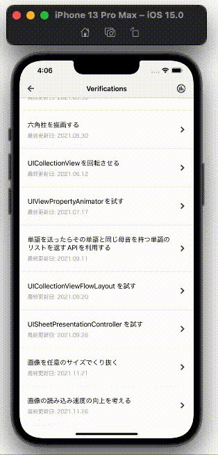

  
<!--more-->  
  
## 開発環境  
  
```bash
> xcodebuild -version
Xcode 13.1
Build version 13A1030d
```
  
## はじめに
何かお題を作って、それに対しどのようにアプローチしていくかを記事として残す。  
[前回](https://tokizuoh.dev/posts/ip4pe036kfiwusjh/) の課題になっていたキャッシュを実装する。  
  
## キャッシュさせて二回目表示以降の表示速度を改善させる
  
```swift
import UIKit

final class LoadImagesViewController: ComponentBaseViewController {

    @IBOutlet weak var collectionView: UICollectionView! {
        didSet {
            collectionView.dataSource = self
            collectionView.register(R.nib.loadImagesCollectionViewCell)
            configureFlowLayout()
        }
    }

    struct ViewControllerModel {
        let thumbnailImageURLs: [URL]
    }

    // 追加
    private var dictionary: [URL: UIImage] = [:]

    private let viewControllerModel = ViewControllerModel(thumbnailImageURLs: [
        URL(string: "https://placehold.jp/7276c4/ffffff/1000x2000.png?text=1000%20%C3%97%202000")!,
        URL(string: "https://placehold.jp/a4b562/ffffff/1000x2000.png?text=1000%20%C3%97%202000")!,
        URL(string: "https://placehold.jp/b56262/ffffff/1000x2000.png?text=1000%20%C3%97%202000")!,
        URL(string: "https://placehold.jp/b262b5/ffffff/1000x2000.png?text=1000%20%C3%97%202000")!,
        URL(string: "https://placehold.jp/6297b5/ffffff/1000x2000.png?text=1000%20%C3%97%202000")!,
        URL(string: "https://raw.githubusercontent.com/tokizuoh/Pendula/feature/%23104/Pendula/View/Component/018_LoadImages/Image/sky.jpeg")!
    ])

    private let cellCount = 300

    override func viewDidLoad() {
        super.viewDidLoad()
        configureNavigationItem(navigationTitle: "018 LoadImages")
    }

}

extension LoadImagesViewController: UICollectionViewDataSource {

    func collectionView(_ collectionView: UICollectionView, numberOfItemsInSection section: Int) -> Int {
        return cellCount
    }

    func collectionView(_ collectionView: UICollectionView, cellForItemAt indexPath: IndexPath) -> UICollectionViewCell {
        let cell = collectionView.dequeueReusableCell(withReuseIdentifier: R.reuseIdentifier.loadImagesCollectionViewCell,
                                                      for: indexPath)!
        let index = indexPath.row % viewControllerModel.thumbnailImageURLs.count
        // 変更
        let image = getImage(url: viewControllerModel.thumbnailImageURLs[index])
        cell.setup(image: image)
        return cell
    }

    private func configureFlowLayout() {
        let layout = UICollectionViewFlowLayout()
        layout.itemSize = .init(width: collectionView.frame.width,
                                height: collectionView.frame.height)
        layout.scrollDirection = .horizontal
        collectionView.collectionViewLayout = layout
    }

}

extension LoadImagesViewController {

    // 追加
    private func getImage(url: URL) -> UIImage? {
        if let image = dictionary[url] {
            return image

        } else {
            let image = fetchImage(url: url)
            dictionary[url] = image
            return image
        }
    }

    private func fetchImage(url: URL) -> UIImage? {
        guard let data = try? Data(contentsOf: url) else {
            return nil
        }

        return .init(data: data)
    }

}
```
  
連想配列で一度fetchして生成した UIImage を格納し、二回目以降の表示の際に流用するようにした。  

  
## gif
  

  
　
  
二回目以降の表示はスムーズになった。
  
## 現状の課題  
  
- 一回目の表示をスムーズにするために先読みをする
  
次回以降の記事で改善していく。
  
## 本記事のシリーズ
  
- [①基本実装編](https://tokizuoh.dev/posts/ip4pe036kfiwusjh/)
- ②キャッシュ編 (本記事)
- [③先読み編](https://tokizuoh.dev/posts/iui31beefylq8y0td/)
  