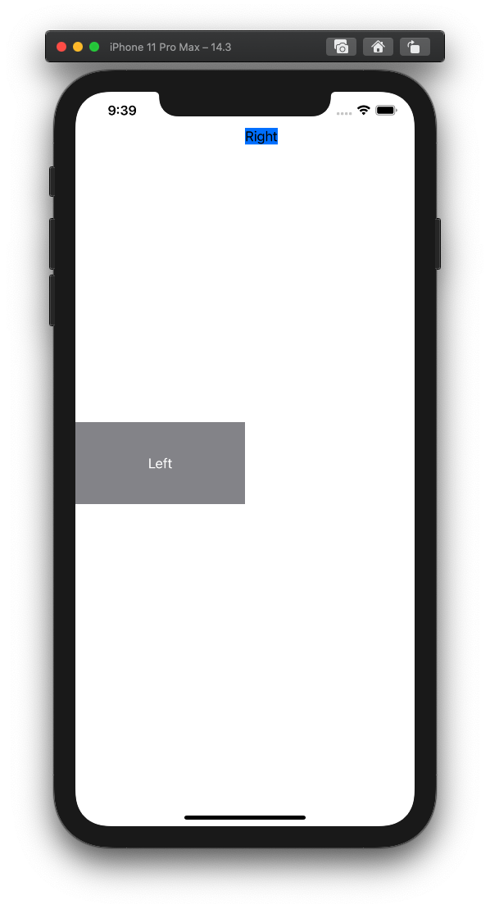
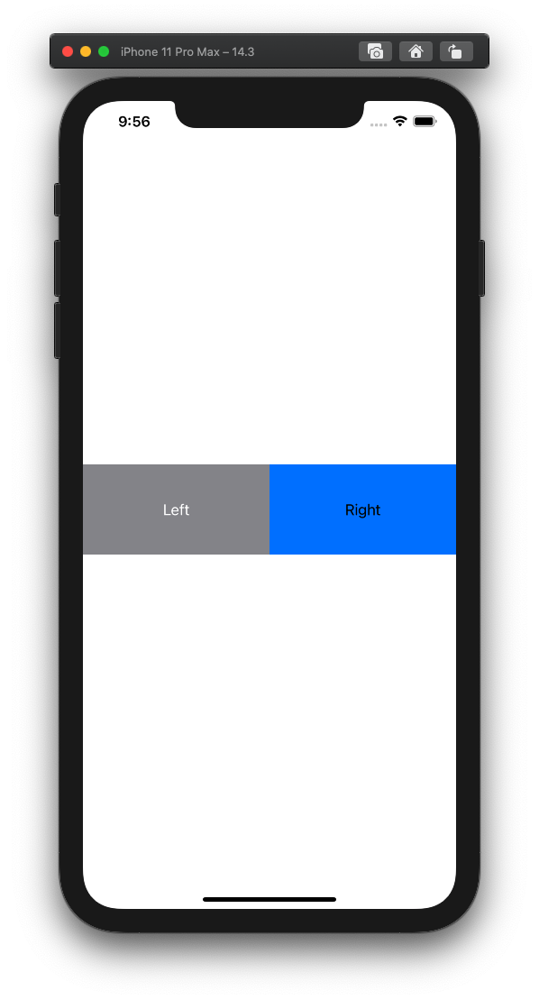

  
<!--more-->  
  
## 開発環境  
  
```bash
> xcodebuild -version 
Xcode 12.3
Build version 12C33
```
  
## GeometryReaderとは  
  
> A container view that defines its content as a function of its own size and coordinate space.  
> (ellipsis)  
> This view returns a flexible preferred size to its parent layout.  
> [GeometryReader | Apple Developer Documentation](https://developer.apple.com/documentation/swiftui/geometryreader)  
  
GeometryReaderを使うことで親Viewのサイズなどを取得できる。  
  
## とりあえず使ってみる
  
  
  
```swift
import SwiftUI

struct ContentView: View {
    var body: some View {

        HStack(spacing: 0) {
            // 比較用
            Text("Left")
                .frame(width: UIScreen.main.bounds.width / 2, height: 100)
                .background(Color.gray)
                .foregroundColor(.white)
            
            // GeometryReader
            GeometryReader { geometry in
                Text("Right")
                    .background(Color.blue)
            }
        }
    }
}
```
  
左の要素にGeometryReaderを親としたTextを配置した。  
何も設定しない場合は、文字列の高さ・横幅のそれぞれ最低限のサイズを取る。
  
## 左の要素を真似る
  
右の要素を左の要素と同じ見た目になるように実装してみた。  
  

  
```swift
import SwiftUI

struct ContentView: View {
    var body: some View {

        HStack(spacing: 0) {
            Text("Left")
                .frame(width: UIScreen.main.bounds.width / 2, height: 100)
                .background(Color.gray)
                .foregroundColor(.white)
            GeometryReader { geometry in
                Text("Right")
                    .frame(width: geometry.size.width, height: 100, alignment: .center)
                    .background(Color.blue)
                    .position(x: geometry.size.width / 2, y: geometry.size.height / 2)
            }
        }
    }
}
```
  
GeometryReaderを使用しない要素はデフォルトでセンタリングされるが、GeometryReaderを使用すると親Viewの `x: 0, y: 0` に配置される。  
  
## 参考  
  
- [GeometryReader | Apple Developer Documentation](https://developer.apple.com/documentation/swiftui/geometryreader)  
  