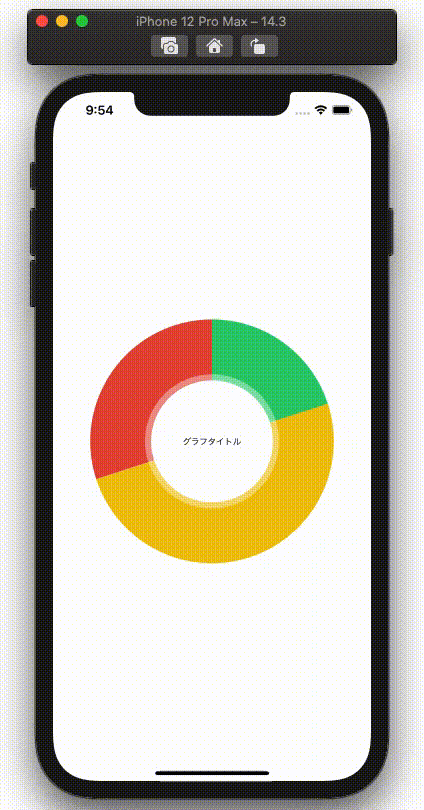

  
円グラフをSwiftで書く。  
  
<!--more-->  
  
## 開発環境  
  
```bash
> xcodebuild -version
Xcode 12.3
Build version 12C33
```
  
## Charts
  

  
[danielgindi/Charts: Beautiful charts for iOS/tvOS/OSX! The Apple side of the crossplatform MPAndroidChart.](https://github.com/danielgindi/Charts)  
  
## gif
  
  
  
タップ後の黒いViewは自作。  
  
## コード
  
```swift
// ViewController.swift

import UIKit
import Charts

final class ViewController: UIViewController {
    
    @IBOutlet weak var pieChartView: PieChartView!
    
    let dataEntries = [
        PieChartDataEntry(value: 20, label: "A"),
        PieChartDataEntry(value: 50, label: "B"),
        PieChartDataEntry(value: 30, label: "C")
    ]

    var annotationView: AnnotationView?
    
    override func viewDidLoad() {
        super.viewDidLoad()
        configurePieChartView()
    }
    
    private func configurePieChartView() {
        pieChartView.centerText = "グラフタイトル"
        pieChartView.delegate = self
        
        let dataSet = PieChartDataSet(entries: dataEntries, label: nil)
        dataSet.colors = ChartColorTemplates.material()
        dataSet.entryLabelFont = NSUIFont(name: NSUIFont.TextStyle.title1.rawValue,
                                          size: 100)
        dataSet.drawValuesEnabled = false
        pieChartView.data = PieChartData(dataSet: dataSet)
        
        pieChartView.rotationEnabled = false
        pieChartView.drawEntryLabelsEnabled = false
        pieChartView.legend.enabled = false
        
        view.addSubview(pieChartView)
    }
}

extension ViewController: ChartViewDelegate {
    func chartValueSelected(_ chartView: ChartViewBase, entry: ChartDataEntry, highlight: Highlight) {
        annotationView?.removeFromSuperview()
        
        annotationView = AnnotationView(frame: CGRect(x: highlight.xPx + 35,
                                                      y: pieChartView.frame.minY + highlight.yPx - 25,
                                                      width: 50,
                                                      height: 20))
        
        guard let pieChartDataEntry = entry as? PieChartDataEntry,
              let annotationView = annotationView else {
            return
        }
        
        annotationView.setup(value: "\(pieChartDataEntry.value)")
        view.addSubview(annotationView)
    }
}
```
  
　
  
```swift
// AnnotationView.swift

import UIKit

final class AnnotationView: UIView {

    @IBOutlet weak var valueLabel: UILabel!
    
    override init(frame: CGRect) {
        super.init(frame: frame)
        loadNib()
    }
    
    required init?(coder: NSCoder) {
        super.init(coder: coder)
        loadNib()
    }
        
    private func loadNib() {
        let view = Bundle.main.loadNibNamed("AnnotationView",
                                            owner: self,
                                            options: nil)?.first as! UIView
        view.frame = self.bounds
        self.addSubview(view)
    }
    
    func setup(value: String) {
        valueLabel.text = value
    }
}
```
  
## 参考  
  
- [GitHub - danielgindi/Charts: Beautiful charts for iOS/tvOS/OSX! The Apple side of the crossplatform MPAndroidChart.](https://github.com/danielgindi/Charts)  
- [Xibでカスタムビューを作成する – 野生のプログラマZ](http://harumi.sakura.ne.jp/wordpress/2019/01/26/xib%E3%81%A7%E3%82%AB%E3%82%B9%E3%82%BF%E3%83%A0%E3%83%93%E3%83%A5%E3%83%BC%E3%82%92%E4%BD%9C%E6%88%90%E3%81%99%E3%82%8B/)  
  