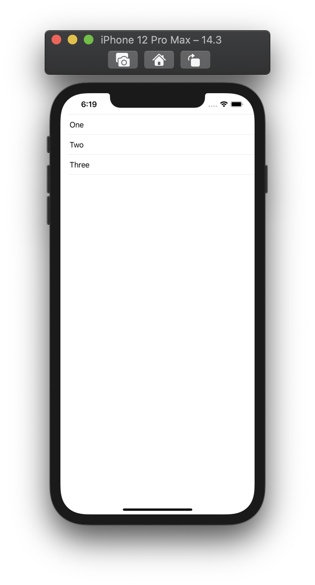
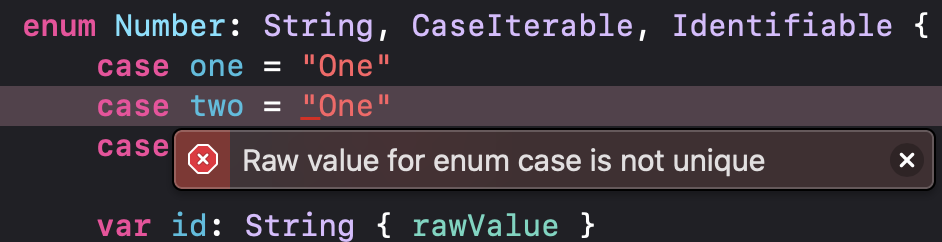

  
<!--more-->  
  
## 開発環境  
  
```bash
> xcodebuild -version
Xcode 12.3
Build version 12C33
```
  
## スクリーンショット  
  
  
  
## コード  
  
```swift
import SwiftUI

struct ContentView: View {
    
    enum Number: String, CaseIterable, Identifiable {
        case one = "One"
        case two = "Two"
        case three = "Three"
        
        var id: String { rawValue }
    }
    
    var body: some View {
        List {
            ForEach(Number.allCases) { number in
                Text(number.rawValue)  // number.idで同じ結果
            }
        }
    }
}
```
  
## enumのrawValueは一意  
  
  
  
enumのrawValueは一意である必要がある。  
  
## ポイント
  
- ForEachのDataはcollectionのため、enumに `CaseIterable` を準拠させる必要がある
- ForEachのContentは `Identifiable` を満たす必要がある
  
## 参考  
- [init(_:content:) | Apple Developer Documentation](https://developer.apple.com/documentation/swiftui/foreach/init(_:content:)-6oy5i)  
- [data | Apple Developer Documentation](https://developer.apple.com/documentation/swiftui/foreach/data)  
- [CaseIterable | Apple Developer Documentation](https://developer.apple.com/documentation/swift/caseiterable)  
- [Identifiable | Apple Developer Documentation](https://developer.apple.com/documentation/swift/identifiable)  