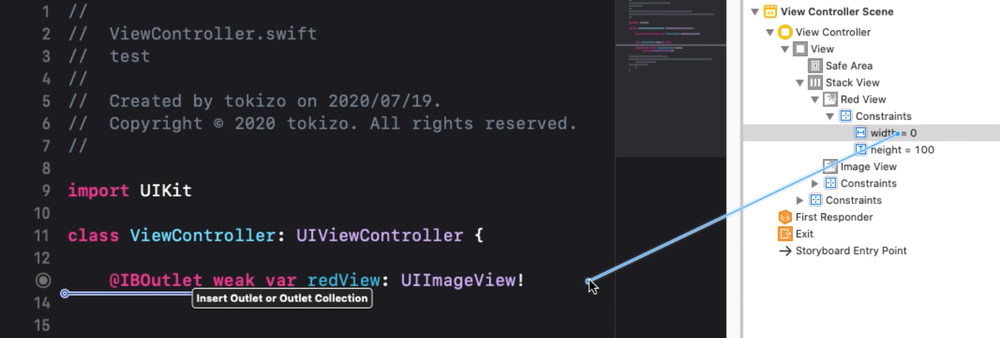
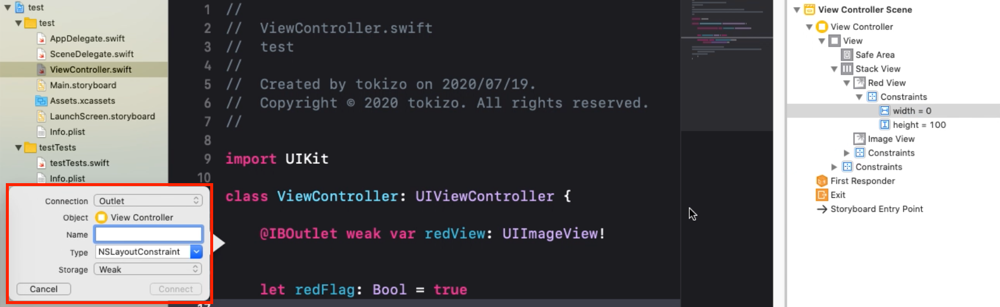
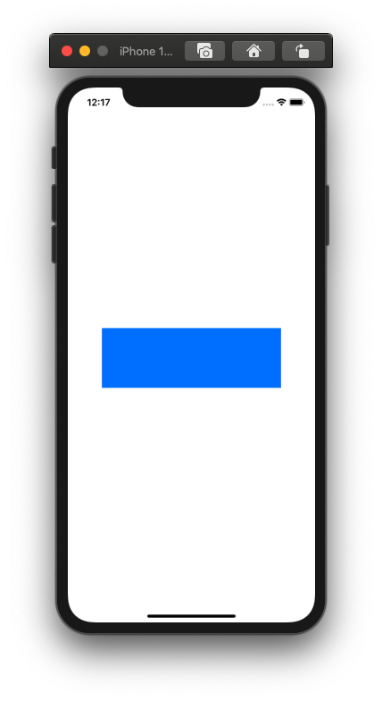
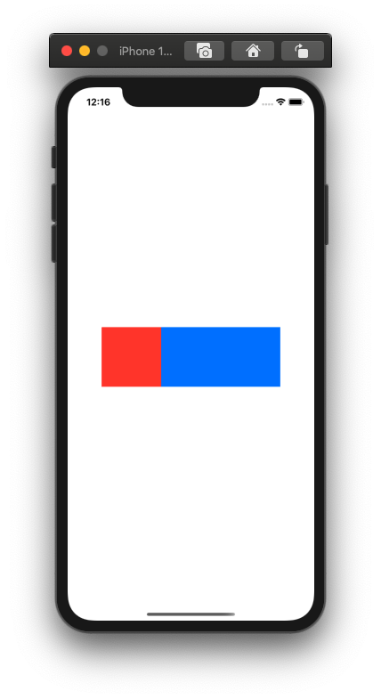

制約をOutlet接続してみる。  
<!--more-->  
  
## 制約をOutlet接続  
通常のUIパーツのOutlet接続と同様に行う。  
  
  
  
  
  
## 条件分岐で制約を変更  
  
## 事前準備  
Storyboard上でUIStackViewを配置。  
中にUIViewを2つ格納し、片方の width を0にする。  
  
## ベース  
  
```swift
import UIKit

class ViewController: UIViewController {
    
    @IBOutlet weak var redView: UIImageView!
    @IBOutlet weak var redViewWidthConstraints: NSLayoutConstraint!
    
    let redFlag: Bool = false
    
    override func viewDidLoad() {
        super.viewDidLoad()
        
        if redFlag {
            redViewWidthConstraints.constant = CGFloat(100)
        }
    }
}
```
  
  
  
## コード上から制約を変更  
`Bool` の変数の値に応じて `redView` の width を変更。

```swift
import UIKit

class ViewController: UIViewController {
    
    @IBOutlet weak var redView: UIImageView!
    @IBOutlet weak var redViewWidthConstraints: NSLayoutConstraint!
    
    let redFlag: Bool = true
    
    override func viewDidLoad() {
        super.viewDidLoad()
        
        if redFlag {
            redViewWidthConstraints.constant = CGFloat(100)
        }
    }
}
```
  
  
  
## 所感  
  
実装の幅が広がるなあ。  
  