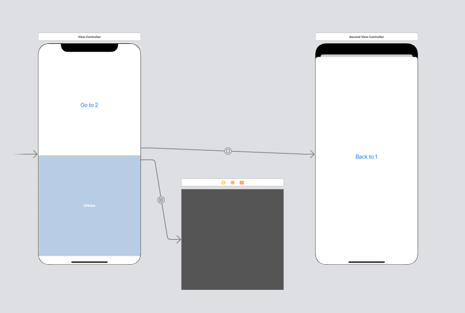
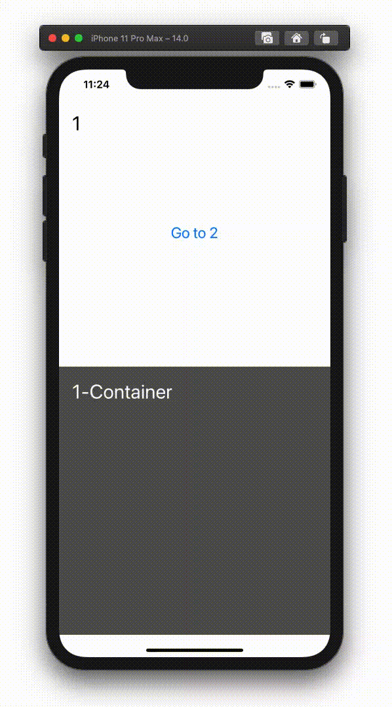

  
<!--more-->  
  
## 開発環境  
  
```bash
> xcodebuild -version
Xcode 12.0.1
Build version 12A7300
```
## 要約  
Q. 下記の条件で遷移を実行し、dismiss後の①でviewWillAppearなどのライフサイクルメソッドを強制的に呼んだ場合、①のContainerView内のViewControllerのライフサイクルメソッドは呼ばれる？
  
- 遷移元: ContainerViewを内包するVC（①）
- 遷移先: VC（②）
- 遷移順: ①→(ページシート)→②→(dismiss)→①
  
A. 呼ばれる。  
  
## Storyboard
  

  
左から、遷移元VC, ContainerView内のVC, 遷移先VC。  
  
## 遷移先から戻ったときにviewWillAppearが呼ばれない  
下記のようなページシートの遷移（遷移先のVCが完全に覆いかぶさらない遷移）の際、遷移元VCに戻った時にviewWillAppearなどのライフサイクルメソッドが呼ばれない。  
  
  
  
遷移元VCでライフサイクルメソッドを実行させるためには、遷移先VCのライフサイクルメソッド内で下記を呼ぶ必要がある。 [過去記事](https://tokizuoh.dev/posts/egmoxngp6yk2hh28/)  
  
- [beginAppearanceTransition()](https://developer.apple.com/documentation/uikit/uiviewcontroller/1621387-beginappearancetransition)  
- [endAppearanceTransition()](https://developer.apple.com/documentation/uikit/uiviewcontroller/1621503-endappearancetransition)  
  
## 遷移元VCがContainerViewを内包する際の挙動  
ContainerViewのように遷移元VC内で別のVCが存在し、[beginAppearanceTransition()](https://developer.apple.com/documentation/uikit/uiviewcontroller/1621387-beginappearancetransition), [endAppearanceTransition()](https://developer.apple.com/documentation/uikit/uiviewcontroller/1621503-endappearancetransition)を呼んだ際の挙動を見る。  
  
```swift
import UIKit

class SecondViewController: UIViewController {
    
    @IBOutlet weak var titleLabel: UILabel! {
        didSet {
            titleLabel.text = "2"
        }
    }
    
    override func viewDidLoad() {
        super.viewDidLoad()
    }
    
    override func viewWillAppear(_ animated: Bool) {
        presentingViewController?.beginAppearanceTransition(false, animated: animated)
        super.viewWillAppear(animated)
    }
    
    override func viewDidAppear(_ animated: Bool) {
        super.viewDidAppear(animated)
        presentingViewController?.endAppearanceTransition()
    }
    
    override func viewWillDisappear(_ animated: Bool) {
        super.viewWillDisappear(animated)
        presentingViewController?.beginAppearanceTransition(true, animated: animated)
        presentingViewController?.endAppearanceTransition()
        
    }
    
    @IBAction func backTo1(_ sender: Any) {
        self.dismiss(animated: true, completion: nil)
    }
    
}

```
  
遷移先のVCに上記のコードを加え、下記の遷移を実行すると、遷移元VCと遷移元VCのContainerView内のVCのライフサイクルメソッドが呼ばれた。  
  
- 遷移順：遷移先VC→(dismiss)→遷移元VC
  
## まとめ
下記の条件で遷移を実行し、dismiss後の①でviewWillAppearなどのライフサイクルメソッドを強制的に呼んだ場合、①のContainerView内のViewControllerのライフサイクルメソッドも呼ばれる。  
  
- 遷移元: ContainerViewを内包するVC（①）
- 遷移先: VC（②）
- 遷移順: ①→(ページシート)→②→(dismiss)→①
  
## 参考  
- [beginAppearanceTransition(_:animated:) | Apple Developer Documentation](https://developer.apple.com/documentation/uikit/uiviewcontroller/1621387-beginappearancetransition)  
- [endAppearanceTransition() | Apple Developer Documentation](https://developer.apple.com/documentation/uikit/uiviewcontroller/1621503-endappearancetransition)  
  