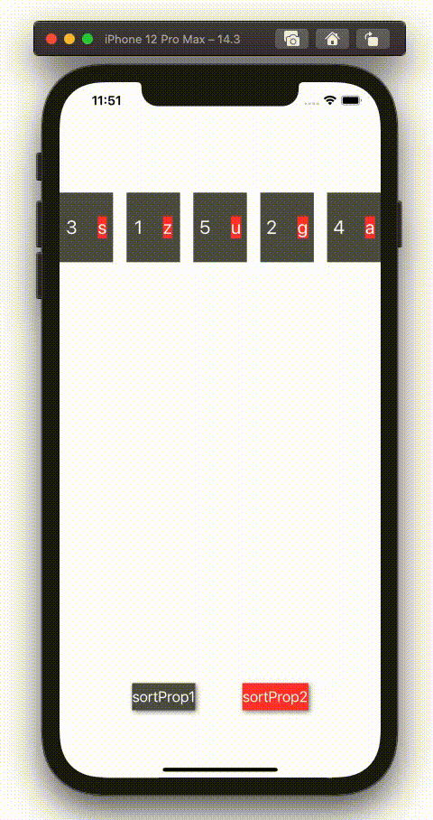

  
Swiftのsortは楽に書ける（気がする）。  
  
<!--more-->  
  
## 開発環境  
  
```bash
> xcodebuild -version
Xcode 12.3
Build version 12C33
```
  
## gif  
  
  
  
- 左のボタン押下で数字でソート(昇順)  
- 右のボタン押下で文字列でソート（昇順）  
  
## コード  
  
```swift
import UIKit

final class ViewController: UIViewController {
    @IBOutlet weak var collectionView: UICollectionView!
    @IBOutlet weak var sortProp1Button: UIButton! {
        didSet {
            sortProp1Button.layer.shadowColor = UIColor.black.cgColor
            sortProp1Button.layer.shadowOffset = CGSize(width: 2, height: 2)
            sortProp1Button.layer.shadowOpacity = 0.5
        }
    }
    @IBOutlet weak var sortProp2Button: UIButton! {
        didSet {
            sortProp2Button.layer.shadowColor = UIColor.black.cgColor
            sortProp2Button.layer.shadowOffset = CGSize(width: 2, height: 2)
            sortProp2Button.layer.shadowOpacity = 0.5
        }
    }
    
    struct ViewModel {
        let prop1: Int
        let prop2: String
    }
    
    private var viewModels: [ViewModel] = [
        ViewModel(prop1: 3, prop2: "s"),
        ViewModel(prop1: 1, prop2: "z"),
        ViewModel(prop1: 5, prop2: "u"),
        ViewModel(prop1: 2, prop2: "g"),
        ViewModel(prop1: 4, prop2: "a")
    ]
    
    override func viewDidLoad() {
        super.viewDidLoad()
        
        collectionView.register(UINib(nibName: "CustomCollectionViewCell", bundle: nil),
                                forCellWithReuseIdentifier: "customCollectionViewCell")
        collectionView.dataSource = self
        setCollectionViewLayout()
    }
    
    private func setCollectionViewLayout() {
        let layout = UICollectionViewFlowLayout()
        layout.itemSize = CGSize(width: view.bounds.width / 6,
                                 height: view.bounds.height / 10)
        collectionView.collectionViewLayout = layout
    }
    
    @IBAction func sortProp1(_ sender: Any) {
        viewModels.sort { (viewModel1, viewModel2) -> Bool in
            return viewModel1.prop1 < viewModel2.prop1
        }
        collectionView.reloadData()
    }
    @IBAction func sortProp2(_ sender: Any) {
        viewModels.sort { (viewModel1, viewModel2) -> Bool in
            return viewModel1.prop2 < viewModel2.prop2
        }
        collectionView.reloadData()
    }
    
}

extension ViewController: UICollectionViewDataSource {
    func collectionView(_ collectionView: UICollectionView, numberOfItemsInSection section: Int) -> Int {
        return viewModels.count
    }
    
    func collectionView(_ collectionView: UICollectionView, cellForItemAt indexPath: IndexPath) -> UICollectionViewCell {
        let cell = collectionView.dequeueReusableCell(withReuseIdentifier: "customCollectionViewCell",
                                                      for: indexPath) as! CustomCollectionViewCell
        cell.viewModel = viewModels[indexPath.row]
        return cell
    }
}

final class CustomCollectionViewCell: UICollectionViewCell {
    @IBOutlet weak var prop1Label: UILabel!
    @IBOutlet weak var prop2Label: UILabel!
    
    var viewModel: ViewController.ViewModel? {
        didSet {
            prop1Label.text = viewModel?.prop1.description ?? "-"
            prop2Label.text = viewModel?.prop2 ?? "-"
        }
    }
}
```
  
