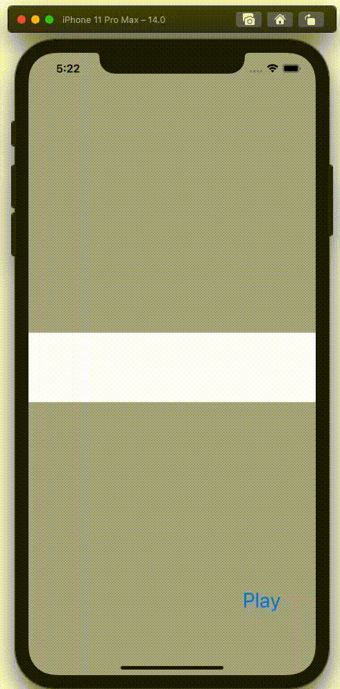

  
使っているアプリを見ていたら実装が思いつかなかった箇所があったので、手元で実装してみた。  
UIViewのanimateを初めて使った。  
  
<!--more-->  
  
## 開発環境  
  
```bash
> xcodebuild -version
Xcode 12.0.1
Build version 12A7300  
```
  
## GIF
  

  
## コード  
  
```swift
import UIKit

class ViewController: UIViewController {

    // 背景が白いView
    @IBOutlet weak var uiView: UIView!
    
    override func viewDidLoad() {
        super.viewDidLoad()
    }
    
    @IBAction func play(_ sender: Any) {
        
        // view1 (red)
        let view1 = UIView(frame: CGRect(x: 0,
                                         y: 0,
                                         width: 100,
                                         height: 100))
        view1.backgroundColor = .red
        self.uiView.addSubview(view1)
        view1.translatesAutoresizingMaskIntoConstraints = false
        view1.widthAnchor.constraint(equalToConstant: 100).isActive = true
        view1.heightAnchor.constraint(equalToConstant: 100).isActive = true
        view1.centerXAnchor.constraint(equalTo: self.uiView.centerXAnchor).isActive = true
        uiView.clipsToBounds = true  // 親View外の領域は描画しない
        let constraint = NSLayoutConstraint(item: view1,
                                            attribute: NSLayoutConstraint.Attribute.top,
                                            relatedBy: NSLayoutConstraint.Relation.equal,
                                            toItem: self.uiView,
                                            attribute: NSLayoutConstraint.Attribute.top,
                                            multiplier: 1.0,
                                            constant: self.uiView.bounds.height / 2 - 150)
        uiView.addConstraint(constraint)
        
        // view2 (blue)
        let view2 = UIView(frame: CGRect(x: 0,
                                         y: 0,
                                         width: 100,
                                         height: 100))
        view2.backgroundColor = .blue
        self.uiView.addSubview(view2)
        view2.translatesAutoresizingMaskIntoConstraints = false
        view2.widthAnchor.constraint(equalToConstant: 100).isActive = true
        view2.heightAnchor.constraint(equalToConstant: 100).isActive = true
        view2.centerXAnchor.constraint(equalTo: self.uiView.centerXAnchor).isActive = true
        let constraintView2 = NSLayoutConstraint(item: view2,
                                            attribute: NSLayoutConstraint.Attribute.top,
                                            relatedBy: NSLayoutConstraint.Relation.equal,
                                            toItem: self.uiView,
                                            attribute: NSLayoutConstraint.Attribute.top,
                                            multiplier: 1.0,
                                            constant: self.uiView.bounds.height / 2 - 50)
        uiView.addConstraint(constraintView2)
        
        UIView.animate(withDuration: 1.0,
                       delay: 0.0,
                       options: .curveLinear) {
            view1.center.y -= 100
            view2.center.y -= 100
        } completion: { _ in
            DispatchQueue.main.asyncAfter(deadline: .now() + 0.5) {
                // clipsToBoundsをtrueにしているので視認はできないが、ヒエラルキーには存在しているため消しておく
                view1.removeFromSuperview()
                
            }
        }
    }
}

```
  
コード上でview1(red), view2(blue)のAuto Layoutの制約をコードで書いた。  
yの位置がview1, view2でずらす必要があるため、垂直方向の制約だけ両方ともNSLayoutConstraintを使って設定した。  
  
## clipsToBoundsで描画されないUIViewは存在はしている
  
```swift
// UIView.animate completion内
DispatchQueue.main.asyncAfter(deadline: .now() + 0.5) {
    let allSubView = self.uiView.subviews  // 2 elements
    view1.removeFromSuperview()  
    let allSubView2 = self.uiView.subviews  // 1 element
}
```
  
clipsToBoundsで描画されず、視認できないUIViewはコード上やヒエラルキー上で存在が確認できるため、不要な場合は消しておく。  
  
## 参考  
- [clipsToBounds | Apple Developer Documentation](https://developer.apple.com/documentation/uikit/uiview/1622415-clipstobounds)  
  