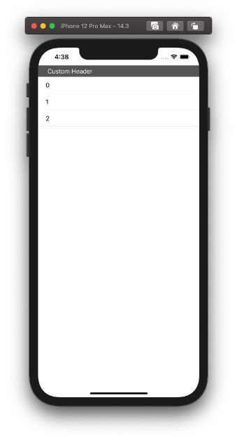
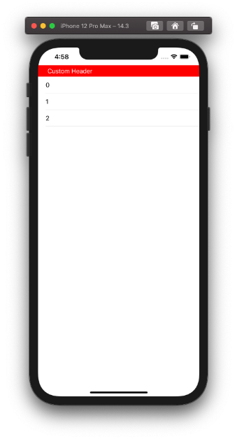

  
UIBackgroundConfigurationのおかげでかなり楽になった。  
  
<!--more-->  
  
## 開発環境  
  
```bash
> xcodebuild -version
Xcode 12.3
Build version 12C33
```
  
## スクリーンショット  
  
  
  
## コード  
  
```swift
import UIKit

final class ViewController: UIViewController {

    @IBOutlet weak var tableView: UITableView!
    
    override func viewDidLoad() {
        super.viewDidLoad()
        setupTableView()
    }
    
    private func setupTableView() {
        tableView.delegate = self
        tableView.dataSource = self
        tableView.tableFooterView = UIView(frame: .zero)
        tableView.register(UINib(nibName: String(describing: CustomTableViewHeaderView.self), bundle: nil),
                           forHeaderFooterViewReuseIdentifier: String(describing: CustomTableViewHeaderView.self))
    }
}

extension ViewController: UITableViewDelegate {
    func tableView(_ tableView: UITableView, viewForHeaderInSection section: Int) -> UIView? {
        guard let header = tableView.dequeueReusableHeaderFooterView(withIdentifier: String(describing: CustomTableViewHeaderView.self)) as? CustomTableViewHeaderView else {
            return nil
        }
        return header
    }
}

extension ViewController: UITableViewDataSource {
    func tableView(_ tableView: UITableView, numberOfRowsInSection section: Int) -> Int {
        return 3
    }
    
    func tableView(_ tableView: UITableView, cellForRowAt indexPath: IndexPath) -> UITableViewCell {
        let cell = UITableViewCell()
        cell.textLabel?.text = "\(indexPath.row)"
        return cell
    }
    
    func tableView(_ tableView: UITableView, heightForHeaderInSection section: Int) -> CGFloat {
        return 30
    }
}
```
  
　
  
```swift
import UIKit

final class CustomTableViewHeaderView: UITableViewHeaderFooterView {

    @IBOutlet weak var headerTitleTextLabel: UILabel! {
        didSet {
            headerTitleTextLabel.text = "Custom Header"
        }
    }

}
```
  
## UITableViewHeaderFooterViewの背景色の変更
xib上でUITableViewHeaderFooterViewの背景色を変更するとコンソールに下記が表示される。  
  
```bash
[TableView] Changing the background color of UITableViewHeaderFooterView is not supported. Use the background view configuration instead.
```
  
UITableViewHeaderFooterViewの背景色を変えるのではなく、`background view configuration` を使ってほしいとのこと。  
  
## background view configuration とは  
  
[UIBackgroundConfiguration](https://developer.apple.com/documentation/uikit/uibackgroundconfiguration)なるものがあるので使ってみる。  
  
> UIBackgroundConfiguration  
> A configuration that describes a specific background appearance.  
  
iOS14.0以上で使えるので割と新しめの機能。  
  
```swift
extension ViewController: UITableViewDelegate {
    func tableView(_ tableView: UITableView, viewForHeaderInSection section: Int) -> UIView? {
        guard let header = tableView.dequeueReusableHeaderFooterView(withIdentifier: String(describing: CustomTableViewHeaderView.self)) as? CustomTableViewHeaderView else {
            return nil
        }
        // 追加
        var backgroundConfiguration = UIBackgroundConfiguration.listPlainHeaderFooter()
        backgroundConfiguration.backgroundColor = .red
        header.backgroundConfiguration = backgroundConfiguration
        return header
    }
}
```
合わせてUITableViewHeaderFooterViewの背景色をdefaultに戻した。  
  
　
  
  
背景色を変更できたと同時に、ターミナル上の出力も消えていたのでおそらくこれが標準なのだろう。  
  
## 参考  
  
- [UIBackgroundConfiguration | Apple Developer Documentation](https://developer.apple.com/documentation/uikit/uibackgroundconfiguration)  
  