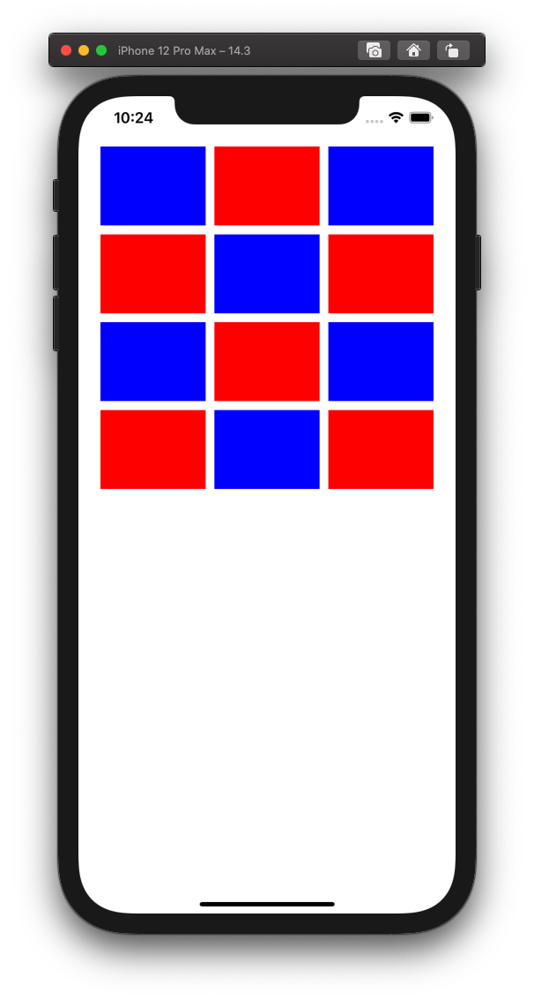

  
端末のサイズからセルの大きさを計算する。  
  
<!--more-->  
  
## 開発環境  
  
```bash
> xcodebuild -version
Xcode 12.3
Build version 12C33
```
  
## 無設定 (端末によって列数行数が異なる)  
  
| iPhone 12 Pro Max | iPhone SE 2nd gen | iPad Pro 4th gen |
| ---- | ---- | ---- |
|  |  |  |
  
```swift
import UIKit

class ViewController: UIViewController {
    
    @IBOutlet weak var collectionView: UICollectionView!
    
    override func viewDidLoad() {
        super.viewDidLoad()
        
        collectionView.dataSource = self
    }
    
}

extension ViewController: UICollectionViewDataSource {
    func collectionView(_ collectionView: UICollectionView, numberOfItemsInSection section: Int) -> Int {
        12
    }
    
    func collectionView(_ collectionView: UICollectionView, cellForItemAt indexPath: IndexPath) -> UICollectionViewCell {
        let cell = collectionView.dequeueReusableCell(withReuseIdentifier: "cell", for: indexPath)
        if indexPath.row % 2 == 0 {
            cell.backgroundColor = .blue
        } else {
            cell.backgroundColor = .red
        }
        return cell
    }
}
```
  
## セルサイズを親Viewから計算して設定  
  
| iPhone 12 Pro Max | iPhone SE 2nd gen | iPad Pro 4th gen |
| ---- | ---- | ---- |
|  |  |  |
  
```swift
import UIKit

class ViewController: UIViewController {

    @IBOutlet weak var collectionView: UICollectionView!

    private let sideMargin: CGFloat = 25
    private let itemPerWidth: CGFloat = 3
    private let itemSpacing: CGFloat = 10

    override func viewDidLoad() {
        super.viewDidLoad()

        collectionView.dataSource = self
        collectionView.delegate = self

        let layout = UICollectionViewFlowLayout()
        layout.sectionInset = UIEdgeInsets(top: 10,
                                           left: sideMargin,
                                           bottom: 10,
                                           right: sideMargin)
        layout.minimumInteritemSpacing = itemSpacing
        collectionView.collectionViewLayout = layout

    }


}

extension ViewController: UICollectionViewDataSource {
    func collectionView(_ collectionView: UICollectionView, numberOfItemsInSection section: Int) -> Int {
        12
    }

    func collectionView(_ collectionView: UICollectionView, cellForItemAt indexPath: IndexPath) -> UICollectionViewCell {
        let cell = collectionView.dequeueReusableCell(withReuseIdentifier: "cell", for: indexPath)
        if indexPath.row % 2 == 0 {
            cell.backgroundColor = .blue
        } else {
            cell.backgroundColor = .red
        }
        return cell
    }
}

extension ViewController: UICollectionViewDelegateFlowLayout {
    func collectionView(_ collectionView: UICollectionView, layout collectionViewLayout: UICollectionViewLayout, sizeForItemAt indexPath: IndexPath) -> CGSize {
        // セルの割当に利用可能なwidth
        // :親viewのwidth - 左右のマージン - セル間の水平方向の間隔 * (列数 - 1)
        let availableWidth = (view.frame.width - sideMargin * 2) - itemSpacing * (itemPerWidth - 1)

        // セル一つのwidth
        let width = availableWidth / itemPerWidth

        return CGSize(width: width, height: 50)
    }
}

```
  
## 比率を与えると見栄えがよくなる  
  
| iPhone 12 Pro Max | iPhone SE 2nd gen | iPad Pro 4th gen |
| ---- | ---- | ---- |
|  |  |  |
  
```swift
extension ViewController: UICollectionViewDelegateFlowLayout {
    func collectionView(_ collectionView: UICollectionView, layout collectionViewLayout: UICollectionViewLayout, sizeForItemAt indexPath: IndexPath) -> CGSize {
        let availableWidth = (view.frame.width - sideMargin * 2) - itemSpacing * (itemPerWidth - 1)
        let width = availableWidth / itemPerWidth
        
        // heightを変更
        return CGSize(width: width, height: width * 3 / 4)
    }
}
```
  
## 参考  
- [UICollectionViewDelegateFlowLayout | Apple Developer Documentation](https://developer.apple.com/documentation/uikit/uicollectionviewdelegateflowlayout)  