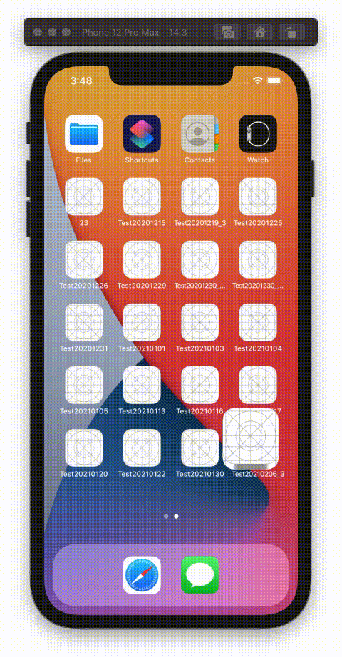

  
アニメーションさせたい年頃。  
  
<!--more-->  
  
## 開発環境  
```bash
> xcodebuild -version
Xcode 12.3
Build version 12C33
```
  
## ViewAnimator  
  
[ViewAnimator](https://github.com/marcosgriselli/ViewAnimator)  
  
> ViewAnimator is a library for building complex iOS UIView animations in an easy way. It provides one line animations for any view included the ones which contain other views like UITableView and UICollectionView with its cells or UIStackView with its arrangedSubviews.  
> [marcosgriselli/ViewAnimator: ViewAnimator brings your UI to life with just one line](https://github.com/marcosgriselli/ViewAnimator)  
  
UITableViewやUICollectionViewに対し、1行でアニメーションが実行できるようになるアニメーションライブラリ。  
  
## 最小構成  
  

  
## コード  
  
```swift
import UIKit
import ViewAnimator

class ViewController: UIViewController {
    
    @IBOutlet weak var collectionView: UICollectionView!
    
    private let sideMargin: CGFloat = 25
    private let horizontalMargin: CGFloat = 10
    private let columnCellCount: CGFloat = 3
    
    override func viewDidLoad() {
        super.viewDidLoad()
        collectionView.dataSource = self
        collectionView.delegate = self
        setCollectionViewInset()
    }
    
    private func setCollectionViewInset() {
        let layout = UICollectionViewFlowLayout()
        layout.sectionInset = UIEdgeInsets(top: 10,
                                           left: sideMargin,
                                           bottom: 0,
                                           right: sideMargin)
        layout.minimumLineSpacing = horizontalMargin
        collectionView.collectionViewLayout = layout
    }
}

extension ViewController: UICollectionViewDataSource {
    func collectionView(_ collectionView: UICollectionView,
                        numberOfItemsInSection section: Int) -> Int {
        return 9
    }
    
    func collectionView(_ collectionView: UICollectionView,
                        cellForItemAt indexPath: IndexPath) -> UICollectionViewCell {
        let cell = collectionView.dequeueReusableCell(withReuseIdentifier: "cell",
                                                      for: indexPath)
        cell.backgroundColor = .blue

        // ライブラリ使用箇所
        let animation = AnimationType.vector(CGVector(dx: 0, dy: 0))
        UIView.animate(views: collectionView.visibleCells,
                       animations: [animation],
                       duration: 0.3)
        return cell
    }
}

extension ViewController: UICollectionViewDelegateFlowLayout {
    func collectionView(_ collectionView: UICollectionView,
                        layout collectionViewLayout: UICollectionViewLayout,
                        sizeForItemAt indexPath: IndexPath) -> CGSize {
        let availableWidth = (view.bounds.width - sideMargin * 2) - horizontalMargin * (columnCellCount - 1)
        
        let cellWidth = availableWidth / columnCellCount
        return CGSize(width: cellWidth, height: cellWidth)
    }
}
```
  
## 回転  
  
  
  
## コード  
  
```swift
import UIKit
import ViewAnimator

class ViewController: UIViewController {
    
    @IBOutlet weak var collectionView: UICollectionView!
    
    private let sideMargin: CGFloat = 25
    private let horizontalMargin: CGFloat = 10
    private let columnCellCount: CGFloat = 3
    
    override func viewDidLoad() {
        super.viewDidLoad()
        collectionView.dataSource = self
        collectionView.delegate = self
        setCollectionViewInset()
    }
    
    // 追加
    override func viewDidAppear(_ animated: Bool) {
        super.viewDidAppear(animated)
        let animation = AnimationType.rotate(angle: CGFloat.pi / 6)
        UIView.animate(views: collectionView.visibleCells(in: 0),
                       animations: [animation],
                       delay: 0,
                       duration: 2)
    }
    
    private func setCollectionViewInset() {
        let layout = UICollectionViewFlowLayout()
        layout.sectionInset = UIEdgeInsets(top: 10,
                                           left: sideMargin,
                                           bottom: 0,
                                           right: sideMargin)
        layout.minimumLineSpacing = horizontalMargin
        collectionView.collectionViewLayout = layout
    }
}

extension ViewController: UICollectionViewDataSource {
    func collectionView(_ collectionView: UICollectionView,
                        numberOfItemsInSection section: Int) -> Int {
        return 9
    }
    
    func collectionView(_ collectionView: UICollectionView,
                        cellForItemAt indexPath: IndexPath) -> UICollectionViewCell {
        let cell = collectionView.dequeueReusableCell(withReuseIdentifier: "cell",
                                                      for: indexPath)
        cell.backgroundColor = .blue
        return cell
    }
}

extension ViewController: UICollectionViewDelegateFlowLayout {
    func collectionView(_ collectionView: UICollectionView,
                        layout collectionViewLayout: UICollectionViewLayout,
                        sizeForItemAt indexPath: IndexPath) -> CGSize {
        let availableWidth = (view.bounds.width - sideMargin * 2) - horizontalMargin * (columnCellCount - 1)
        
        let cellWidth = availableWidth / columnCellCount
        return CGSize(width: cellWidth, height: cellWidth)
    }
}
```
  
アニメーションの記述位置はUICollectionViewDataSourceのメソッド内か、ライフサイクルメソッド内かで好みが分かれそう。  
  
## 参考  
  
- [marcosgriselli/ViewAnimator: ViewAnimator brings your UI to life with just one line](https://github.com/marcosgriselli/ViewAnimator)  
  