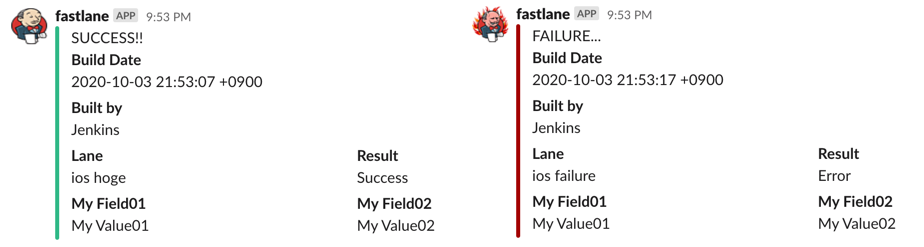

  
fastlaneでのslack通知が標準搭載らしく、触ってみたかった。  
<!--more-->  
  
## fastlaneとは  
  
> fastlane is the easiest way to automate beta deployments and releases for your iOS and Android apps. (from [fastlane docs](https://docs.fastlane.tools/))
  
fastlaneは、iOSおよびAndroidアプリ開発における必要な作業を支援するツール。  
  
今回はslack通知のみを試してみる。  
  
## 実行  
  
#### Gemfile生成  
  
```bash
> bundle init
```
  
　
  
#### Gemfile編集  
```ruby
# froze
source "https://rubygems.org"

# gem "rails"
gem "fastlane"
```
  
　
  
#### Gemfileに記載した依存関係のインストール  
  
```bash
> sudo bundle install 
```
  
　
  
#### fastlaneの初期化  
  
```bash
> fastlane init       
```
  
　
  
#### Fastfile編集
  
```
lane :success do
  slack(
    message: "SUCCESS!!",
    icon_url: "https://www.jenkins.io/images/logos/jenkins/jenkins.png",
    slack_url: "{SLACK_WEBHOOK_URL}",
    success: true,
    payload: {
      "Build Date" => Time.new.to_s,
      "Built by" => "Jenkins",
    },
    attachment_properties: {
      fields: [
        {
          title: "My Field01",
          value: "My Value01",
          short: true
        },
        {
          title: "My Field02",
          value: "My Value02",
          short: true
        },
      ]
    }
  )
end

lane :failure do
  slack(
    message: "FAILURE...",
    icon_url: "https://www.jenkins.io/images/logos/fire/fire.png",
    slack_url: "{SLACK_WEBHOOK_URL}",
    success: false,
    payload: {
      "Build Date" => Time.new.to_s,
      "Built by" => "Jenkins",
    },
    attachment_properties: {
      fields: [
        {
          title: "My Field01",
          value: "My Value01",
          short: true
        },
        {
          title: "My Field02",
          value: "My Value02",
          short: true
        },
      ]
    }
  )
end

lane :hoge do
  if rand(0...10) % 2 == 0 then
    success
  else
    failure
  end
end

```
  
　
  
- Rubyの文法で記述可能  
- laneは関数やメソッドみたいに、それぞれの内部で使い回すことが可能  
- SlackのWebhook URLは [ここ](https://slack.com/services/new/incoming-webhook) から取得  
  
　
  
#### laneの実行  
  
```bash
> bundle exec fastlane hoge
```
  
　
  
  
  
## 参考  
- [Jenkins Artwork](https://www.jenkins.io/artwork/)  
- [fastlane docs](https://docs.fastlane.tools/)  
- [slack - fastlane docs](https://docs.fastlane.tools/actions/slack/)  
- [Incoming WebHooks | Slack](https://slack.com/services/new/incoming-webhook)  
  