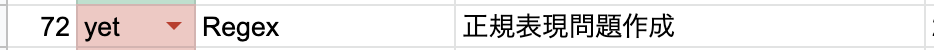
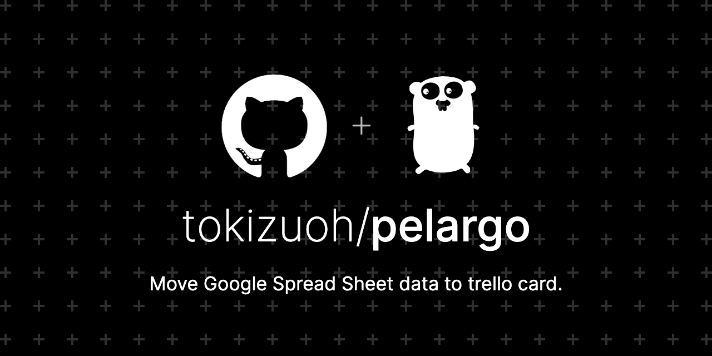

  
Go でこういうツール作るの慣れてきた。  
  
<!--more-->  
  
- [Google Spread Sheet](https://www.google.com/intl/ja_jp/sheets/about/)  
- [Trello](https://Trello.com/ja): タスク管理ツール  
  
## 開発環境  
  
```bash
> docker --version
Docker version 19.03.12, build 48a66213fe

> docker-compose --version
docker-compose version 1.27.2, build 18f557f9
```
  
## つくったもの
  
|  Google スプレッドシート  |  Trello カード  |
| ---- | ---- |
|    |    |
  
Google スプレッドシートのデータを Trello のカードとして起票するツールを作った。  
  
## コード  
  

  
https://github.com/tokizuoh/pelargo  
  

## 処理手順
  
1. Sheets API を使ってスプレッドシートを取得。各言語の Guide ([Go quickstart](https://developers.google.com/sheets/api/quickstart/go) など) に沿って進める  
2. 1で取得した値をもとに Trello のカードとして、起票する  
  
Trello のカードの起票は [adlio/trello](https://github.com/adlio/trello) を使用した。 Go製の Trello APIラッパー。  
  
## 参考  
  
- [Google スプレッドシート - オンラインでスプレッドシートを作成、編集できる無料サービス](https://www.google.com/intl/ja_jp/sheets/about/)  
- [Trello](https://Trello.com/ja)  
- [Go Quickstart  |  Sheets API  |  Google Developers](https://developers.google.com/sheets/api/quickstart/go)  
- [adlio/trello: Trello API wrapper for Go](https://github.com/adlio/trello)  
  