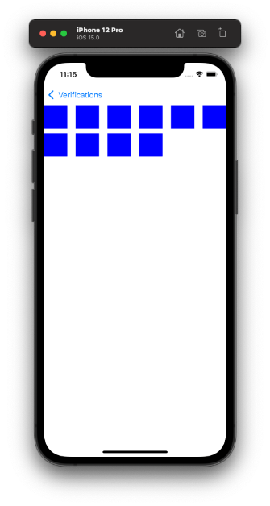
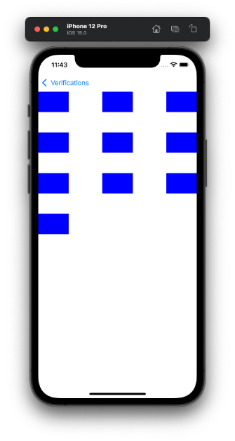
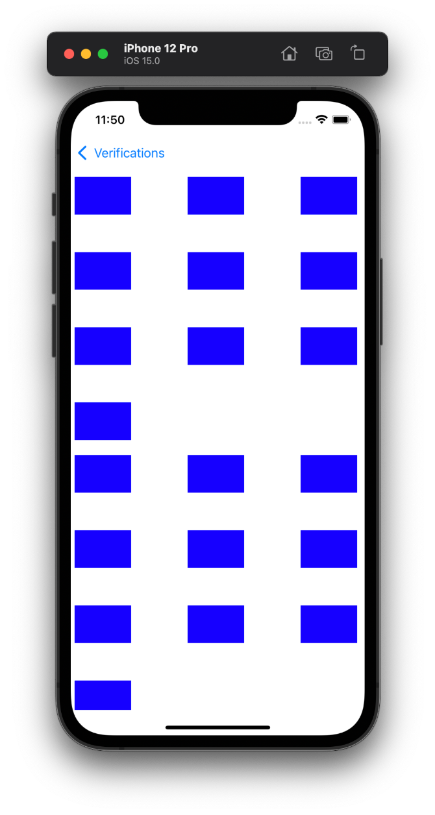

  
iOSDC 2021 楽しかった。  
<!--more-->  
  
iOSDC 2021 で 2021/09/19 (日) に発表があった、[ケースに応じたUICollectionViewのレイアウト実装パターン](https://fortee.jp/iosdc-japan-2021/proposal/dae86b07-b55c-449f-bdf1-72acf578d11a) を見て、今まで自分はなんとなく UICollectionViewFlowLayout を使っていたのでは？ と感じたので改めて使ってみる。  
  
## 開発環境  
  
```bash
> xcodebuild -version
Xcode 13.0
Build version 13A233
```
  
この記事から Xcode 13 RC を使っている。  
12 -> 13 でかなり UI に変更があったみたい。  
Swiftファイルのロゴアイコンが結構好き。  
  
## 最小構成

  
　
  
```swift
import UIKit

final class FlowLayoutViewController: UIViewController {

    @IBOutlet weak var collectionView: UICollectionView! {
        didSet {
            collectionView.dataSource = self
            collectionView.collectionViewLayout = UICollectionViewFlowLayout()
        }
    }

    private let itemCount: Int = 10

    override func viewDidLoad() {
        super.viewDidLoad()
    }

}

extension FlowLayoutViewController: UICollectionViewDataSource {

    func collectionView(_ collectionView: UICollectionView, numberOfItemsInSection section: Int) -> Int {
        return itemCount
    }

    func collectionView(_ collectionView: UICollectionView, cellForItemAt indexPath: IndexPath) -> UICollectionViewCell {
        let cell = collectionView.dequeueReusableCell(withReuseIdentifier: R.reuseIdentifier.flowLayoutCell.identifier,
                                                      for: indexPath)
        cell.backgroundColor = .blue
        return cell
    }

}
```
  
セルのサイズなどは UICollectionViewFlowLayout にて、デフォルトで設定された値が反映される。  
  
## セルのサイズ、セル間の距離を変える
  
  
  
　
  
```swift
import UIKit

final class FlowLayoutViewController: UIViewController {

    @IBOutlet weak var collectionView: UICollectionView! {
        didSet {
            func configureLayout() -> UICollectionViewLayout {
                let layout = UICollectionViewFlowLayout()
                layout.itemSize = .init(width: 75, height: 50)
                layout.minimumInteritemSpacing = 75  // 水平方向
                layout.minimumLineSpacing = 50  // 垂直方向
                return layout
            }

            collectionView.dataSource = self
            collectionView.collectionViewLayout = configureLayout()
        }
    }

    private let itemCount: Int = 10

    override func viewDidLoad() {
        super.viewDidLoad()
    }

}

extension FlowLayoutViewController: UICollectionViewDataSource {

    func collectionView(_ collectionView: UICollectionView, numberOfItemsInSection section: Int) -> Int {
        return itemCount
    }

    func collectionView(_ collectionView: UICollectionView, cellForItemAt indexPath: IndexPath) -> UICollectionViewCell {
        let cell = collectionView.dequeueReusableCell(withReuseIdentifier: R.reuseIdentifier.flowLayoutCell.identifier,
                                                      for: indexPath)
        cell.backgroundColor = .blue
        return cell
    }

}
```
  
## セクションのinset
  

  
```swift
import UIKit

final class FlowLayoutViewController: UIViewController {

    @IBOutlet weak var collectionView: UICollectionView! {
        didSet {
            func configureLayout() -> UICollectionViewLayout {
                let layout = UICollectionViewFlowLayout()
                layout.itemSize = .init(width: 75, height: 50)
                layout.minimumInteritemSpacing = 75
                layout.minimumLineSpacing = 50
                layout.sectionInset = .init(top: 10,
                                            left: 5,
                                            bottom: 10,
                                            right: 10)
                return layout
            }

            collectionView.dataSource = self
            collectionView.collectionViewLayout = configureLayout()
        }
    }

    private let itemCount: Int = 10

    override func viewDidLoad() {
        super.viewDidLoad()
    }

}

extension FlowLayoutViewController: UICollectionViewDataSource {

    func numberOfSections(in collectionView: UICollectionView) -> Int {
        return 3
    }

    func collectionView(_ collectionView: UICollectionView, numberOfItemsInSection section: Int) -> Int {
        return itemCount
    }

    func collectionView(_ collectionView: UICollectionView, cellForItemAt indexPath: IndexPath) -> UICollectionViewCell {
        let cell = collectionView.dequeueReusableCell(withReuseIdentifier: R.reuseIdentifier.flowLayoutCell.identifier,
                                                      for: indexPath)
        cell.backgroundColor = .blue
        return cell
    }

}
```
  
## UICollectionViewFlowLayout の使いどき
  
- セルのサイズが固定のとき
- セクション別でレイアウトを組む必要がないとき（= 単一のセクションのみ or 複数セクションで同じレイアウト のとき）  
  
UICollectionViewFlowLayout、意外と実装者側でカスタムできる箇所が少ない。  
シンプルな一覧画面などを作る際は重宝しそう。  
  
## 参考  
  
- [ケースに応じたUICollectionViewのレイアウト実装パターン by to4iki | トーク | iOSDC Japan 2021 #iosdc - fortee.jp](https://fortee.jp/iosdc-japan-2021/proposal/dae86b07-b55c-449f-bdf1-72acf578d11a)  
- [UICollectionViewFlowLayout | Apple Developer Documentation](https://developer.apple.com/documentation/uikit/uicollectionviewflowlayout)  
  