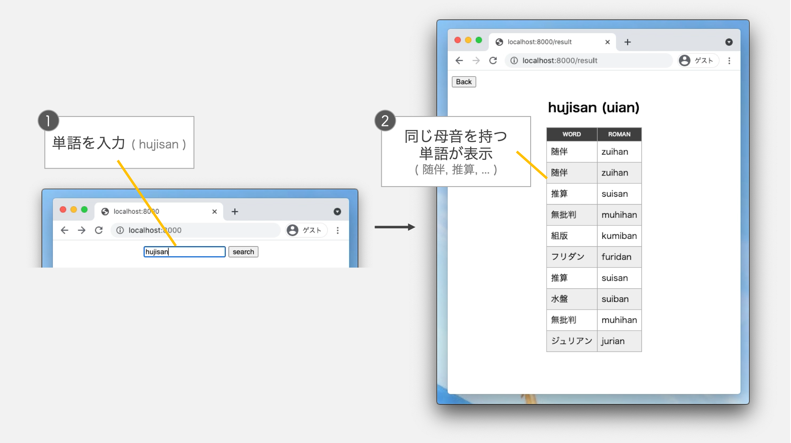
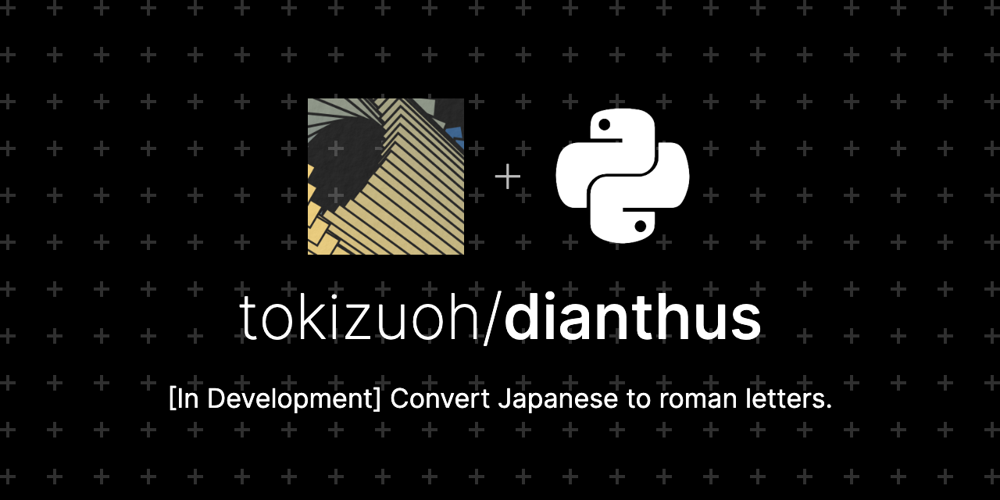
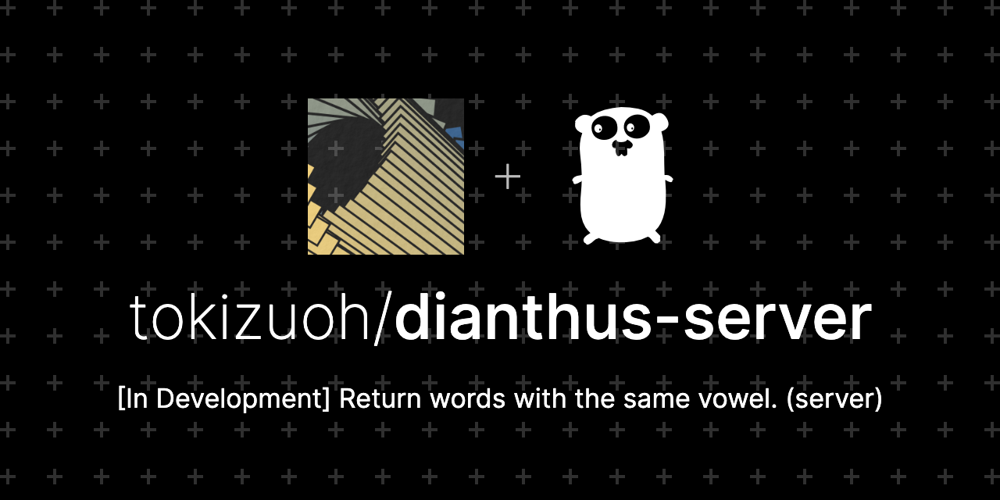
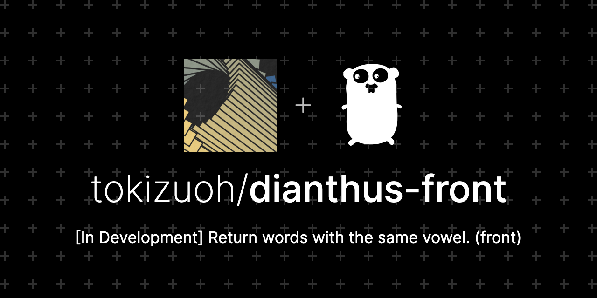
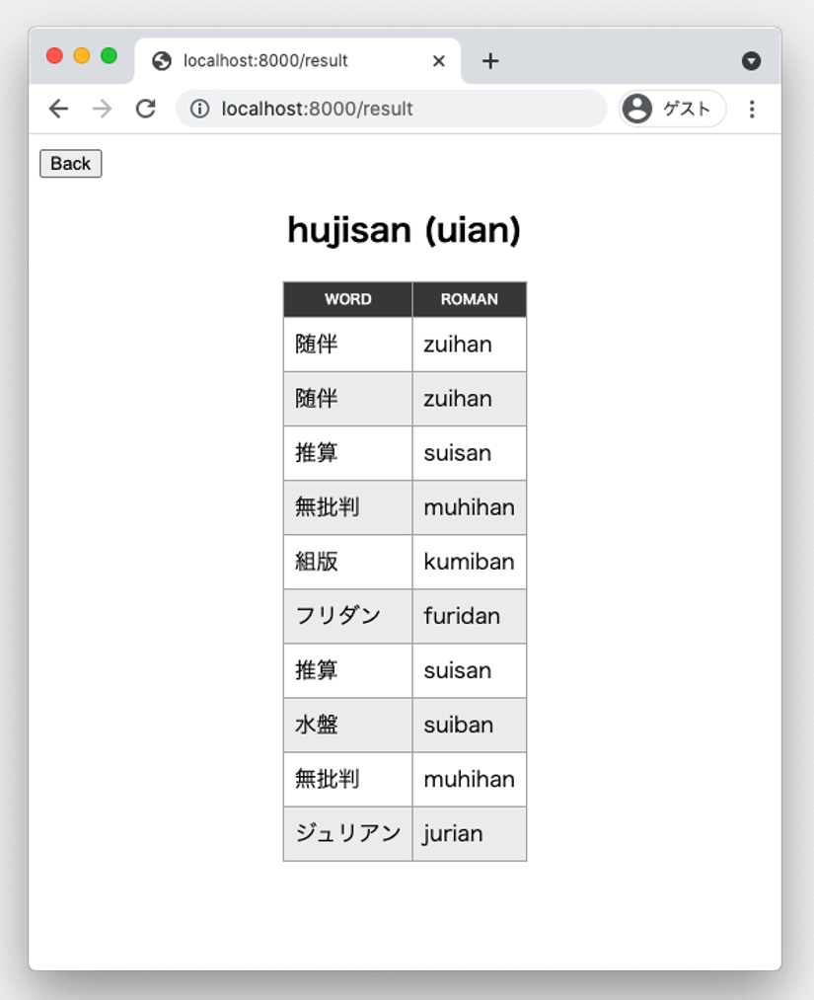

  
これでいつでも韻を踏める。  
  
<!--more-->  
  
前回 > [指定した単語と同じ母音を持つ単語を返すツール を開発中
](https://tokizuoh.dev/posts/zyi34tdy6a77bfoa/)  
  
## つくったもの
  
  
  
## 構成
  
3つのリポジトリから成る。  
  
- CSV 生成
- APIサーバー
- フロントエンドサーバー
  
## CSV 生成
ここでのみ Python を使用。  
  

  
https://github.com/tokizuoh/dianthus  
  
1. [日本語 Wordnet](http://compling.hss.ntu.edu.sg/wnja/) から日本語の単語を抽出
2. 各単語を [pykakasi](https://github.com/miurahr/pykakasi) を使ってローマ字に変換
3. 日本語の単語とローマ字の対応を1行とした CSV ファイルを生成
4. Firebase Storage に CSV ファイルをアップロード
  
　
  
```
155288,頭金,atamakin,aaain
155289,どうにかこうにか,dounikakounika,ouiaouia
155290,大砲,taihou,aiou
155291,スチーム,suchiimu,uiiu
155293,マーティニ,maateini,aaeii
155294,検閲官,ken'etsukan,eneuan
155295,シャイラー,shairaa,aiaa
155296,イベリア,iberia,ieia
155301,ゾーリンゲン,zooringen,ooinen
155303,院長,inchou,inou
```
  
上記のようなフォーマットの CSV ファイルがアップロードされる。  
  
## APIサーバー
  
ここからは Go を使用。  
  
  
  
https://github.com/tokizuoh/dianthus-server  
  
1. GET リクエストで文字列 (target) をクエリとして受け取る
2. target の母音を抽出
3. Firebase Storage の CSV を取得
4. 3 の中から、 2 と同じ母音を持つ単語を抽出
5. 4 をレスポンスとして返す
  
　
  
```
> curl -u user:pass “localhost:8080/v1/roman?target=amana” | jq .
  % Total    % Received % Xferd  Average Speed   Time    Time     Time  Current
                                 Dload  Upload   Total   Spent    Left  Speed
100  7003    0  7003    0     0   175k      0 --:--:-- --:--:-- --:--:--  175k
[
  {
    “raw”: “矢玉“,
    “roman”: “yatama”,
    “vowels”: “aaa”
  },
  {
    “raw”: “バーバ“,
    “roman”: “baaba”,
    “vowels”: “aaa”
  },
  {
    “raw”: “蛇腹“,
    “roman”: “jabara”,
    “vowels”: “aaa”
  }
]
```
  
GET時に "amana" を指定した場合、上記のフォーマットでレスポンスを返す。  
  
## フロントエンドサーバー  
  

  
  
  
https://github.com/tokizuoh/dianthus-front
  
1. [echo](https://github.com/labstack/echo) を使って入力フォームを持つ HTML ファイルを表示  
2. HTML 上で ユーザーが単語を入力し、search ボタンが押下される
3. HTML 上で入力された単語をクエリとして、APIサーバー（前述）に GET リクエストを送信  
4. レスポンスとして返ってきた 2 で入力された単語と、同じ母音を持つ単語を HTML ファイル としてレンダリング
5. 4 を表示
  
　
  
  
2で "hujisan" を指定したときの 5。  
  
## 所感  
  
- 母音抽出の「な行」がイレギュラー。「ん」と「な行」の識別が必要だった。
- docker-compose 間のコンテナの接続に時間がかかった。ドキュメントをよく読もう。

## 課題  
  
- 単語の重複削除
- CSV の DB化: 検索速度の向上のため。
- APIサーバーの認証強化: 現在はBasic認証。セキュリティレベルを向上させるため。
  
## 参考  
  
- [日本語 Wordnet](http://compling.hss.ntu.edu.sg/wnja/)  
- [miurahr/pykakasi: Lightweight converter from Japanese Kana-kanji sentences into Kana-Roman.](https://github.com/miurahr/pykakasi)  
- [labstack/echo: High performance, minimalist Go web framework](https://github.com/labstack/echo)  
- [Echo - High performance, minimalist Go web framework](https://echo.labstack.com/)  
- [network inspect — Docker-docs-ja 19.03 ドキュメント](https://docs.docker.jp/engine/reference/commandline/network_inspect.html)  
  
