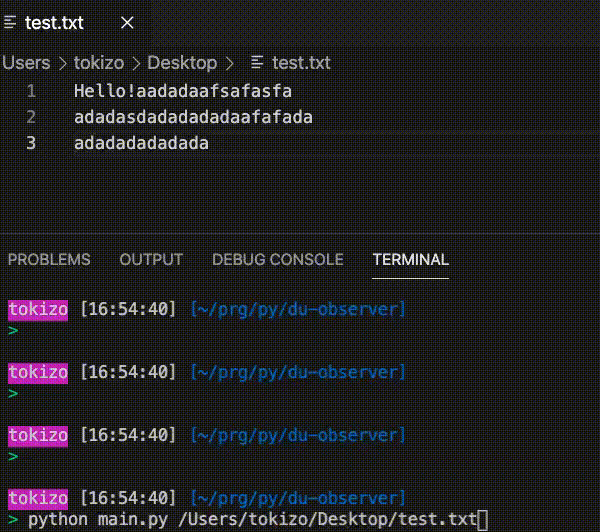

  
<!--more-->  
  
## 開発環境  
  
```bash
> python -V
Python 3.8.5
```
  
## gif  
  
  
  
## コード  
  
```python
import os
import sys
import time
import signal
import datetime

input_file_path = ""


def main():
    args = sys.argv

    if len(args) < 2:
        print("対象ファイルのパスを入力してください")
        return
    
    # グローバル変数の再代入
    global input_file_path
    input_file_path = args[1]
    if not os.path.exists(input_file_path):
        print("パスの入力形式が正しくありません")
        return
    
    interval = int(input("- ファイル容量を監視する間隔(s): "))
    print()
    
    # 定期実行
    signal.signal(signal.SIGALRM, scheculer)
    signal.setitimer(signal.ITIMER_REAL, interval, interval)
    time.sleep(interval * 1000)


def scheculer(arg1, arg2):
    now = datetime.datetime.fromtimestamp(time.time())
    now_formatted = now.strftime("%Y/%m/%d %H:%M:%S")
    file_size = os.path.getsize(input_file_path)
    print("{}  {}B".format(now_formatted,file_size))


if __name__ == "__main__":
    main()
```
  
## 参考  
  
- [Pythonで定周期で実行する方法と検証 - Qiita](https://qiita.com/montblanc18/items/05715730d99d450fd0d3)  
    - シグナルハンドラを使った定期実行について参考にさせていただきました。  
  