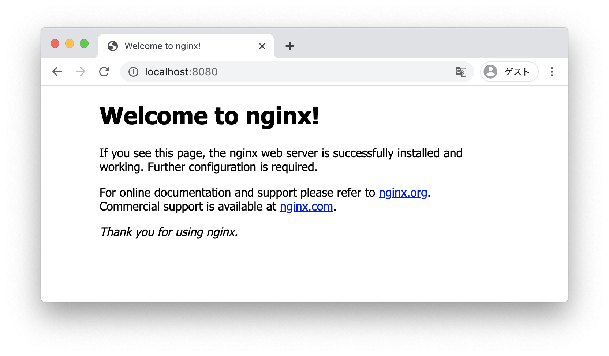
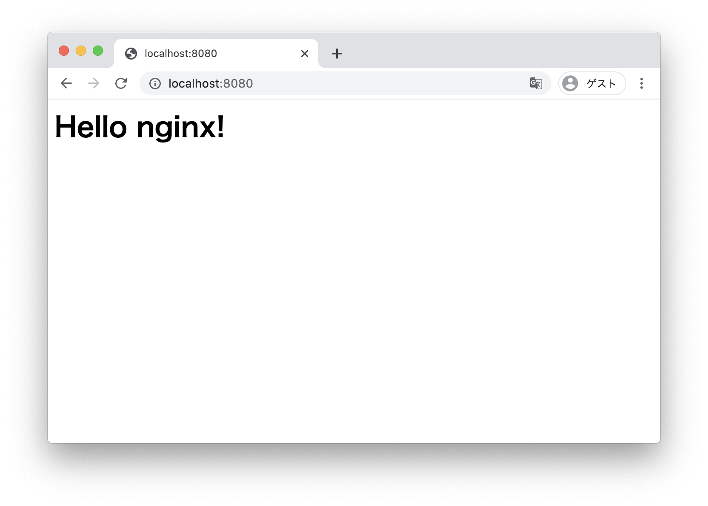

  
Dockerを習得していきたい。  
  
<!--more-->  
  
## バインドマウントとは  
ホストマシン上のファイルやディレクトリをコンテナ上に**マウント**する。  
（ホストマシン上でファイル編集を行った際に、コンテナ内へコピーする必要がない）  
  
## 開発環境  
  
```bash
> docker --version
Docker version 19.03.12, build 48a66213fe

> docker image inspect nginx
..., "NGINX_VERSION=1.19.2", ...
```
  
nginxは `docker pull nginx` でlatestのイメージを使用。  
  
## nginxのコンテナを起動してみる  
  
バインドマウントは一旦置いておいて、pullしたnginxのイメージを使ってコンテナを起動。  
  
```bash
docker run --name test-nginx -d -p 8080:80 nginx
```
  
　
  
|オプション|内容|備考|
|----|---------------|:----------------------------------------------------------------------|
|name|コンテナ名       |-                                                                      |
|d   |デタッチド       |コンテナをバックグラウンドで起動。指定しないとターミナルがコンテナのログに専有される。|
|p   |ポートのマッピング|-p 8080:80 （ホストマシンの8080ポートをコンテナの80ポートにマップ）             |
  
　
  
  
  
## バインドマウント  
  
ホストマシンのhtmlファイルをコンテナ内にマウント。  
あらかじめホストマシン上でhtmlという名のディレクトリを作成し、その配下にhtmlファイルを配置。  
  
```bash
docker run --name test-nginx-2 -v ~/html/:/usr/share/nginx/html:ro -d -p 8080:80 nginx
```
  
　
  
|オプション|内容|備考|
|----|---------------|:----------------------------------------------------------------------|
|v|ボリュームのマウント|ホストマシンのディレクトリをコンテナ内にマウント。`ro`を加えることで読み込み専用ボリュームとしてマウント。|
  
　
  
  
  
## nginxを停止すると？  
  
```bash
> docker exec -i -t test-nginx bash
  
root@6{CONTAINER ID}:/# nginx -s stop
```
  
コンテナ内でnginxを停止させると、コンテナ自体も停止する。  
  
## 参考  
- [バインドマウントの利用 | Docker ドキュメント](https://matsuand.github.io/docs.docker.jp.onthefly/storage/bind-mounts/)  
- [Docker run リファレンス — Docker-docs-ja 17.06 ドキュメント](https://docs.docker.jp/engine/reference/run.html#detached-vs-foreground)  