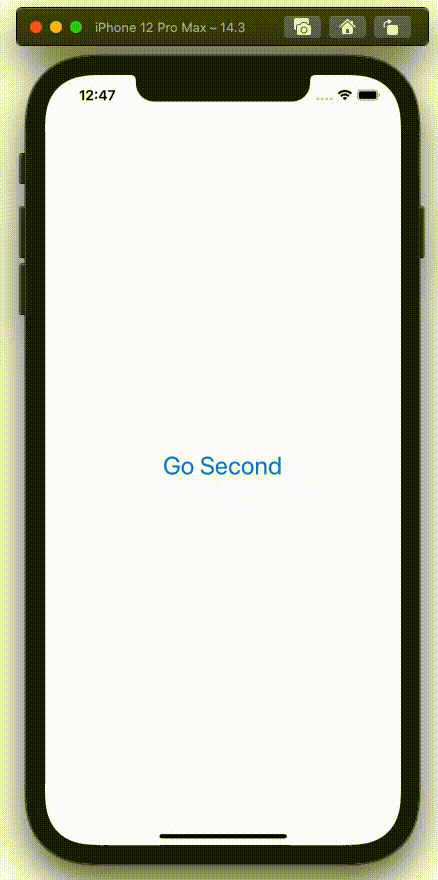
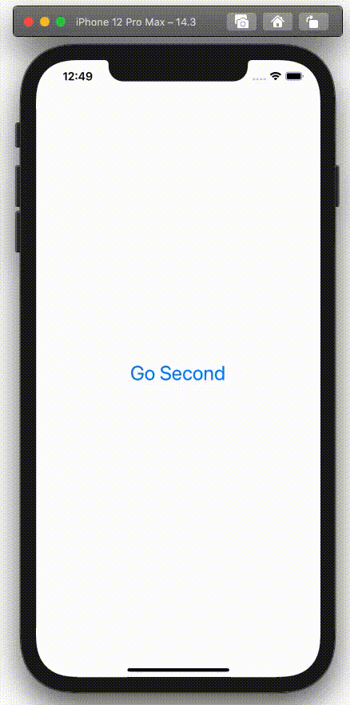

  
アニメーション系はおわりが見えない。  
  
<!--more-->  
  
## 開発環境  
  
```bash
> xcodebuild -version
Xcode 12.3
Build version 12C33
```
  
## UIViewControllerの遷移アニメーションのカスタム  
  
UIViewController の遷移アニメーションのカスタムにあたって、[UIViewControllerAnimatedTransitioning](https://developer.apple.com/documentation/uikit/uiviewcontrolleranimatedtransitioning) を使った。  
  
> A set of methods for implementing the animations for a custom view controller transition.  
> [UIViewControllerAnimatedTransitioning](https://developer.apple.com/documentation/uikit/uiviewcontrolleranimatedtransitioning)  
  
UIViewControllerAnimatedTransitioning はカスタムな view controller の遷移アニメーションを実装するための一連のメソッドを提供する。  
  
## gif
  
  
  
#### 比較
  
| 設定なし | カスタム (本記事の内容) |
| --- | --- |
|  |  |
  
## コード
  
```swift
// ViewController.swift
import UIKit

class ViewController: UIViewController {

    override func viewDidLoad() {
        super.viewDidLoad()
    }

    @IBAction func goSecond(_ sender: Any) {
        let vc = storyboard?.instantiateViewController(withIdentifier: "second") as! SecondViewController
        vc.modalPresentationStyle = .fullScreen
        present(vc, animated: true, completion: nil)
    }
}
```
  
　
  
```swift
// SecondViewController.swift
import UIKit

class SecondViewController: UIViewController {

    override func viewDidLoad() {
        super.viewDidLoad()

        transitioningDelegate = self
    }
    
    @IBAction func close(_ sender: Any) {
        dismiss(animated: true, completion: nil)
    }
}

extension SecondViewController: UIViewControllerTransitioningDelegate {
    
    func animationController(forPresented presented: UIViewController, presenting: UIViewController, source: UIViewController) -> UIViewControllerAnimatedTransitioning? {
        return AnimationTransitioning(animationType: .present)
    }
    
    func animationController(forDismissed dismissed: UIViewController) -> UIViewControllerAnimatedTransitioning? {
        return AnimationTransitioning(animationType: .dismiss)
    }
}
```
  
　
  
```swift
// AnimationTransitioning.swift
import UIKit

final class AnimationTransitioning: NSObject, UIViewControllerAnimatedTransitioning {
        
    private let animationType: AnimationType
    
    enum AnimationType {
        case present
        case dismiss
    }
    
    init(animationType: AnimationType) {
        self.animationType = animationType
    }
    
    func transitionDuration(using transitionContext: UIViewControllerContextTransitioning?) -> TimeInterval {
        0.5
    }
    
    func animateTransition(using transitionContext: UIViewControllerContextTransitioning) {
        guard let to = transitionContext.viewController(forKey: .to),
              let from = transitionContext.viewController(forKey: .from) else {
            transitionContext.completeTransition(false)
            return
        }
        
        switch animationType {
        case .present:
            transitionContext.containerView.addSubview(to.view)
            presentAnimation(with: transitionContext, viewToAnimate: to.view)
        case .dismiss:
            transitionContext.containerView.addSubview(to.view)
            transitionContext.containerView.addSubview(from.view)
            dismissAnimation(with: transitionContext, viewToAnimate: from.view)
        }
    }
   
   private func presentAnimation(with transitionContext: UIViewControllerContextTransitioning, viewToAnimate: UIView) {
        viewToAnimate.clipsToBounds = true
        viewToAnimate.transform = CGAffineTransform(scaleX: 0.2, y: 0.2)
        UIView.animate(withDuration: transitionDuration(using: transitionContext),
                       delay: 0.0,
                       usingSpringWithDamping: 100.0,
                       initialSpringVelocity: 0.1,
                       options: .curveEaseOut) {
            viewToAnimate.transform = CGAffineTransform(scaleX: 1.0, y: 1.0)
        } completion: { finised in
            transitionContext.completeTransition(finised)
        }
    }
    
    private func dismissAnimation(with transitionContext: UIViewControllerContextTransitioning, viewToAnimate: UIView) {
        UIView.animateKeyframes(withDuration: transitionDuration(using: transitionContext),
                                delay: 0.0,
                                options: .calculationModeLinear) {
            UIView.addKeyframe(withRelativeStartTime: 0.0,
                               relativeDuration: 0.5) {
                viewToAnimate.transform = CGAffineTransform(scaleX: 0.0, y: 0.0)
            }
        } completion: { (finised) in
            transitionContext.completeTransition(finised)
        }
    }
}
```
  
## 参考  
  
- [UIViewControllerAnimatedTransitioning | Apple Developer Documentation](https://developer.apple.com/documentation/uikit/uiviewcontrolleranimatedtransitioning)  
- [animateKeyframes(withDuration:delay:options:animations:completion:) | Apple Developer Documentation](https://developer.apple.com/documentation/uikit/uiview/1622552-animatekeyframes)  
- [addKeyframe(withRelativeStartTime:relativeDuration:animations:) | Apple Developer Documentation](https://developer.apple.com/documentation/uikit/uiview/1622554-addkeyframe)  
  