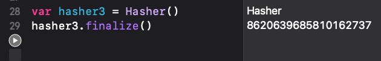

  
Arrayの差分確認、シンプルなので個人の癖が出る。  
  
<!--more-->  
  
## 開発環境  
  
```bash
> xcodebuild -version
Xcode 13.0
Build version 13A233
```
  
## 前提
  
```swift
struct CustomStruct {
    let name: String
}

var a1: [CustomStruct] = stride(from: 0, to: 1000, by: 1).compactMap {
    return .init(name: $0.description)
}

var a2: [CustomStruct] = stride(from: 0, to: 1000, by: 1).compactMap {
    return .init(name: $0.description)
}

var a3: [CustomStruct] = stride(from: 0, to: 2000, by: 2).compactMap {
    return .init(name: $0.description)
}
```
  
ユーザー定義の構造体を要素に持つArrayの差分確認を行う。  
Arrayともう一方のArrayに含まれる要素が完全に一致するか確認できればOK。  
単純比較(O(N^2)) などあるが、今回はSwiftライクに書いてみる。  
  
## 1. Equatable を準拠させて比較
  
```swift
struct CustomStruct: Equatable {
    let name: String
}

...

print(a1 == a2)  // true
print(a2 == a3) // false
```
  
構造体に Equatable を準拠させて比較。  
かなりシンプルに書ける。これで十分。  
  
## 2. Hashable を準拠させてハッシュ値を生成し比較
  
```swift
struct CustomStruct: Hashable {
    let name: String
}

... 

var hasher1 = Hasher()
hasher1.combine(a1)
hasher1.finalize() // 6303833638181181639

var hasher2 = Hasher()
hasher2.combine(a2)
hasher2.finalize() // 6303833638181181639

var hasher3 = Hasher()
hasher3.combine(a3)
hasher3.finalize() // -7034783640522885626
```
  
　
  
> Never call finalize() on hasher. Doing so may become a compile-time error in the future.  
> [hash(into:) | Apple Developer Documentation](https://developer.apple.com/documentation/swift/hashable/2995575-hash)  
  
finalize() は将来的にコンパイルエラーになるかもしれないとのこと。  
  
　
  
> Finalizing consumes the hasher: it is illegal to finalize a hasher you don’t own, or to perform operations on a finalized hasher. (These may become compile-time errors in the future.)   
> [finalize() | Apple Developer Documentation](https://developer.apple.com/documentation/swift/hasher/2995580-finalize)  
  
所有していない Hasher を finalize() することは違法らしい。想定しない、が日本語的にしっくりきそう。  
  

  
あくまで将来の話で、現時点ではコンパイルエラーにならない。  
  
　
  
また、ハッシュ値は複数環境下で等しいことが保証されないので、UserDefaults に保存して将来的に再利用することは意味を持たない。  
  
## 3. Hashable を準拠させてSetに入れて比較
  
```swift
struct CustomStruct: Hashable {
    let name: String
}

...

let set1 = Set(a1.compactMap {$0})
let set2 = Set(a2.compactMap {$0})
let set3 = Set(a3.compactMap {$0})

print(set1 == set2)  // true
print(set2 == set3)  // false

```
  
  
この記事を書くまではこれが真っ先に思いついていた。  
1の方がシンプルなのでこれからは1を使っていく。  
  
## 参考  
  
- [Equatable | Apple Developer Documentation](https://developer.apple.com/documentation/swift/equatable)  
- [finalize() | Apple Developer Documentation](https://developer.apple.com/documentation/swift/hasher/2995580-finalize)  
  
