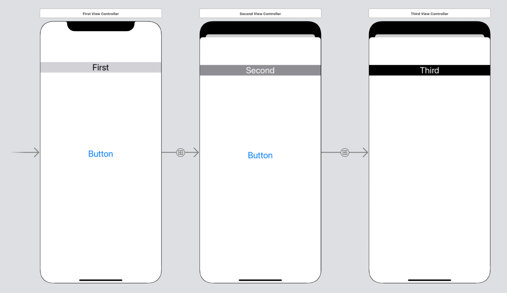

  
iOS13のModel遷移後ではVCをDismissする際に、遷移前VCのライフサイクルメソッド(viewWillAppearなど)が呼ばれない。  
<!--more-->  
  
対策の一つとして、[こちら](https://techblog.recochoku.jp/7215)で紹介されている下記メソッドを遷移先VCの各ライフサイクルメソッド内に埋め込む方法がある。  
- [beginAppearanceTransition(_:animated:)](https://developer.apple.com/documentation/uikit/uiviewcontroller/1621387-beginappearancetransition)  
- [endAppearanceTransition()](https://developer.apple.com/documentation/uikit/uiviewcontroller/1621503-endappearancetransition)  
  
埋め込んだ際のライフサイクルメソッドの実行順を見ていく。  
  
## 開発環境
  
```bash
> xcodebuild -version 
Xcode 12.0.1
Build version 12A7300
```
  
## Storyboard
  

  
Segue kind: show  
  
## コード
  
#### FirstViewController (Secondも同様)  
  
```swift
import UIKit

class FirstViewController: UIViewController {
    
    override func viewDidLoad() {
        super.viewDidLoad()
        // Do any additional setup after loading the view.
    }
    
    override func viewWillAppear(_ animated: Bool) {
        super.viewWillAppear(animated)
        debugPrint("1️⃣: viewWillAppear")
    }
    
    override func viewDidAppear(_ animated: Bool) {
        super.viewDidAppear(animated)
        debugPrint("1️⃣: viewDidAppear")
    }
    
    override func viewWillDisappear(_ animated: Bool) {
        super.viewWillDisappear(animated)
        debugPrint("1️⃣: viewWillDisappear")
    }
    
}
```
  
　
  
#### ThirdViewController
  
```swift
import UIKit

class ThirdViewController: UIViewController {

    override func viewDidLoad() {
        super.viewDidLoad()

        // Do any additional setup after loading the view.
    }
    

    override func viewWillAppear(_ animated: Bool) {
        presentingViewController?.beginAppearanceTransition(false, animated: animated)
        super.viewWillAppear(animated)
        debugPrint("3️⃣: viewWillAppear")
    }
    
    override func viewDidAppear(_ animated: Bool) {
        super.viewDidAppear(animated)
        debugPrint("3️⃣: viewDidAppear")
        presentingViewController?.endAppearanceTransition()
    }
    
    override func viewWillDisappear(_ animated: Bool) {
        super.viewWillDisappear(animated)
        debugPrint("3️⃣: viewWillDisappear")
        presentingViewController?.beginAppearanceTransition(true, animated: animated)
        presentingViewController?.endAppearanceTransition()
        
    }
}
```
  
## 出力  
  
```bash
"1️⃣: viewWillAppear"
"1️⃣: viewDidAppear"
--- [FirstVC >>> SecondVC] ---
"💕: viewWillAppear"
"💕: viewDidAppear"
--- [SecondVC >>> ThirdVC] ---
"💕: viewWillDisappear"
"3️⃣: viewWillAppear"
"3️⃣: viewDidAppear"
--- [SecondVC <<< ThirdVC] ---
"3️⃣: viewWillDisappear"
"💕: viewWillAppear"
"💕: viewDidAppear"
```
  
  
## 参考
- [iOS13のModal遷移はデフォルトだとDismiss時に遷移元のviewWillAppear等が呼ばれない | レコチョクのエンジニアブログ](https://techblog.recochoku.jp/7215)  
- [beginAppearanceTransition(_:animated:) | Apple Developer Documentation](https://developer.apple.com/documentation/uikit/uiviewcontroller/1621387-beginappearancetransition)  
- [endAppearanceTransition() | Apple Developer Documentation](https://developer.apple.com/documentation/uikit/uiviewcontroller/1621503-endappearancetransition)  