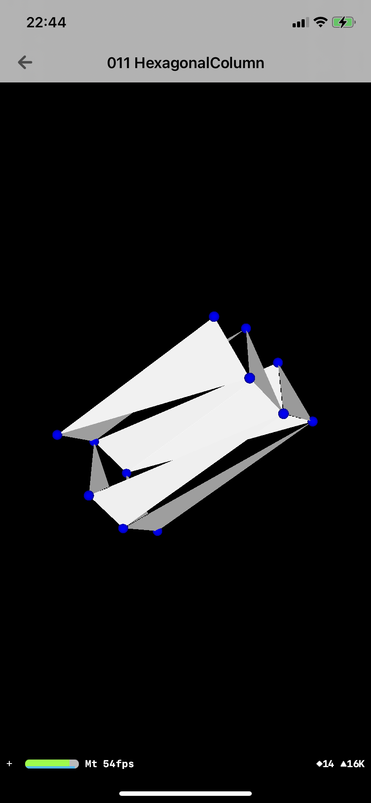

  
描画系は目に見えるので楽しい。  
<!--more-->  
  
## 開発環境  
  
```bash
> xcodebuild -version
Xcode 12.3
Build version 12C33
```
  
## やること
  
- SceneKit を使って六角柱を描画する
  
## つくったもの  
  
|  スクリーンショット  |  gif  |
| ---- | ---- |
|    |    |
  
面の貼り方が悪かったのか、スカスカに見える（見る方向によって歯抜けの位置が異なる...）  
  
## コード  
  
```swift
private func configureHexagonalColumn() {
    let sceneView = SCNView()
    sceneView.backgroundColor = .black
    sceneView.autoenablesDefaultLighting = true
    sceneView.allowsCameraControl = true
    sceneView.showsStatistics = true
    self.view = sceneView

    let scene = SCNScene()
    sceneView.scene = scene

    let node = SCNNode()
    node.camera = SCNCamera()
    node.position = SCNVector3(1.5, 1.5, 30)
    scene.rootNode.addChildNode(node)

    let vertices = [
        SCNVector3(1, 0, 2),  // 0
        SCNVector3(2, 0, 2),  // 1
        SCNVector3(0, 1, 2),  // 2
        SCNVector3(3, 1, 2),  // 3
        SCNVector3(1, 2, 2),  // 4
        SCNVector3(2, 2, 2),  // 5
        SCNVector3(1, 0, -2), // 6
        SCNVector3(2, 0, -2), // 7
        SCNVector3(0, 1, -2), // 8
        SCNVector3(3, 1, -2), // 9
        SCNVector3(1, 2, -2), // 10
        SCNVector3(2, 2, -2)  // 11

    ]

    let indices: [Int32] = [
        // 底面
        0, 2, 4,
        0, 1, 4,
        1, 4, 5,
        1, 3, 5,

        6, 8, 10,
        6, 7, 10,
        7, 10, 11,
        7, 9, 11,

        // 側面
        4, 5, 10,
        5, 10, 11,

        3, 5, 11,
        3, 9, 11,

        1, 3, 7,
        3, 7, 9,

        0, 1, 6,
        1, 6, 7,

        0, 2, 8,
        0, 6, 8,

        2, 4, 8,
        4, 8, 10
    ]

    let geometorySource = SCNGeometrySource(vertices: vertices)
    let geometryElement = SCNGeometryElement(indices: indices, primitiveType: .triangles)
    let geometory = SCNGeometry(sources: [geometorySource], elements: [geometryElement])
    scene.rootNode.addChildNode(SCNNode(geometry: geometory))

    for vector in vertices {
        let sphear = SCNSphere(radius: 0.1)
        sphear.materials.first?.diffuse.contents = UIColor.blue

        let node = SCNNode(geometry: sphear)
        node.position = vector

        scene.rootNode.addChildNode(node)
    }
}
```
