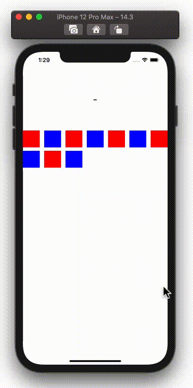

  
複数項目に対して処理を行う際に便利な、UICollectionViewを用いたセル選択を実装してみた。  
  
<!--more-->  
  
## 開発環境  
  
```bash
> xcodebuild -version
Xcode 12.3
Build version 12C33
```
  
## gif  
  
  
  
## コード  
  
```swift
import UIKit

class ViewController: UIViewController {
    
    @IBOutlet weak var selectedCellLabel: UILabel!
    @IBOutlet weak var collectionView: UICollectionView!
    
    private struct SelectedCellStore {
        var nowCellNumber: Int?
        var beforeOneCellNumber: Int?
    }
    
    private var selectedCellStore = SelectedCellStore(nowCellNumber: nil,
                                                      beforeOneCellNumber: nil)
    
    override func viewDidLoad() {
        super.viewDidLoad()
        
        collectionView.dataSource = self
        collectionView.delegate = self
        
        // 初期値（セルが選択されていない状態）
        selectedCellLabel.text = "-"
    }
}

extension ViewController: UICollectionViewDataSource {
    func collectionView(_ collectionView: UICollectionView, numberOfItemsInSection section: Int) -> Int {
        return 10
    }
    
    func collectionView(_ collectionView: UICollectionView, cellForItemAt indexPath: IndexPath) -> UICollectionViewCell {
        let cell = collectionView.dequeueReusableCell(withReuseIdentifier: "cell",
                                                      for: indexPath)
        cell.backgroundColor = (indexPath.row % 2 == 0 ? .red : .blue)
        return cell
    }
}

extension ViewController: UICollectionViewDelegate {
    func collectionView(_ collectionView: UICollectionView, didHighlightItemAt indexPath: IndexPath) {
        // セルの番号の更新
        updateSelectedCellStore(cellNumber: indexPath.row)
        selectedCellLabel.text = selectedCellStore.nowCellNumber?.description
        
        // セル選択時に最後に選択したセルと同じだった場合は非選択状態に
        if selectedCellStore.nowCellNumber == selectedCellStore.beforeOneCellNumber {
            let cell = collectionView.cellForItem(at: indexPath)!
            if cell.alpha == 1.0 {
                cell.alpha = 0.25
            } else {
                cell.alpha = 1.0
                selectedCellLabel.text = "-"
            }
        } else {
            let nowSelectedCell = collectionView.cellForItem(at: indexPath)!
            nowSelectedCell.alpha = 0.25
            
            if let beforeOneCellNumber = selectedCellStore.beforeOneCellNumber {
                let beforeOneSelectedCell = collectionView.cellForItem(at: IndexPath(row: beforeOneCellNumber,
                                                                                     section: 0))!
                beforeOneSelectedCell.alpha = 1.0
            }
        }
    }
    
    private func updateSelectedCellStore(cellNumber: Int) {
        selectedCellStore.beforeOneCellNumber = selectedCellStore.nowCellNumber
        selectedCellStore.nowCellNumber = cellNumber
    }
}
```
  