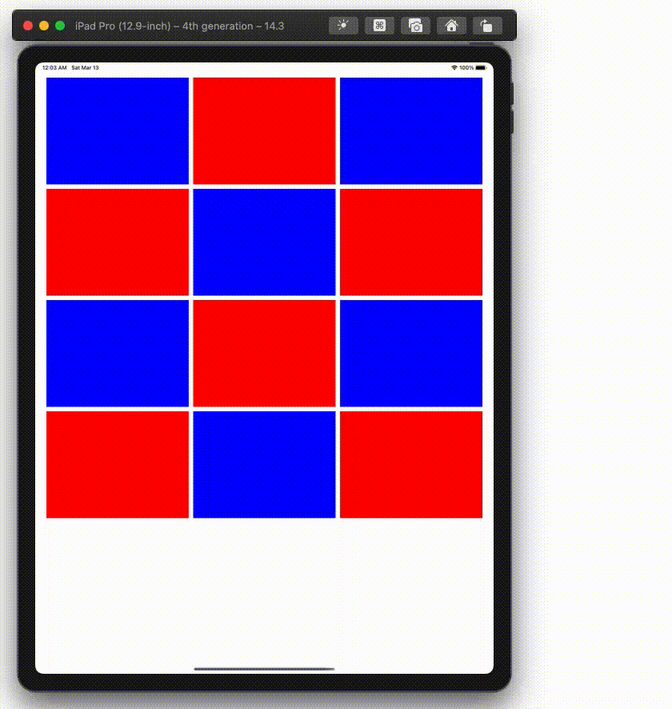

  
回転系は色々対処方法がある。  
  
<!--more-->  
  
## 開発環境  
  
```bash
> xcodebuild -version
Xcode 12.3
Build version 12C33
```
  
## 回転後のレイアウト修正
  
UICollectionView を持つ画面を回転させた時、回転後の画面サイズでレイアウトを組み直すことがある。  
どのタイミングでレイアウトを組み直すのか、結構悩ましい。  
  
対応策として、下記が挙げられる。（厳密にはタイミングが違うが…）  
  
- [viewWillTransition(to:with:)](https://developer.apple.com/documentation/uikit/uicontentcontainer/1621466-viewwilltransition) で UIViewController のライフサイクルに乗せて解決  
- [orientationDidChangeNotification](https://developer.apple.com/documentation/uikit/uidevice/1620025-orientationdidchangenotification) を使ってイベント通知受け取り時に解決  
- [UICollectionViewFlowLayout](https://developer.apple.com/documentation/uikit/uicollectionviewflowlayout) で UICollectionView 内で解決  
  
今回は **UICollectionViewFlowLayout** を使って回転後のレイアウト計算を行う。  
  
## gif
  
  
  
## コード
  
```swift
// ViewController.swift
import UIKit

final class ViewController: UIViewController {
    
    @IBOutlet weak var collectionView: UICollectionView!
    
    private let verticalMargin: CGFloat = 10
    private let sideMargin: CGFloat = 25
    private let itemPerWidth: CGFloat = 3
    private let itemSpacing: CGFloat = 10
    
    override func viewDidLoad() {
        super.viewDidLoad()
        setupCollectionView()
    }
    
    private func setupCollectionView() {
        collectionView.dataSource = self
        collectionView.delegate = self
        let layout = CustomFlowLayout()
        layout.sectionInset = UIEdgeInsets(top: verticalMargin,
                                           left: sideMargin,
                                           bottom: verticalMargin,
                                           right: sideMargin)
        layout.minimumInteritemSpacing = itemSpacing
        collectionView.collectionViewLayout = layout
    }
}

extension ViewController: UICollectionViewDataSource {
    func collectionView(_ collectionView: UICollectionView, numberOfItemsInSection section: Int) -> Int {
        return 12
    }
    
    func collectionView(_ collectionView: UICollectionView, cellForItemAt indexPath: IndexPath) -> UICollectionViewCell {
        let cell = collectionView.dequeueReusableCell(withReuseIdentifier: "cell",
                                                      for: indexPath)
        cell.backgroundColor = indexPath.row % 2 == 0 ? .blue : .red
        return cell
    }
}

extension ViewController: UICollectionViewDelegateFlowLayout {
    func collectionView(_ collectionView: UICollectionView, layout collectionViewLayout: UICollectionViewLayout, sizeForItemAt indexPath: IndexPath) -> CGSize {
        let availableWidth = (view.frame.width - sideMargin * 2) - itemSpacing * (itemPerWidth - 1)
        let width = availableWidth / itemPerWidth
        return CGSize(width: width, height: width * 3 / 4)
    }
}
```
  
　
  
```swift
// CustomFlowLayout.swift
import UIKit
  
final class CustomFlowLayout: UICollectionViewFlowLayout {
    override func shouldInvalidateLayout(forBoundsChange newBounds: CGRect) -> Bool {
        guard let collectionView = collectionView,
              collectionView.bounds != newBounds else {
            return super.shouldInvalidateLayout(forBoundsChange: newBounds)
        }
        return true
    }
    
    override func invalidationContext(forBoundsChange newBounds: CGRect) -> UICollectionViewLayoutInvalidationContext {
        let context = super.invalidationContext(forBoundsChange: newBounds)
        guard let collectionView = collectionView,
              let invalidationContext = context as? UICollectionViewFlowLayoutInvalidationContext,
              collectionView.bounds != newBounds else {
            return context
        }
        
        let oldBounds = collectionView.bounds
        // しっかり計算しよう
        invalidationContext.contentSizeAdjustment = CGSize(width: newBounds.width - oldBounds.width,
                                                           height: newBounds.height - oldBounds.height)
        invalidationContext.invalidateFlowLayoutDelegateMetrics = true
        return context
    }
}
```
  
　
  
```swift
// しっかり計算しよう
invalidationContext.contentSizeAdjustment = CGSize(width: newBounds.width - oldBounds.width,
                                                   height: newBounds.height - oldBounds.height)
```
  
[contentSizeAdjustment](https://developer.apple.com/documentation/uikit/uicollectionviewlayoutinvalidationcontext/1617763-contentsizeadjustment?language=objc) で回転前と回転後の画面サイズの差分を設定する。  
本コードは適当に書いたが、実際にはsectionやsection内のセルの個数を使って計算する。  
  
## 参考  
  
- [viewWillTransition(to:with:) | Apple Developer Documentation](https://developer.apple.com/documentation/uikit/uicontentcontainer/1621466-viewwilltransition)  
- [orientationDidChangeNotification | Apple Developer Documentation](https://developer.apple.com/documentation/uikit/uidevice/1620025-orientationdidchangenotification)  
- [contentSizeAdjustment | Apple Developer Documentation](https://developer.apple.com/documentation/uikit/uicollectionviewlayoutinvalidationcontext/1617763-contentsizeadjustment?language=objc)  
  