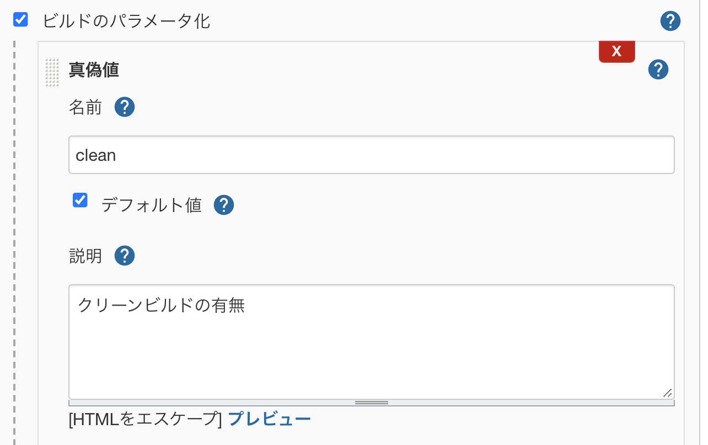
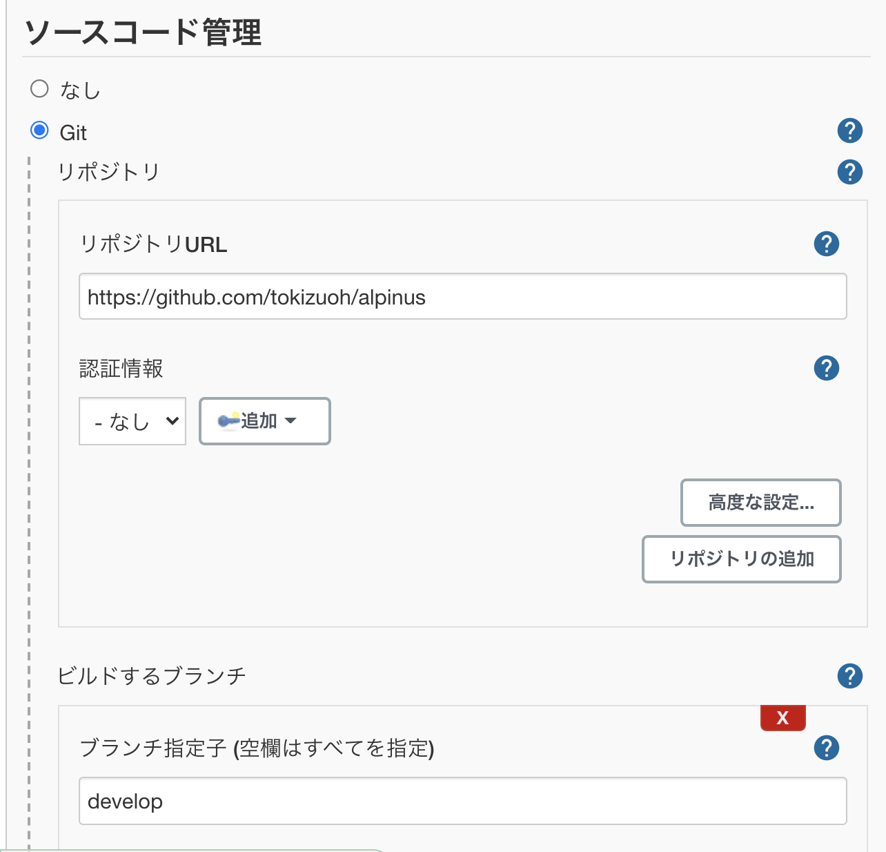
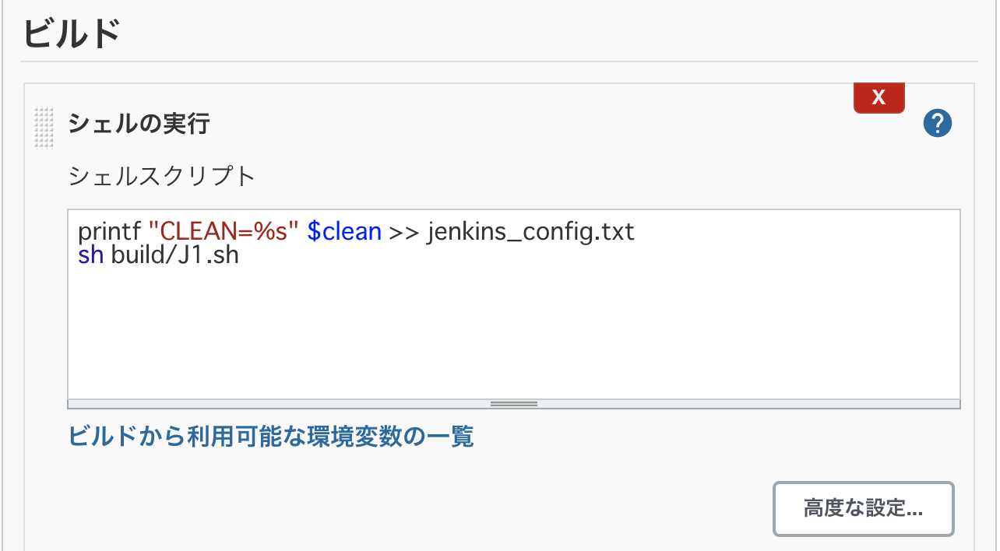
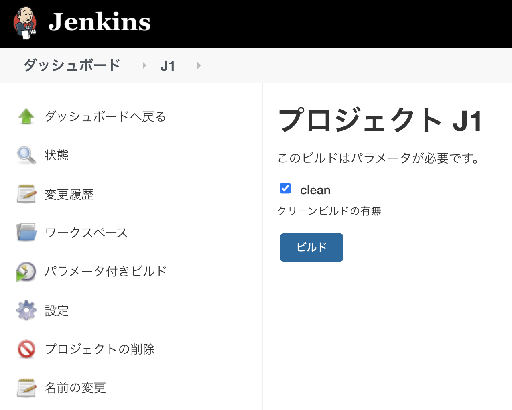

  
Jenkins で指定するパラメータをシェルスクリプトに渡すことができれば、スクリプトの Git 管理化が出来て差分管理ができるようになる！ というモチベ。  
  
<!--more-->  
  
## 開発環境  
  
```bash
> docker --version
Docker version 19.03.12, build 48a66213fe

> docker-compose --version
docker-compose version 1.27.2, build 18f557f9
```
  
## やりたいこと  
  
- Jenkins でビルド時に実行するシェルスクリプトを Git で管理する
- Jenkins でビルド時に指定するパラメータを Git 管理のシェルスクリプトに渡す
  
簡単のため、Jenkins を Docker で構築する。  
  
## コード  
https://github.com/tokizuoh/alpinus  
コードは GitHub に載せている。  
  
#### /Dockerfile
  
```
FROM jenkins/jenkins:lts-jdk11
WORKDIR /jenkins/src

COPY ./ ./
```
  
#### /docker-compose.yml
  
```
version: '3.8'
services:
    app:
        build:
            context: .
            dockerfile: Dockerfile
        tty: true
        ports:
            - 8080:8080
        volumes:
            - .:/jenkins/src
```
  
#### /build/J1.sh
  
```bash
#!/bin/sh

. ./jenkins_config.txt

if "${CLEAN}"; then
    echo "\$CLEAN が true のときに行う処理"
else
    echo "\$CLEAN が false のときに行う処理"
fi
```
  
　
  
普段の記事では説明が適当なので、手順を書いてみる。  
  
## コンテナの構築
  
```bash
docker-compose up --build -d
```
  
-d: デタッチド。 バックグラウンドでコンテナを実行。  
  
## Jenkins のセットアップ
  
`localhost:8080` にアクセスし、 Jenkins のセットアップを行う。  
  
コンテナ内でコマンド実行したい時は下記が便利。  
  
```bash
docker exec {CONTAINER_ID} {COMMAND}
```
  
## プラグインのインストール  
  
必要最低限の構成で済ませたいので、インストールするのは下記2つのみ。  
  
- [Git](https://plugins.jenkins.io/git/): ジョブ内で `git clone` を行うためのプラグイン  
- [Workspace Cleanup](https://plugins.jenkins.io/ws-cleanup/): ジョブ実行前後でワークスペースを削除するためのプラグイン  
  
Jenkins はデフォルトでジョブ実行前後のワークスペースの削除を行わないので、プラグインを使ってジョブ実行前にワークスペースを削除させる。  
  
## ジョブの作成  
  
#### パラメータ

  
ビルド時に指定するパラメータを Git 管理のシェルスクリプトに渡したいので、適当なパラメータを追加する。  
　
  
#### Git
  
  
  
実行するシェルスクリプトを保有するリポジトリや、実行するブランチを設定。  
　
#### ビルド時に実行するシェルスクリプト
  
  
　
  
```bash
printf "CLEAN=%s" $clean >> jenkins_config.txt 
```
  
ジョブ実行時に指定するパラメータをテキストファイルに保存する。
  
　
  
```bash
CLEAN=true
```
  
`jenkins_config.txt` は上記のようなフォーマット。  
  
　
  
```
sh build/J1.sh
```
  
clone したシェルスクリプトを実行。  
  
シェルスクリプトの中身を確認する。  
　
  
```bash
#!/bin/sh

# 外部ファイルに記述された変数を読み込む
. ./jenkins_config.txt

# 外部ファイル内の変数を利用
if "${CLEAN}"; then
    echo "\$CLEAN が true のときに行う処理"
else
    echo "\$CLEAN が false のときに行う処理"
fi
```
  
## ジョブの実行  
  
  
  
　
  
`clean` にチェックが入っていると下記のログが出力される。  
  
```bash
# 省略

+ printf CLEAN=%s true
+ sh build/J1.sh
$CLEAN が true のときに行う処理
Finished: SUCCESS
```
  
## 参考  
  
- [up — Docker-docs-ja 19.03 ドキュメント](https://docs.docker.jp/compose/reference/up.html)  
- [Git | Jenkins plugin](https://plugins.jenkins.io/git/)  
- [Workspace Cleanup | Jenkins plugin](https://plugins.jenkins.io/ws-cleanup/)
