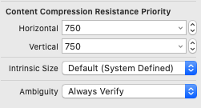
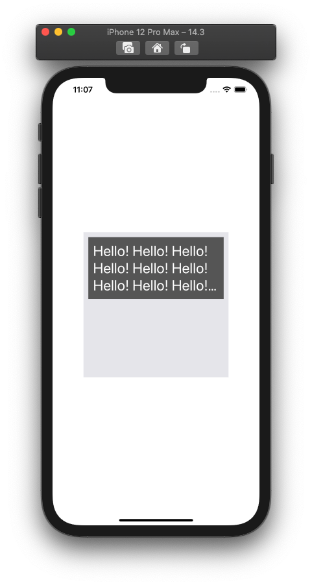
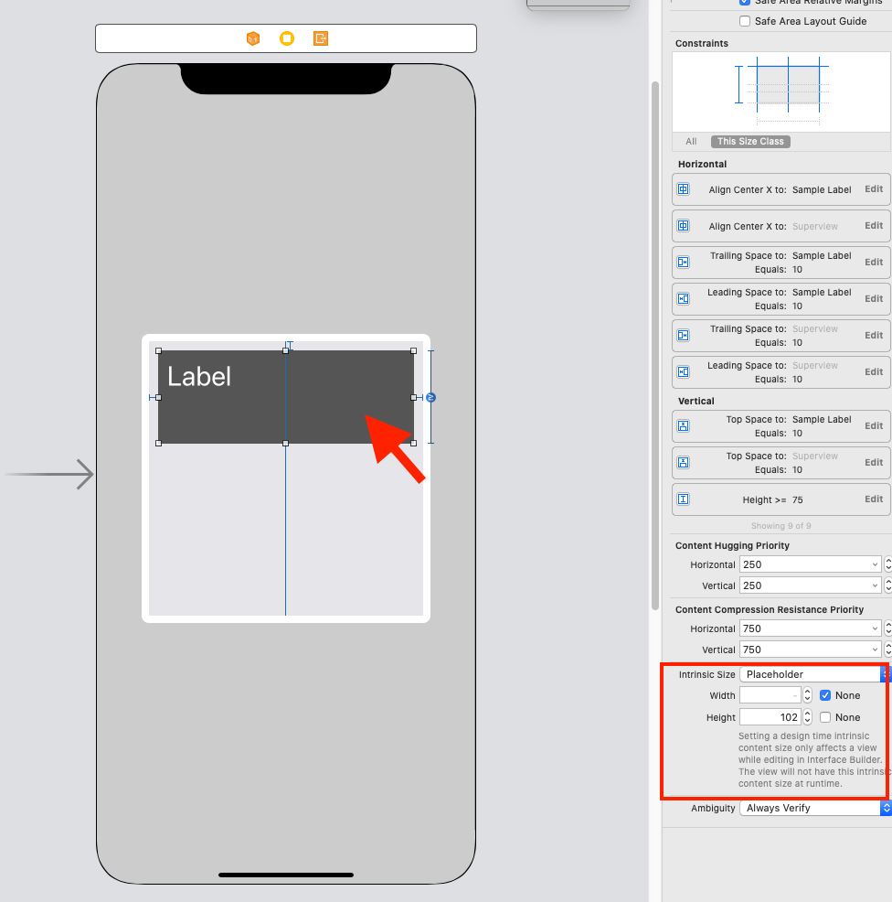

  
制約めちゃくちゃでもビルドは通る（気をつけよう）
<!--more-->  
  
## 開発環境  
  
```bash
> xcodebuild -version
Xcode 12.3
Build version 12C33
```
  
## Content Compression Resistance Priority とは  
  
  
  
Xcode > Utility Area > Size Inspector 内に該当項目がある。  
  
　
  
> Sets the priority with which a view resists being made smaller than its intrinsic size.  
> [setContentCompressionResistancePriority(_:for:) | Apple Developer Documentation](https://developer.apple.com/documentation/uikit/uiview/1622526-setcontentcompressionresistancep)  
  
コード上でも設定可能。  
直訳すると、「ビューが本来のサイズより小さくならないようにする優先順位を設定する」。  
具体例を見ていく。  
  
## 具体例
  

  
白文字の UILabel の高さに応じて、背景の黒い UIView の高さを変えたい時に、  
  
　
  
  
  
背景の黒い UIView に対して、Content Compression Resistance Priority を設定する。  
  
- Instrinstic Size: Placeholder  
- Width: None (Wifthを動的にしたい場合は設定) 
- Height: 102 (伸ばす前の標準値)  
  
## 参考  
  
- [setContentCompressionResistancePriority(_:for:) | Apple Developer Documentation](https://developer.apple.com/documentation/uikit/uiview/1622526-setcontentcompressionresistancep)  
  