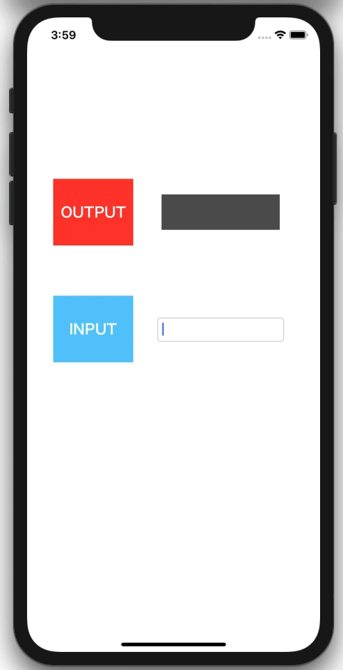

  
デザインパターンが頭から抜けていた。  
<!--more-->  
  
## RxSwift  
  
  
  
> Rx is a generic abstraction of computation expressed through Observable<Element> interface. 
This is a Swift version of Rx.
  
([ReactiveX/RxSwift: Reactive Programming in Swift](https://github.com/ReactiveX/RxSwift) より)  
  
> which facilitates the automatic propagation of the changed data flow.  
  
([Reactive programming - Wikipedia](https://en.wikipedia.org/wiki/Reactive_programming) より)  
  
Rx: Observerパターン（あるオブジェクトで発生したイベントを別のオブジェクトへ通知するパターン、デザインパターンの一種）の抽象化。データの自動伝搬を容易にする枠組み。  
RxSwift: RxのSwift版。  
  
## 開発環境  
  
```bash
Xcode: Version 11.5 (11E608c)  
Apple Swift version 5.2.4 (swiftlang-1103.0.32.9 clang-1103.0.32.53)
Target: x86_64-apple-darwin19.5.0
```
  
## 最小構成で試運転  
RxSwiftを用いて、UITextField の値を UILabel に伝搬させるコードを書いてみる。  
pod周りは[README > Installation](https://github.com/ReactiveX/RxSwift#installation) の通りに実行。  
  
```swift
import UIKit
import RxSwift
import RxCocoa

class ViewController: UIViewController {

    @IBOutlet weak var outputLabel: UILabel!
    @IBOutlet weak var inputTextField: UITextField!
    
    override func viewDidLoad() {
        super.viewDidLoad()
        
        inputTextField.rx.text
            .bind(to: outputLabel.rx.text)
    }
    
}
```
  
　
  
  
  
UITextField の値が UILabel に自動で反映されている。  
  
ちなみに、RxSwiftを使わずに書くと下記のようになる。  
  
```swift
import UIKit

class ViewController: UIViewController {

    @IBOutlet weak var outputLabel: UILabel!
    @IBOutlet weak var inputTextField: UITextField!
    
    override func viewDidLoad() {
        super.viewDidLoad()
        
        inputTextField.addTarget(self,
                                 action: #selector(textFieldDidChange(textField:)),
                                 for: .editingChanged)
    }
    
    @objc func textFieldDidChange(textField: UITextField) {
        outputLabel.text = textField.text
    }
    
}
```
  
UITextField の値を UILabel に伝搬させるだけで、コード量にして数行の差異がでる。  
加えて、RxSwift を用いた実装は Selector を用いた実装に比べて、Selectorに紐づく関数を追う必要がなくなり、コード理解に費やす時間が削減される。  
  
## disposed(by: DisposeBag)  
  
RxSwiftで調べていると `disposed(by: DisposeBag)` の記述をよく見かける。  
  
```swift
import UIKit
import RxSwift
import RxCocoa

class ViewController: UIViewController {

    @IBOutlet weak var outputLabel: UILabel!
    @IBOutlet weak var inputTextField: UITextField!
    
    let disposeBag = DisposeBag()
    
    override func viewDidLoad() {
        super.viewDidLoad()
        
        inputTextField.rx.text
            .bind(to: outputLabel.rx.text)
            .disposed(by: disposeBag)  // これ
    }
    
}

```
  
メモリ解放周りのメソッドだが、加えなくても `deinit` が正常に動作する。  
そこで、下記の記述を見かけた。  
  
> Using dispose bags or takeUntil operator is a robust way of making sure resources are cleaned up. We recommend using them in production even if the sequences will terminate in finite time.
  
([RxSwift/GettingStarted.md at master · ReactiveX/RxSwift](https://github.com/ReactiveX/RxSwift/blob/master/Documentation/GettingStarted.md) より)  
  
`disposed` を明示的に呼ぶ必要がない場合（処理が時間内に終わる場合）でも、呼ぶことが推奨されている。  
  
## 参考  
  
- [ReactiveX/RxSwift: Reactive Programming in Swift](https://github.com/ReactiveX/RxSwift)  
- [Reactive programming - Wikipedia](https://en.wikipedia.org/wiki/Reactive_programming)  
- [デザインパターン (ソフトウェア) - Wikipedia](https://ja.wikipedia.org/wiki/%E3%83%87%E3%82%B6%E3%82%A4%E3%83%B3%E3%83%91%E3%82%BF%E3%83%BC%E3%83%B3_(%E3%82%BD%E3%83%95%E3%83%88%E3%82%A6%E3%82%A7%E3%82%A2))  
- [アッテ開発の技術：Swift と RxSwift - Speaker Deck](https://speakerdeck.com/bricklife/atutekai-fa-falseji-shu-swift-to-rxswift)  