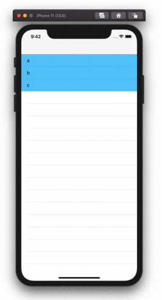
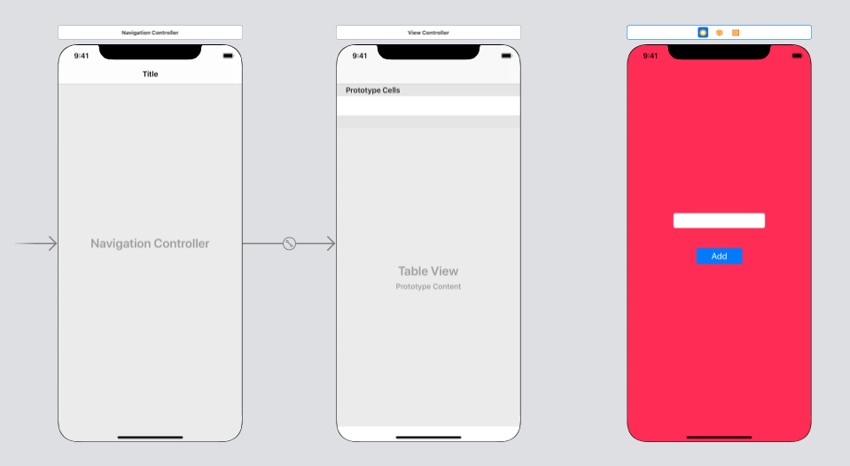

  
UITableViewを持つViewControllerに戻ってきた時に、UITableViewを再描画させる。  
  
<!--more-->  
  
## 実行結果
  

  
## 処理手順  
  
```
1. UITableViewのセル押下 
2. navigationControllerで別のViewController（Pink）に遷移
3. UITextFieldに文字列を入力
4. UIButton押下
5. 「1.」のViewControllerのTableViewの表示元の配列に「3.」で入力した文字列が追加
6. 「1.」のViewControllerのTableViewが再描画
```
  
## 開発環境  
  
```bash
Xcode: Version 11.6 (11E708)  
Apple Swift version 5.2.4 (swiftlang-1103.0.32.9 clang-1103.0.32.53)
Target: x86_64-apple-darwin19.6.0
```
  
## Storyboard  
  

  
## コード  
  
### ViewController
  
```swift
import UIKit

class ViewController: UIViewController {
    
    var items = ["a", "b", "c"]
    
    @IBOutlet weak var tableView: UITableView!
    
    override func viewDidLoad() {
        super.viewDidLoad()
        
        tableView.dataSource = self
        tableView.delegate = self
    }
    
    override func viewWillAppear(_ animated: Bool) {

        // viewWillAppear は遷移するたびに実行されるのでTableViewの更新はここで行う。  
        // - 本アプリは navigationController で遷移するため、このVCは遷移後も残る。  
        // - よって、viewDidLoad ではなく、viewWillAppear 内にTableView更新処理を記述する。  
        tableView.reloadData()
    }
    
}

extension ViewController: UITableViewDelegate {
    func tableView(_ tableView: UITableView, didSelectRowAt indexPath: IndexPath) {
        let storyboard = UIStoryboard(name: "Main", bundle: nil)
        let pinkVC = storyboard.instantiateViewController(withIdentifier: "pink") as! PinkViewController
        navigationItem.backBarButtonItem?.title = ""
        navigationController?.pushViewController(pinkVC, animated: true)
    }
}

extension ViewController: UITableViewDataSource {
    func tableView(_ tableView: UITableView, numberOfRowsInSection section: Int) -> Int {
        return items.count
    }
    
    func tableView(_ tableView: UITableView, cellForRowAt indexPath: IndexPath) -> UITableViewCell {
        let cell = tableView.dequeueReusableCell(withIdentifier: "cell", for: indexPath)
        cell.backgroundColor = .systemTeal
        cell.textLabel?.text = items[indexPath.row]
        return cell
    }
}
```
  
　
  
### PinkViewController
  
```swift
import UIKit

class PinkViewController: UIViewController {

    @IBOutlet weak var textField: UITextField!

    override func viewDidLoad() {
        super.viewDidLoad()
    }
    

    @IBAction func add(_ sender: Any) {
        guard let text = textField.text else { return }
        
        let nc = self.navigationController

        guard let vcNum = nc?.viewControllers.count else { return }
        let firstVC = nc?.viewControllers[vcNum - 2] as! ViewController
       
        firstVC.items.append(text)
    }
}
```
  
　
  
なぜ `-2` するのか。  
  
```swift
let firstVC = nc?.viewControllers[vcNum - 2] as! ViewController
```
  
> The root view controller is at index 0 in the array, the back view controller is at index n-2, and the top controller is at index n-1, where n is the number of items in the array.  
>  
> (from [viewControllers | Apple Developer Documentation](https://developer.apple.com/documentation/uikit/uinavigationcontroller/1621873-viewcontrollers))
  
## 参考  
  
- [viewControllers | Apple Developer Documentation](https://developer.apple.com/documentation/uikit/uinavigationcontroller/1621873-viewcontrollers)  
- [【Swift】ViewControllerとNavigationControllerの相互関係まとめ - Qiita](https://qiita.com/wadaaaan/items/342a3cc47faf746b353d)  
- [【Swift】前の画面への値の受け渡し方 - Qiita](https://qiita.com/wadaaaan/items/acc8967c836d616e3b0b)  
