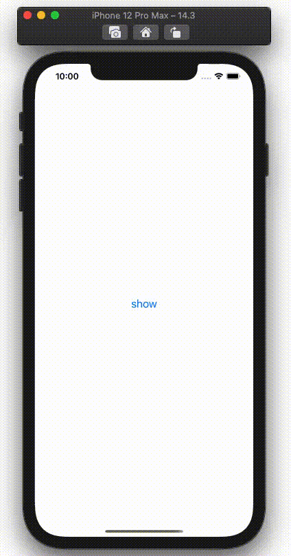

  
[scenee/FloatingPanel](https://github.com/scenee/FloatingPanel)  
  
<!--more-->  
  
## 開発環境  
  
```bash
> xcodebuild -version
Xcode 12.3
Build version 12C33
```
  
## gif
  
  
  
## コード
  
```swift
import UIKit
import FloatingPanel

final class ViewController: UIViewController {

    override func viewDidLoad() {
        super.viewDidLoad()
    }
    
    @IBAction func show(_ sender: Any) {
        let secondViewController = SecondViewController()
        secondViewController.view.backgroundColor = .blue
        
        let floatingPanelController = FloatingPanelController()
        floatingPanelController.delegate = self
        floatingPanelController.isRemovalInteractionEnabled = true
        floatingPanelController.set(contentViewController: secondViewController)
        floatingPanelController.addPanel(toParent: self)
    }
}

extension ViewController: FloatingPanelControllerDelegate {}
```
  
## 参考  
  
- [scenee/FloatingPanel: A clean and easy-to-use floating panel UI component for iOS](https://github.com/scenee/FloatingPanel)  
  