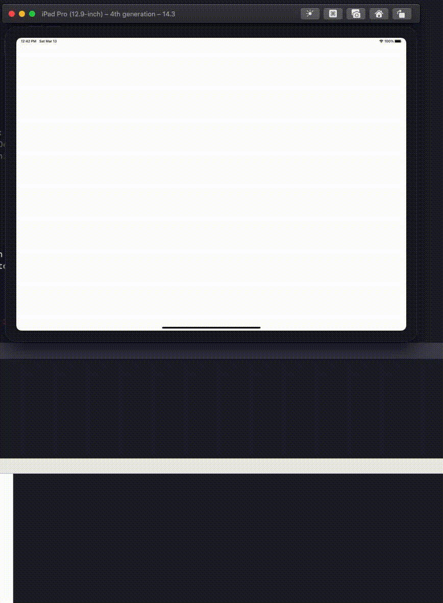

  
回転系は色々対処方法がある。  
  
<!--more-->  
  
## 開発環境  
  
```bash
> xcodebuild -version
Xcode 12.3
Build version 12C33
```
  
## 回転の検知  
  
回転を検知する仕組みは複数存在する。
  
- [viewWillTransition(to:with:)](https://developer.apple.com/documentation/uikit/uicontentcontainer/1621466-viewwilltransition)  
- [orientationDidChangeNotification](https://developer.apple.com/documentation/uikit/uidevice/1620025-orientationdidchangenotification)  
  
今回は **viewWillTransition(to:with:)** を使って、回転を検知してみる。  
  
## viewWillTransition(to:with:)
  
> Notifies the container that the size of its view is about to change.  
> [viewWillTransition(to:with:)](https://developer.apple.com/documentation/uikit/uicontentcontainer/1621466-viewwilltransition)  
  
view のサイズ変更をコンテナに通知する。  
  
- size (CGSize): 変更後のサイズ  
- coordinator (UIViewControllerTransitionCoordinator): サイズ変更を管理する遷移コーディネーターオブジェクト  
  
orientationDidChangeNotification では変更後のサイズを取得できないが、viewWillTransition() であれば可能。  
  
view controller 内での回転検知のハンドリングを行うなら、viewWillTransition() を使ったほうが利便性は高そう。  
  
## 最小構成で実装
  
  
  
　
  
```swift
override func viewWillTransition(to size: CGSize, with coordinator: UIViewControllerTransitionCoordinator) {
    super.viewWillTransition(to: size, with: coordinator)
    // 回転開始時に行う処理
    print("回転開始！")
        
    coordinator.animate(alongsideTransition: nil) { _ in
        // 回転終了時に行う処理
        print("回転終了！")
    }
}
```
  
viewWillTransition() は変更後のサイズ取得に加え、回転開始時と回転終了時それぞれ処理をハンドリングすることができる。  
  

## 参考  
  
- [viewWillTransition(to:with:) | Apple Developer Documentation](https://developer.apple.com/documentation/uikit/uicontentcontainer/1621466-viewwilltransition)  
  