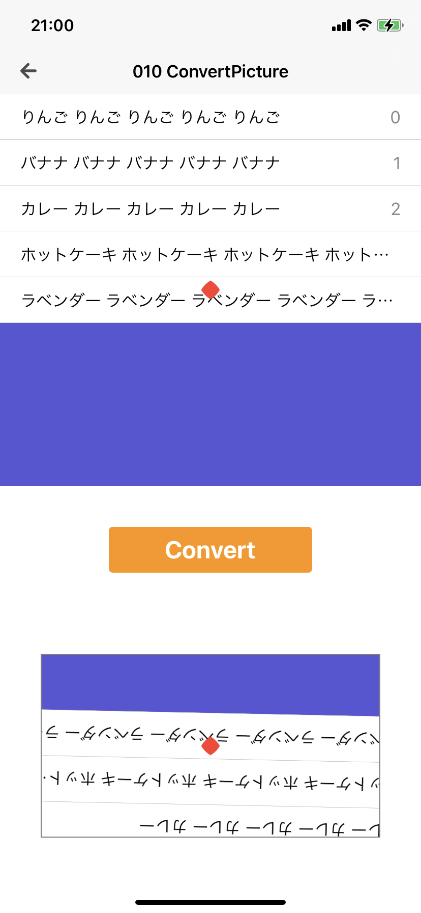
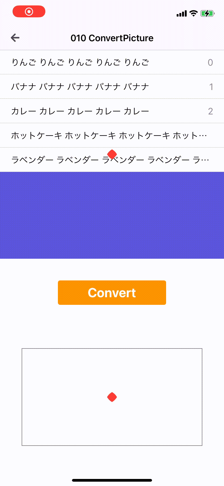

  
画像周り楽しいね。  
  
<!--more-->  
  
## 開発環境  
  
```bash
> xcodebuild -version
Xcode 12.3
Build version 12C33
```
  
## やること
  
- UIView (UITableView) を UIImage に変換
- 変換した UIImage を回転して UIImageView に表示
  
## つくったもの
  
|  スクリーンショット  |  gif  |
| ---- | ---- |
|    |    |
  
UITableView を UIImage に変換して、ランダムに回転するようにした。  
※ 赤い点は回転の中心の目安として置いた。  
  
## コード  
  
#### UIView -> UIImage の変換
  
```swift
private func convertUIViewToUIImage(from: UIView) -> UIImage {
    let renderer = UIGraphicsImageRenderer(size: from.bounds.size)
    let image = renderer.image { context in
        from.layer.render(in: context.cgContext)
    }
    return image
}
```
  
#### UIImage の回転
  
```swift
private func rotate(from: UIImage, angle: CGFloat = CGFloat.random(in: 0...360)) -> UIImage {
    UIGraphicsBeginImageContextWithOptions(from.size, false, UIScreen.main.scale)

    let context = UIGraphicsGetCurrentContext()!
    context.translateBy(x: from.size.width / 2, y: from.size.height / 2)
    context.scaleBy(x: 1.0, y: -1.0)

    let radian = -angle * CGFloat.pi / 180
    context.rotate(by: radian)

    context.draw(from.cgImage!, in: CGRect(x: -(from.size.width / 2), y: -(from.size.height / 2),
                                            width: from.size.width, height: from.size.height))

    let rotatedImage = UIGraphicsGetImageFromCurrentImageContext()!
    UIGraphicsEndImageContext()

    return rotatedImage
}
```
  
## 参考  
  
- [UIGraphicsBeginImageContextWithOptions(_:_:_:) | Apple Developer Documentation](https://developer.apple.com/documentation/uikit/1623912-uigraphicsbeginimagecontextwitho)  
  