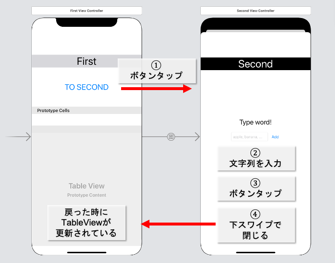

  
（NotificationCenterを使うだけ）  
  
<!--more-->  
iOS13のModel遷移後ではVCをDismissする際に、遷移前VCのライフサイクルメソッド(viewWillAppearなど)が呼ばれない。  
遷移後VCの処理によって、遷移前VCの描画内容に更新が必要な場合、次の2つの方法が適用できる。  
  
1. NotificationCenterを用いて値の監視を行う
2. [(begin|end)AppearanceTransition()](https://tokizuoh.dev/posts/egmoxngp6yk2hh28/) を使う
  
今回は1の **NotificationCenter** を用いた監視を試す。  
  
## 開発環境
  
```bash
> xcodebuild -version 
Xcode 12.0.1
Build version 12A7300
```
  
## Storyboard
  

  
Segue kind: show  
  
## デザインパターン  
[iOSアプリ設計パターン入門』](https://peaks.cc/books/iOS_architecture)で紹介されているMVP(Passive View)をFirstVCに取り入れた。  
とはいえ、Presenter(Input, Outputが)
  
SecondVCは値を受け取るのみ。そのためデザインパターンの適用は行っていない。（悩ましい）  
  
## コード
  
#### FirstVC  
  
```swift

```
  
　
  
#### SecondVC  
  
```swift
```
  
## 疑問  
複数画面のPresenter適用がまだ分からない。  
例えば、今回の例のような下記のパターンを考える。  
  
- ①VC: 値の描画
- ②VC: ①VCで使う値の取得

## 参考  
- [iOSアプリ設計パターン入門』](https://peaks.cc/books/iOS_architecture)  
    - 第6章MVPを参考