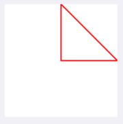
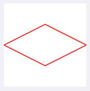
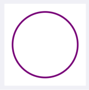

  
<!--more-->  
  
## 開発環境  
  
```bash
> xcodebuild -version
Xcode 12.3
Build version 12C33
```
  
## UIBezierPath
  
> UIBezierPath  
> A path that consists of straight and curved line segments that you can render in your custom views.  
  
カスタムビューでレンダリング可能な直線セグメントと曲線セグメントで構成されるパス。  
UIBezierPathを使って図形を書いていく。  
  
## 三角形
  
  
  
UIViewを継承したサブクラスで override した draw() 内で描画処理を記述。  
  
```swift
override func draw(_ rect: CGRect) {
    let path = UIBezierPath()
    path.move(to: CGPoint(x: rect.midX, y: rect.minY))
    path.addLine(to: CGPoint(x: rect.midX, y: rect.midY))
    path.addLine(to: CGPoint(x: rect.maxX, y: rect.midY))

    path.close()

    UIColor.red.setStroke()
    path.stroke()
}
```
  
　
  
`path.close()` は最後の点と最後の点を結ぶので、下記でも同じ結果が得られる。  
  
```
path.addLine(to: CGPoint(x: rect.midX, y: rect.minY))
```
  
## ひし形  
  
  
  
```swift
override func draw(_ rect: CGRect) {
    let path = UIBezierPath()
    path.move(to: CGPoint(x: rect.minX, y: rect.midY))
    path.addLine(to: CGPoint(x: rect.midX, y: rect.midY / 2))
    path.addLine(to: CGPoint(x: rect.maxX, y: rect.midY))
    path.addLine(to: CGPoint(x: rect.midX, y: rect.midY + rect.midY / 2))

    path.close()

    UIColor.red.setStroke()
    path.stroke()
}
```
  
## 円  
  
  
  
```swift
override func draw(_ rect: CGRect) {
    let circle = UIBezierPath(arcCenter: CGPoint(x: rect.midX, y: rect.midY),
                              radius: rect.midY - 10,
                              startAngle: 0,
                              endAngle: CGFloat(Double.pi * 2),
                              clockwise: true)
    UIColor.purple.setStroke()
    circle.lineWidth = 2.0
    circle.stroke()
}
```
  
## 参考  
  
- [UIBezierPath | Apple Developer Documentation](https://developer.apple.com/documentation/uikit/uibezierpath)  
- [close() | Apple Developer Documentation](https://developer.apple.com/documentation/uikit/uibezierpath/1624338-close)  
