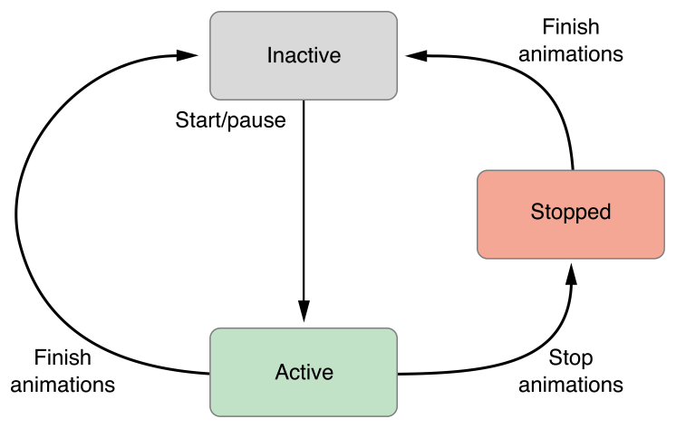
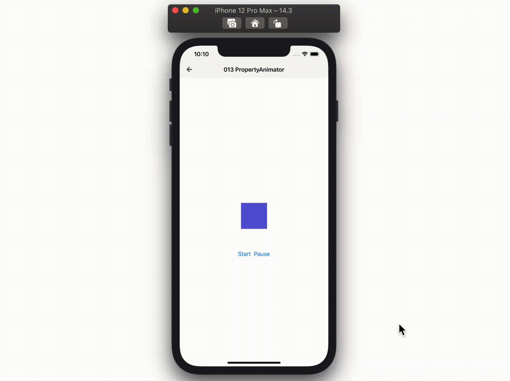

  
<!--more-->  
  
## 開発環境  
  
```bash
> xcodebuild -version
Xcode 12.3
Build version 12C33
```
  
## UIViewPropertyAnimator
  
> A class that animates changes to views and allows the dynamic modification of those animations.  
> [UIViewPropertyAnimator | Apple Developer Documentation](https://developer.apple.com/documentation/uikit/uiviewpropertyanimator)  
  
view への変更をアニメーション化し、アニメーションの動的な変更を可能にするクラス。  
iOS10 で登場。  
  
## Animation States
  
UIViewPropertyAnimator では State を意識する必要がある。  
  
  
  
図からは読み取れないが、`Active` の状態で `Pause` を行っても状態は変わらない。 (= `Active` のまま)  
  
## つくったもの  
  
  
  
　
  
- 紫色の UIView を画面中央から右端に移動させるアニメーション
- Start ボタンでアニメーション実行、Pause ボタンでアニメーション停止
- アニメーションが停止しているときに Start ボタンを押すと、停止箇所からアニメーションが再開
  
## コード
  
```swift
import UIKit

final class PropertyAnimatorViewController: UIViewController {

    @IBOutlet weak var squareView: UIView!

    private var animator: UIViewPropertyAnimator!
    private var fractionComplete: CGFloat?

    override func viewDidLoad() {
        super.viewDidLoad()

        configureAnimation()
    }

    @IBAction func startAnimation(_ sender: Any) {
        switch animator.state {
        case .active:
            let durationFactor: CGFloat = 1.0 - animator.fractionComplete
            animator.continueAnimation(withTimingParameters: nil, durationFactor: durationFactor)

        case .inactive:
            animator.startAnimation()

        case .stopped:
            // NOP
            break
        }
    }

    @IBAction func pauseAnimation(_ sender: Any) {
        // アニメーションの進行度（0.0 ~ 1.0）を保存
        fractionComplete = animator.fractionComplete
        animator.pauseAnimation()
    }

}

extension PropertyAnimatorViewController {

    private func configureAnimation() {
        animator = UIViewPropertyAnimator(duration: 1.0, curve: .easeInOut, animations: {
            // 四角UIViewを画面右端まで移動させる
            self.squareView.center.x += self.view.bounds.width / 2 - self.squareView.bounds.width / 2
        })
    }

}
```
  
　
  
アニメーションを再開させたい場合は `animator.stopAnimation()` ではなく、 `pauseAnimation()` を使った後、 再開させたいタイミングで `animator.continueAnimation` を実行する。  
  
## 参考  
  
- [UIViewPropertyAnimator | Apple Developer Documentation](https://developer.apple.com/documentation/uikit/uiviewpropertyanimator)  
- [UIViewAnimating | Apple Developer Documentation](https://developer.apple.com/documentation/uikit/uiviewanimating)  
  
