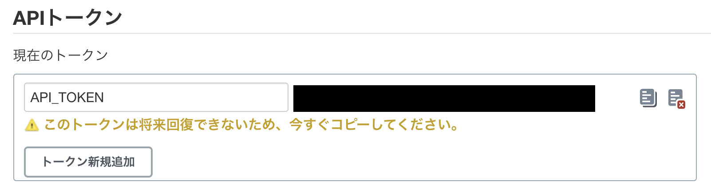
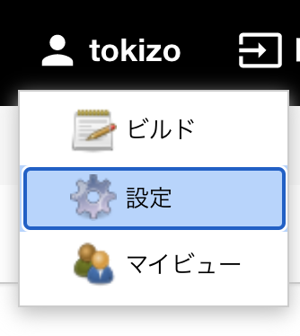
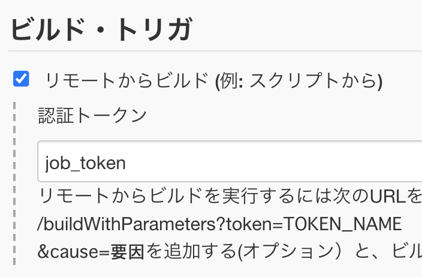

  
Jenkins のジョブごとで共通のパラメータ使う時は集約したい。  
  
<!--more-->  
  
## 開発環境  
  
Docker image: [jenkins/jenkins:lts-jdk11](https://hub.docker.com/layers/jenkins/jenkins/lts-jdk11/images/sha256-049ed8206529c5c6736741bdcb3c8f8c53ffec72eb84dfb8dc7a84c9bcaa1624?context=explore)  
  
## やりたいこと
  
- Jenkins のジョブ実行時に、そのジョブ内で別のジョブを実行する
- 直接実行するジョブを親ジョブ、間接的に実行されるジョブを小ジョブとする時に、親ジョブから小ジョブにパラメータを渡す
  
## パラメータなし実行  
  
親ジョブ > シェルの実行 > シェルスクリプトに、下記を記載して親ジョブを実行。  
  
```bash
curl --user {USER_NAME}:{API_TOKEN} http://{JENKINS_URL}/job/{JOB_NAME}/build?token={JOB_TOKEN}
```
  
　
  
| Key | Value | 備考 |
| ---- | ---- | ---- |
| USER_NAME | API_TOKEN を発行するユーザーID | |
| API_TOKEN|  |  設定から取得 |
| JENKINS_URL | Jenkins のURL | |
| JOB_NAME | ジョブ名 | |
| JOB_TOKEN |  | ジョブの設定から設定 |
  
## パラメータあり実行  
  
```bash
url=`printf "http://{JENKINS_URL}/job/{JOB_NAME}/buildWithParameters?token={JOB_TOKEN}&param=%s" $param`
curl --user {USER_NAME}:{API_TOKEN} $url
```
  
{API_TOKEN} 以降をダブルクォーテーションで囲むのが重要。（囲まないとパラメータが送れない）  
  
ちなみに、パラメータが選択値の場合、ジョブ側で設定していない選択肢でGETリクエストを送るとリクエスト自体が失敗する。  
  
## 参考  
  
- [Remote access API - 日本語 - Jenkins Wiki](https://wiki.jenkins.io/display/JA/Remote+access+API)  
  
