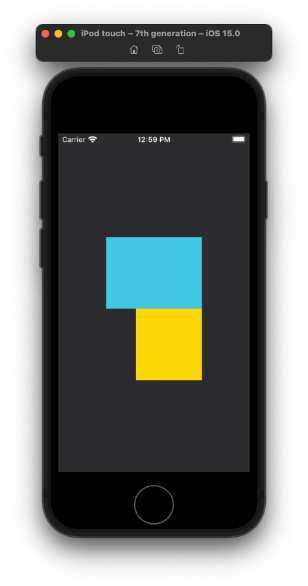
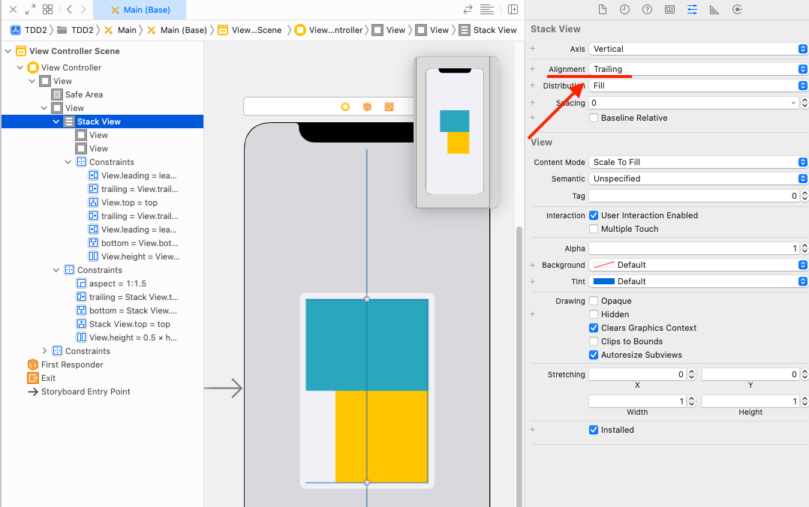

  
タイトル長い！  
  
<!--more-->  
  
## 開発環境  
  
```bash
Xcode 13.1
Build version 13A1030d
```
  
## こんなレイアウトを組む時
  

  
UIStackViewの中に青と黄のUIViewを配置して、黄の leading のみ個別で制約を付けたい時。
  
## こうする
  
  
  
UIStackView の alignment を trailing にする。  
子要素の trailing の制約が定まることで、leading の制約が付けられるようになる。  
  