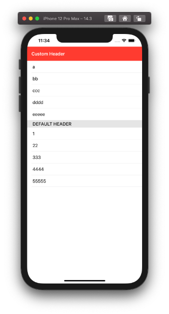

  
<!--more-->  
  
## 開発環境  
  
```bash
> xcodebuild -version
Xcode 12.3
Build version 12C33
```
  
## スクリーンショット
  

  
## コード  
  
```swift
import SwiftUI

struct ContentView: View {
    var body: some View {
        List {
        
            Section(header: HStack {
                Text("Custom Header")
                    .foregroundColor(.white)
                    .font(.headline)
                    .padding()
                    .textCase(.none)
                Spacer()
            }
            .background(Color.red)
            .listRowInsets(EdgeInsets(top: 0,
                                      leading: 0,
                                      bottom: 0,
                                      trailing: 0))
            ){
                Text("a")
                Text("bb")
                Text("ccc")
                Text("dddd")
                Text("eeeee")
            }
            
            Section(header: Text("Default Header")) {
                Text("1")
                Text("22")
                Text("333")
                Text("4444")
                Text("55555")
            }
        }
    }
}
```
  
プロパティ1つで変えられなかったので、潔く別Viewとして切り出したほうが良さそう。  
  