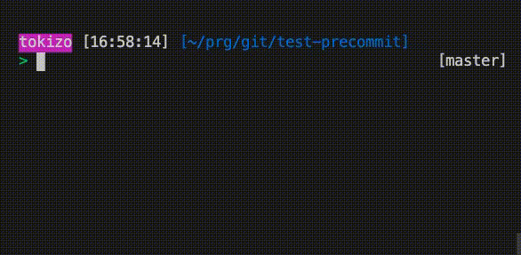

  
pushする前に不要な記述をチェックしたい！  
  
<!--more-->  
  
## 開発環境  
  
```bash
> git --version
git version 2.24.3 (Apple Git-128)
```
  
## gif  
  
  
  
## スクリーンショット  
  
  
  
## コード (.git/hooks/pre-commit)  
  
```bash
#!/bin/bash

declare -a blocklist=("hoge" "fuga" "piyo")

# 差分のあるファイルを抽出
diff_files=$(git diff --name-only HEAD)

for file in $diff_files
do
    for element in ${blocklist[@]};
    do
        if grep -q $element $file  # grep -q(--quiet): 結果を表示しない
        then
            echo -e -n "\033[40;31mERROR\033[0m"  # echo -n: 改行を出力しない 
            echo -e "\033[40;40m: Can't commit files that contain blocklist words.\033[0m"
            echo -n "- FILENAME: "
            echo -e "\033[40;32m$file\033[0m"
            echo -n "- BLOCKLIST_WORD: "
            echo -e "\033[47;30m${element}\033[0m"
            exit 1
        fi
    done
done
```
  