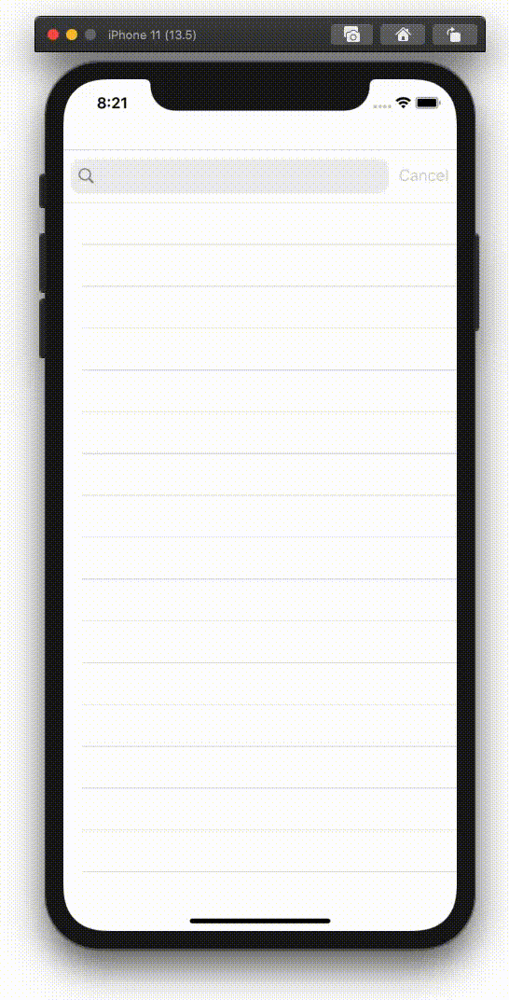
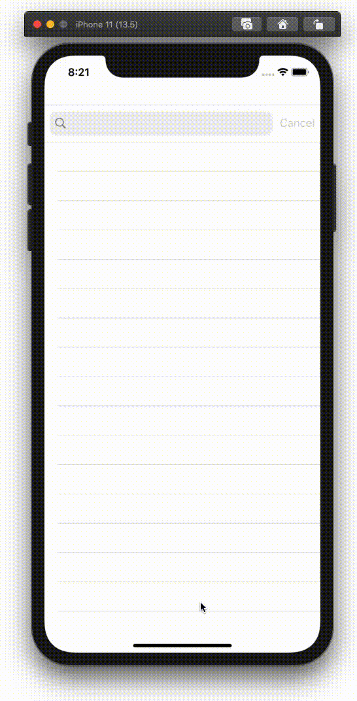

  
苗字、サイコー！  
<!--more-->  
  
## gif  
  
  
  
## 開発環境  
  
```bash
Xcode: Version 11.5 (11E608c)  
Apple Swift version 5.2.4 (swiftlang-1103.0.32.9 clang-1103.0.32.53)
Target: x86_64-apple-darwin19.5.0
```
  
## コード  
  
```swift
import UIKit

struct Surname {
    let name: String
    let rubyList: [String]
}

class ViewController: UIViewController {
    
    @IBOutlet weak var tableView: UITableView!
    @IBOutlet weak var searchBar: UISearchBar!
    
    var surnameList: [Surname] = [
        Surname(name: "畑中", rubyList: ["hatanaka"]),
        Surname(name: "小嶋", rubyList: ["kojima, kozima, ojima, ozima, oshima, koshima"]),
        Surname(name: "芳賀", rubyList: ["haga", "yoshiga", "houga", "hoga", "houka", "hoka", "yoshika"]),
        Surname(name: "大井", rubyList: ["ooi", "oi"]),
        Surname(name: "相原", rubyList: ["aihara", "aibara", "sagara", "aira"]),
    ]
    var searchResultItems: [String] = []
    
    override func viewDidLoad() {
        super.viewDidLoad()
        
        // MARK: SearchBar
        searchBar.delegate = self
        searchBar.showsCancelButton = true
        
        // MARK: TableView
        tableView.dataSource = self
    }
    
}

extension ViewController: UISearchBarDelegate {
    func searchBar(_ searchBar: UISearchBar, textDidChange searchText: String) {
        searchSurname(searchText: searchText)
        tableView.reloadData()
    }
    
    func searchBarTextDidBeginEditing(_ searchBar: UISearchBar) {
        searchSurname(searchText: "")
        tableView.reloadData()
    }
    
    func searchSurname(searchText: String) {
        searchResultItems.removeAll()
        
        if searchText.isEmpty {
            searchResultItems = surnameList.compactMap({ (surname) in
                return surname.name
            })
        } else {
            let loweredSearchText = searchText.lowercased()
            for surname in surnameList {
                let isInSearchText = surname.rubyList.filter { (ruby) -> Bool in
                    ruby.contains(loweredSearchText)
                }
                if !isInSearchText.isEmpty {
                    searchResultItems.append(surname.name)
                }
            }
        }
    }
}

extension ViewController: UITableViewDataSource {
    func tableView(_ tableView: UITableView, numberOfRowsInSection section: Int) -> Int {
        return searchResultItems.count
    }
    
    func tableView(_ tableView: UITableView, cellForRowAt indexPath: IndexPath) -> UITableViewCell {
        let cell = tableView.dequeueReusableCell(withIdentifier: "cell", for: indexPath)
        cell.textLabel?.text = searchResultItems[indexPath.row]
        return cell
    }
    
}

```
  
## 複数読み対応  
  
  
  
小嶋さんなどの "kozima", "ozima" のような複数の読み方にも対応した。  
  
```swift
for surname in surnameList {
    let isInSearchText = surname.rubyList.filter { (ruby) -> Bool in
        ruby.contains(loweredSearchText)
    }
    if !isInSearchText.isEmpty {
        searchResultItems.append(surname.name)
    }
}
```
  
改善の余地がある書き方だと思うが今の所思いつかない。  
  
## 参考  
- [UISearchBar | Apple Developer Documentation](https://developer.apple.com/documentation/uikit/uisearchbar)  
- [UITableViewの中身をUISearchBarで検索する(Swift4) - すいすいSwift](https://swiswiswift.com/2018-12-30/)  