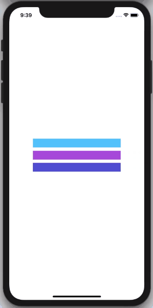
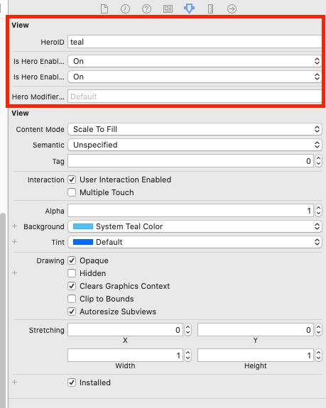

色んなライブラリを試していきたい。（いずれ作る）  
<!--more-->  
  
## Hero  
  

  
- [HeroTransitions/Hero: Elegant transition library for iOS & tvOS](https://github.com/HeroTransitions/Hero)  
  
> Hero is a library for building iOS view controller transitions. It provides a declarative layer on top of the UIKit's cumbersome transition APIs—making custom transitions an easy task for developers.  
  
ViewControllerのカスタム遷移を楽に実装できるライブラリ。  
  
## 開発環境  
  
```bash
Xcode: Version 11.5 (11E608c)  
Apple Swift version 5.2.4 (swiftlang-1103.0.32.9 clang-1103.0.32.53)
Target: x86_64-apple-darwin19.5.0
```
  
## 試したこと  
  
  
  
遷移元と遷移先のUIViewに対して遷移アニメーションを付与。  
gif の処理は全て Storyboard 上のみで完結している。（すごい）  
  
　
  
  
  
Utility Area にて遷移元の UIView と遷移先の UIView に同じ HeroIDを付与。  
  
## 参考
  
- [HeroTransitions/Hero: Elegant transition library for iOS & tvOS](https://github.com/HeroTransitions/Hero)  