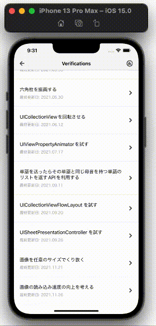

  
お題を作ってアプローチしていくシリーズ。  
  
<!--more-->  
  
## 開発環境  
  
```bash
> xcodebuild -version
Xcode 13.1
Build version 13A1030d
```
  
## はじめに
  
何かお題を作って、それに対しどのようにアプローチしていくかを記事として残す。  
  
## お題
  
**UICollectionViewCell の読み込みの高速化**
  
- UICollectionViewCell には UIImageView が存在する
- UIImageView に使用する UIImage の元の画像サイズは最大 1MB 程度
- Cell の総数は 300
- スクロールがスムーズにいくことをゴールとする
  
## 基本実装
  
```swift
import UIKit

final class LoadImagesViewController: ComponentBaseViewController {

    @IBOutlet weak var collectionView: UICollectionView! {
        didSet {
            collectionView.dataSource = self
            collectionView.register(R.nib.loadImagesCollectionViewCell)
            configureFlowLayout()
        }
    }

    struct ViewControllerModel {
        let thumbnailImageURLs: [URL]
    }

    private let viewControllerModel = ViewControllerModel(thumbnailImageURLs: [
        URL(string: "https://placehold.jp/7276c4/ffffff/1000x2000.png?text=1000%20%C3%97%202000")!,
        URL(string: "https://placehold.jp/a4b562/ffffff/1000x2000.png?text=1000%20%C3%97%202000")!,
        URL(string: "https://placehold.jp/b56262/ffffff/1000x2000.png?text=1000%20%C3%97%202000")!,
        URL(string: "https://placehold.jp/b262b5/ffffff/1000x2000.png?text=1000%20%C3%97%202000")!,
        URL(string: "https://placehold.jp/6297b5/ffffff/1000x2000.png?text=1000%20%C3%97%202000")!,
        URL(string: "https://raw.githubusercontent.com/tokizuoh/Pendula/feature/%23104/Pendula/View/Component/018_LoadImages/Image/sky.jpeg")!
    ])

    private let cellCount = 300

    override func viewDidLoad() {
        super.viewDidLoad()
        configureNavigationItem(navigationTitle: "018 LoadImages")
    }

}

extension LoadImagesViewController: UICollectionViewDataSource {

    func collectionView(_ collectionView: UICollectionView, numberOfItemsInSection section: Int) -> Int {
        return cellCount
    }

    func collectionView(_ collectionView: UICollectionView, cellForItemAt indexPath: IndexPath) -> UICollectionViewCell {
        let cell = collectionView.dequeueReusableCell(withReuseIdentifier: R.reuseIdentifier.loadImagesCollectionViewCell,
                                                      for: indexPath)!
        let index = indexPath.row % viewControllerModel.thumbnailImageURLs.count
        let image = fetchImage(url: viewControllerModel.thumbnailImageURLs[index])
        cell.setup(image: image)
        return cell
    }

    private func configureFlowLayout() {
        let layout = UICollectionViewFlowLayout()
        layout.itemSize = .init(width: collectionView.frame.width,
                                height: collectionView.frame.height)
        layout.scrollDirection = .horizontal
        collectionView.collectionViewLayout = layout
    }

}

extension LoadImagesViewController {

    private func fetchImage(url: URL) -> UIImage? {
        guard let data = try? Data(contentsOf: url) else {
            return nil
        }

        return .init(data: data)
    }

}
```
  
　
  
検証用のためややFatなViewControllerになったが気にせず進む。  
  
## gif
  

  
　
  
空の画像が他の画像に比べて容量が大きい。  
gifだと分かりにくいが、それぞれのセルに移動する度に画像をfetchしているため、容量が大きい空の画像セルの手前でユーザーは待たされてしまっている。  
  
## 現状の課題  
  
- 一度読み込んだ画像のキャッシュ化
  
次回以降の記事で改善していく。  
  
## 本記事のシリーズ
  
- ①基本実装編 (本記事)
- [②キャッシュ編](https://tokizuoh.dev/posts/ad1wj87xryo7n1wa/) 
- [③先読み編](https://tokizuoh.dev/posts/ui31beefylq8y0td/)
  