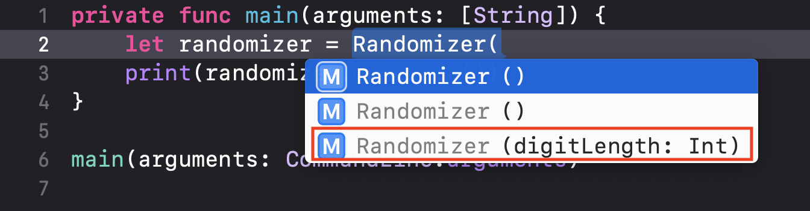

CLIならPythonやGoでも作れるが、Swiftでもやってみよう。  
<!--more-->  
  
## 動機  
ブログのタイトルID（[https://tokizuoh.dev/posts/abc171/](https://tokizuoh.dev/posts/abc171/) における「abc171」）を決めるのが面倒。  
何でもいいので楽に決めたい。  
ランダムな文字列を手元で生成するCLIあったら便利だな。  
  
## 成果物  
  
```bash
$ randomizer
spg87wd4q90w2xfp
```  
  
16文字のランダムな文字列を生成する。  
1文字目はアルファベット小文字からランダム。  
2文字目から16文字目までアルファベット小文字と数字からランダム。  
  
## コード  
[こちら](https://qiita.com/mono0926/items/e8fdd97115780204f797)を参考に書いた。  
buildするとバイナリが生成されるので適当にエイリアス設定して実行できるようにした。（なんか違ってそうだけど使えるのでヨシ！）  
  
### main.swift  
  
```swift
private func main(arguments: [String]) {
    let randomizer = Randomizer()
    print(randomizer.generate())
}

main(arguments: CommandLine.arguments) // 今後のために引数を受け取っておく
```
  
### Randomizer.swift  
  
```swift
import Foundation

struct Randomizer {
    var digitLength: Int = 16
    static let alphabets = (97...122).map({Character(UnicodeScalar($0))})
    static let numberCharacters = (48...57).map({Character(UnicodeScalar($0))})
    private let characters = alphabets + numberCharacters
    
    func generate() -> String {
        var result = ""
        for i in 0 ..< digitLength {
            var index: Int
            // Of course, the first letter can be a number. This is not a function or variable naming.
            if i == 0 {
                index = Int.random(in: 0..<26)
            } else {
                index = Int.random(in: 0..<self.characters.count)
            }
            result += String(characters[index])
        }
        return result
    }
}
```
  
Swiftの構造体は [Memberwise Initializers](https://docs.swift.org/swift-book/LanguageGuide/Initialization.html)（プロパティ値を引数に取るイニシャライザ）を自動生成してくれるので、明示的にイニシャライザを記述する必要はない。  
デフォルト値が設定できるので良い。  
  
  
  
## 所感  
バイナリ作るなら大体の言語できないか…？  
CLIって何だ…？  
  
## 参考  
  
- [Swift Package Manager (SwiftPM) で作るコマンドラインツール - Qiita](https://qiita.com/mono0926/items/e8fdd97115780204f797)  
- [isASCII | Apple Developer Documentation](https://developer.apple.com/documentation/swift/unicode/scalar/2905383-isascii)  
- [Initialization — The Swift Programming Language (Swift 5.3)](https://docs.swift.org/swift-book/LanguageGuide/Initialization.html)  