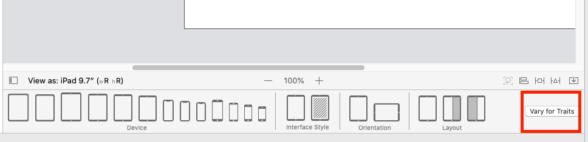
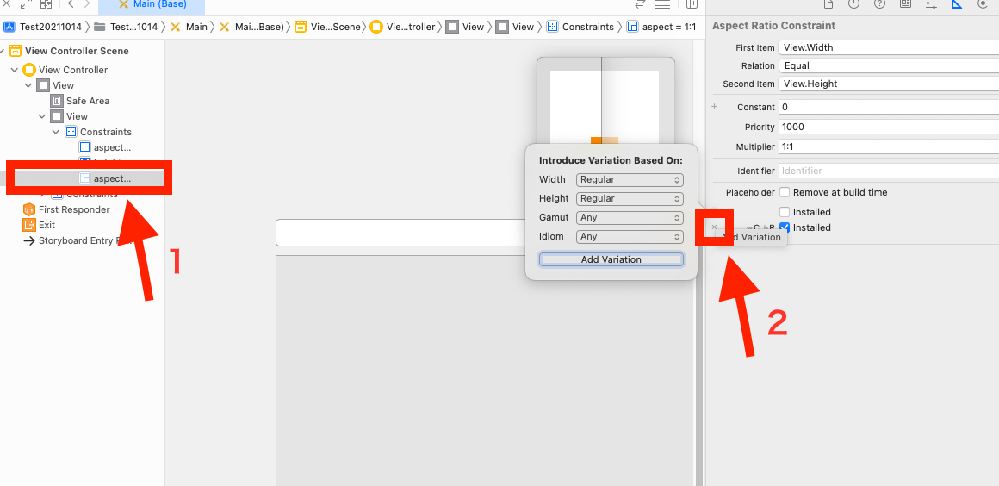

  
<!--more-->  
  
## 開発環境  
  
```bash
> xcodebuild -version
Xcode 13.0
Build version 13A233
```
  
## Xcode13 では Vary for Traits が使えない
  
複数 Size Classes のレイアウト実装を際には [Vary for Traits](https://tokizuoh.dev/posts/mjpt8thy94h3gyu6/) を使っていたが、Xcode13にそのボタンが無くなっている。  

| Xcode12 | Xcode13 |
|---|---|
|| |
  
## 対応策
  

  
対応する Size Class それぞれに対して制約をつける。  
  
## 参考  
  
- [Adaptivity and Layout - Visual Design - iOS - Human Interface Guidelines - Apple Developer](https://developer.apple.com/design/human-interface-guidelines/ios/visual-design/adaptivity-and-layout/)
  