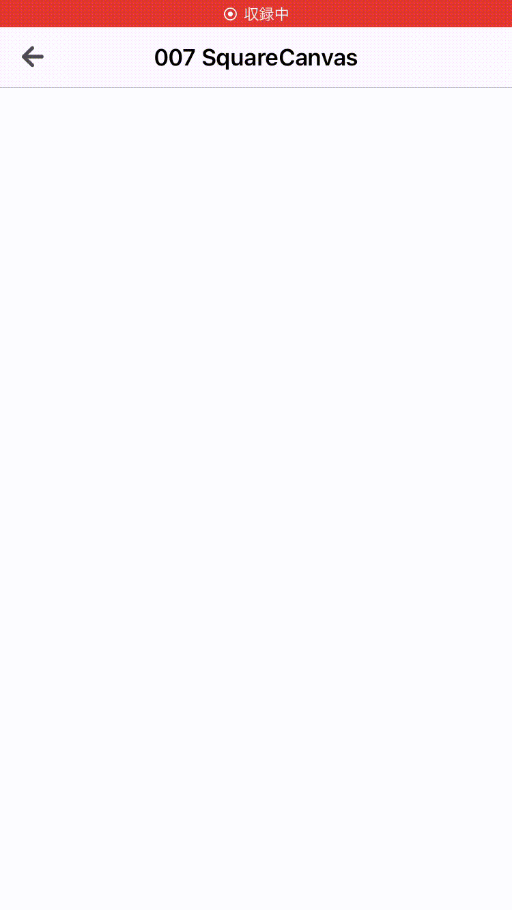

  
<!--more-->  
  
## 開発環境  
  
```bash
> xcodebuild -version
Xcode 12.3
Build version 12C33
```
  
## つくったもの
  
  
  
- UITapGestureRecognizer を使ってタップを検知 (小さい赤と青の四角形)
- 2点タップした対角線を持つ四角形の UIView を作成
  
## コード  
  
```swift
import UIKit

final class SquareCanvasViewController: ComponentBaseViewController {

    var startPoint: CGPoint?
    var startPointView: UIView?
    var finishPointView: UIView?

    var squareViews: [UIView] = []

    override func viewDidLoad() {
        super.viewDidLoad()

        // NavigationItemの設定なのでスルー
        configureNavigationItem(navigationTitle: "007 SquareCanvas",
                                blogURL: nil,
                                githubPRURL: nil)
        configureGestures()
    }

}

// MARK: - UIGestureRecognizer
extension SquareCanvasViewController {

    private func configureGestures() {
        // 一回タップ時に発火させるメソッドを登録
        let singleTapGesture = UITapGestureRecognizer(target: self,
                                                      action: #selector(detectSingleTap(sender:)))
        singleTapGesture.numberOfTapsRequired = 1
        view.addGestureRecognizer(singleTapGesture)

        // 下方向にスワイプしたときに発火させるメソッドを登録
        let swipeGesture = UISwipeGestureRecognizer(target: self,
                                                    action: #selector(detectSwipeGesture))
        swipeGesture.direction = .down
        view.addGestureRecognizer(swipeGesture)
    }

    @objc private func detectSingleTap(sender: UITapGestureRecognizer) {
        let location = sender.location(in: view)

        if let startPoint = startPoint {
            // 青い四角形マーカーを描画 -> 四角形の UIView を描画
            finishAnimation(startPoint: startPoint,
                            endPoint: location)
            self.startPoint = nil
        } else {
            // 赤い四角形マーカーを描画
            beginAnimation(location: location)
            self.startPoint = location
        }
    }

    // 下スワイプ時に生成した四角形のUIViewをすべて削除（リセット機能）
    @objc private func detectSwipeGesture() {
        _ = squareViews.map { $0.removeFromSuperview() }
        self.squareViews.removeAll()
    }
}

// MARK: - Animation
extension SquareCanvasViewController {

    private func beginAnimation(location: CGPoint) {
        startPointView = UIView(frame: CGRect(x: location.x,
                                              y: location.y,
                                              width: 20,
                                              height: 20))
        startPointView?.backgroundColor = .red
        view.addSubview(startPointView!)
    }

    private func finishAnimation(startPoint: CGPoint, endPoint: CGPoint) {
        func generateSquareView(startPoint: CGPoint, endPoint: CGPoint) {
            let width = endPoint.x - startPoint.x
            let height = endPoint.y - startPoint.y
            let squareView = UIView(frame: CGRect(x: min(startPoint.x, endPoint.x),
                                                  y: min(startPoint.y, endPoint.y),
                                                  width: abs(width),
                                                  height: abs(height)))
            squareView.backgroundColor = UIColor(hue: 0.5 + CGFloat.random(in: 0..<0.2),
                                                 saturation: 1.0,
                                                 brightness: 100/42,
                                                 alpha: 0.5)
            squareView.alpha = 0.3
            view.addSubview(squareView)
            squareViews.append(squareView)
        }

        // UIView 生成の一連の流れが終わるまでユーザーにタップさせない
        view.isUserInteractionEnabled = false
        finishPointView = UIView(frame: CGRect(x: endPoint.x,
                                               y: endPoint.y,
                                               width: 20,
                                               height: 20))
        finishPointView?.backgroundColor = .blue
        view.addSubview(finishPointView!)

        generateSquareView(startPoint: startPoint,
                           endPoint: endPoint)

        DispatchQueue.main.asyncAfter(deadline: .now() + 0.5) { [unowned self] in
            self.startPointView?.removeFromSuperview()
            self.finishPointView?.removeFromSuperview()
            self.view.isUserInteractionEnabled = true
        }
    }

}

```
  
全体的に命名がよろしくないので改善していきたい…  
  
## 参考  
  
- [UITapGestureRecognizer | Apple Developer Documentation](https://developer.apple.com/documentation/uikit/uitapgesturerecognizer)  
- [isUserInteractionEnabled | Apple Developer Documentation](https://developer.apple.com/documentation/uikit/uiview/1622577-isuserinteractionenabled)  
  