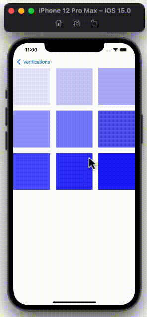

  
<!--more-->  
  
## 開発環境  
  
```bash
> xcodebuild -version
Xcode 13.0
Build version 13A233
```
  
## 実装方針
  
[collectionView(_:moveItemAt:to:)](https://developer.apple.com/documentation/uikit/uicollectionviewdatasource/1618064-collectionview) で配列内の移動処理を書けばOK。  

## つくったもの
  
  
  
## コード
  
```swift
final class FlowLayoutViewController: UIViewController {

    @IBOutlet weak var collectionView: UICollectionView!

    private var transparencies: [CGFloat] = []

    override func viewDidLoad() {
        super.viewDidLoad()

        transparencies = [Int](1..<10).map { CGFloat($0) / 10 }

        configureCollectionView()
    }

}

extension FlowLayoutViewController {

    private func configureCollectionView() {
        collectionView.dataSource = self
        configureLayout()
        configureGestureRecognizer()
    }

    private func configureLayout() {
        let itemSpacing: CGFloat = 20
        let itemCountPerRow: CGFloat = 3
        let cellWidth: CGFloat = (view.bounds.width - (itemCountPerRow - 1) * itemSpacing) / itemCountPerRow - 0.1
        let cellSize = CGSize(width: cellWidth, height: cellWidth)

        let layout = UICollectionViewFlowLayout()
        layout.itemSize = cellSize
        layout.minimumLineSpacing = itemSpacing
        layout.minimumInteritemSpacing = itemSpacing
        collectionView.collectionViewLayout = layout
    }

    private func configureGestureRecognizer() {
        let gesture = UILongPressGestureRecognizer(target: self,
                                                   action: #selector(handleLongPressGesture(_:)))
        collectionView.addGestureRecognizer(gesture)
    }

    @objc private func handleLongPressGesture(_ gesture: UILongPressGestureRecognizer) {
        switch gesture.state {
        case .began:
            guard let indexPath = collectionView.indexPathForItem(at: gesture.location(in: collectionView)) else {
                return
            }
            collectionView.beginInteractiveMovementForItem(at: indexPath)

        case .changed:
            collectionView.updateInteractiveMovementTargetPosition(gesture.location(in: collectionView))

        case .ended:
            collectionView.endInteractiveMovement()

        default:
            collectionView.cancelInteractiveMovement()
        }
    }

}

extension FlowLayoutViewController: UICollectionViewDataSource {

    func collectionView(_ collectionView: UICollectionView, numberOfItemsInSection section: Int) -> Int {
        return transparencies.count
    }

    func collectionView(_ collectionView: UICollectionView, cellForItemAt indexPath: IndexPath) -> UICollectionViewCell {
        let cell = collectionView.dequeueReusableCell(withReuseIdentifier: R.reuseIdentifier.flowLayoutCell.identifier,
                                                      for: indexPath)
        cell.backgroundColor = .init(red: 0,
                                     green: 0,
                                     blue: 1.0,
                                     alpha: transparencies[indexPath.row])
        return cell
    }

    func collectionView(_ collectionView: UICollectionView, moveItemAt sourceIndexPath: IndexPath, to destinationIndexPath: IndexPath) {
        let item = transparencies.remove(at: sourceIndexPath.row)
        transparencies.insert(item, at: destinationIndexPath.row)
    }

}
```
  
　
  
> If you do not implement this method, but you do implement the collectionView(_:moveItemAt:to:) method, the collection view allows all items to be reordered.  
> -- [collectionView(_:canMoveItemAt:) | Apple Developer Documentation](https://developer.apple.com/documentation/uikit/uicollectionviewdatasource/1618015-collectionview)  
  
実装するにあたって、[collectionView(_:canMoveItemAt:)](https://developer.apple.com/documentation/uikit/uicollectionviewdatasource/1618015-collectionview) を使うのかと思いきや、使わずに実装できた。  
となると、[collectionView(_:canMoveItemAt:)](https://developer.apple.com/documentation/uikit/uicollectionviewdatasource/1618015-collectionview) はいつ使うんだろう。  
  
## 参考  
  
- [collectionView(_:moveItemAt:to:) | Apple Developer Documentation](https://developer.apple.com/documentation/uikit/uicollectionviewdatasource/1618064-collectionview)  
- [collectionView(_:canMoveItemAt:) | Apple Developer Documentation](https://developer.apple.com/documentation/uikit/uicollectionviewdatasource/1618015-collectionview)  
