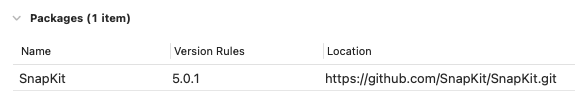
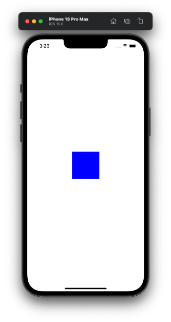
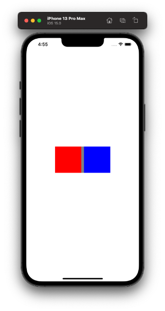
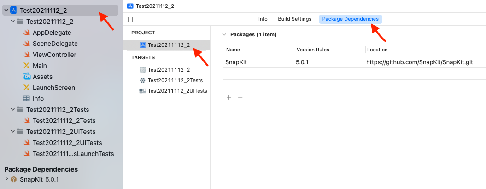

  
とても書きやすい。  
  
<!--more-->  
  
## 開発環境  
  
```bash
> xcodebuild -version
Xcode 13.1
Build version 13A1030d
```
  
## SnapKit
  
Auto Layout を簡単にするDSL。  
DSLはドメイン固有言語の意。  
  
　
  
  
  
https://github.com/SnapKit/SnapKit  
  
今回は5.0.1を使用。  
  
## 最小構成で実装  
  
  
  
```swift
import UIKit
import SnapKit

final class ViewController: UIViewController {

    override func viewDidLoad() {
        super.viewDidLoad()
        setupBlueView()
    }

}

extension ViewController {
    
    private func setupBlueView() {
        let blueView = UIView()
        blueView.backgroundColor = .blue
        view.addSubview(blueView)
        blueView.snp.makeConstraints { make in
            make.size.equalTo(100)
            make.center.equalToSuperview()
        }
    }

}

```
  
　
  
SnapKitを使わずに書くと、以下のようになる。  
  
```swift
import UIKit

final class ViewController: UIViewController {

    override func viewDidLoad() {
        super.viewDidLoad()
        setupBlueView()
    }

}

extension ViewController {
    
    private func setupBlueView() {
        let blueView = UIView()
        blueView.backgroundColor = .blue
        view.addSubview(blueView)
        blueView.translatesAutoresizingMaskIntoConstraints = false
        blueView.heightAnchor.constraint(equalToConstant: 100).isActive = true
        blueView.widthAnchor.constraint(equalToConstant: 100).isActive = true
        blueView.centerXAnchor.constraint(equalTo: view.centerXAnchor).isActive = true
        blueView.centerYAnchor.constraint(equalTo: view.centerYAnchor).isActive = true
    }

}
```
  
単純な処理でも記述量に大きな差があるので、大規模開発になるほどSnapKitの恩恵を感じられそう。  
  
## 複数UIView
  

  
```swift
import UIKit
import SnapKit

final class ViewController: UIViewController {
    
    override func viewDidLoad() {
        super.viewDidLoad()
        setupCustomView()
    }
    
}

extension ViewController {
    
    private func setupCustomView() {
        let baseView = UIView()
        baseView.backgroundColor = .gray
        view.addSubview(baseView)
        baseView.snp.makeConstraints { make in
            make.width.equalTo(210)
            make.height.equalTo(100)
            make.center.equalToSuperview()
        }
        
        let redView = UIView()
        redView.backgroundColor = .red
        baseView.addSubview(redView)
        redView.snp.makeConstraints { make in
            make.size.equalTo(100)
            make.centerY.equalToSuperview()
            make.leading.equalTo(0)
        }
        
        let blueView = UIView()
        blueView.backgroundColor = .blue
        baseView.addSubview(blueView)
        blueView.snp.makeConstraints { make in
            make.size.equalTo(100)
            make.centerY.equalToSuperview()
            make.trailing.equalTo(0)
        }
    }

}
```
  
かなりスッキリ書くことが出来る。  
  
## おまけ
  
Xcode13 における Swift Package Manager の追加導線が変わっていたのでメモ。  
  

  
## 参考  
  
- [SnapKit/SnapKit: A Swift Autolayout DSL for iOS & OS X](https://github.com/SnapKit/SnapKit)  
  