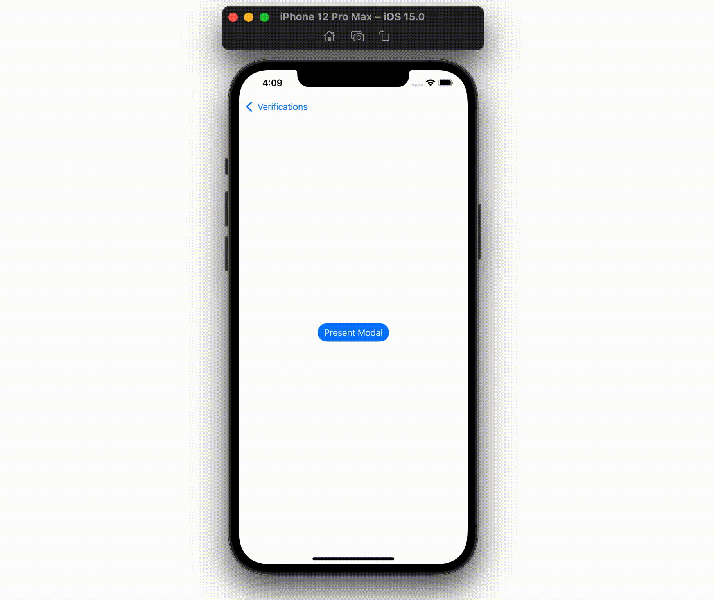
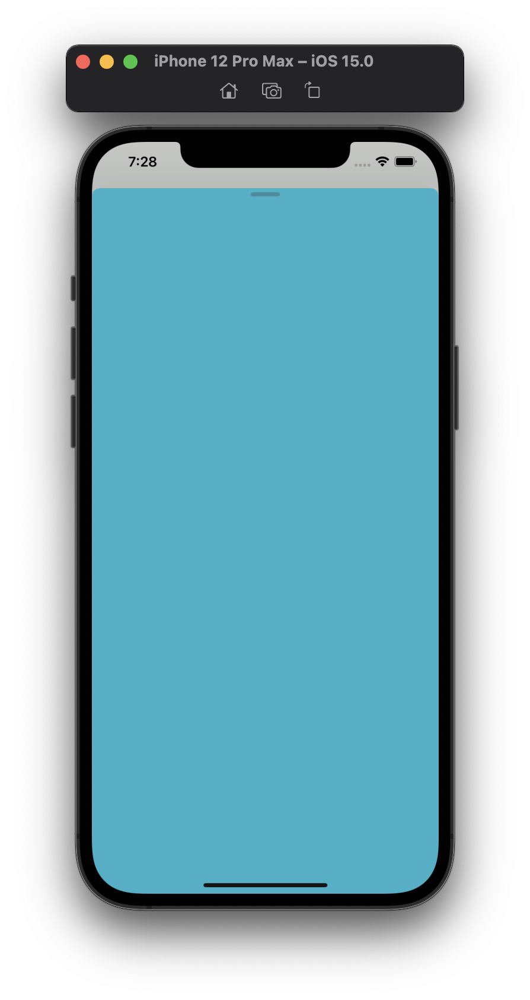
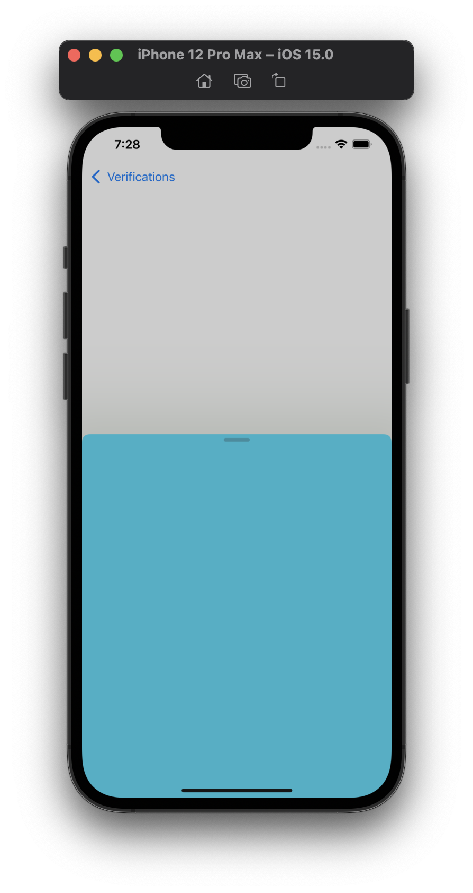
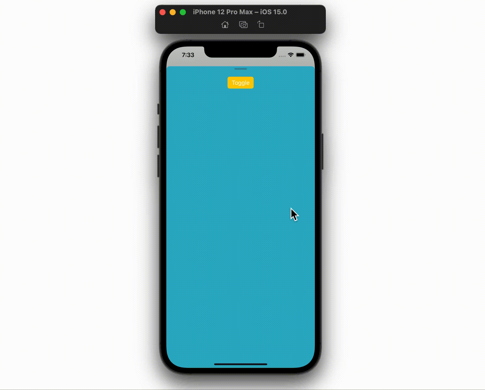
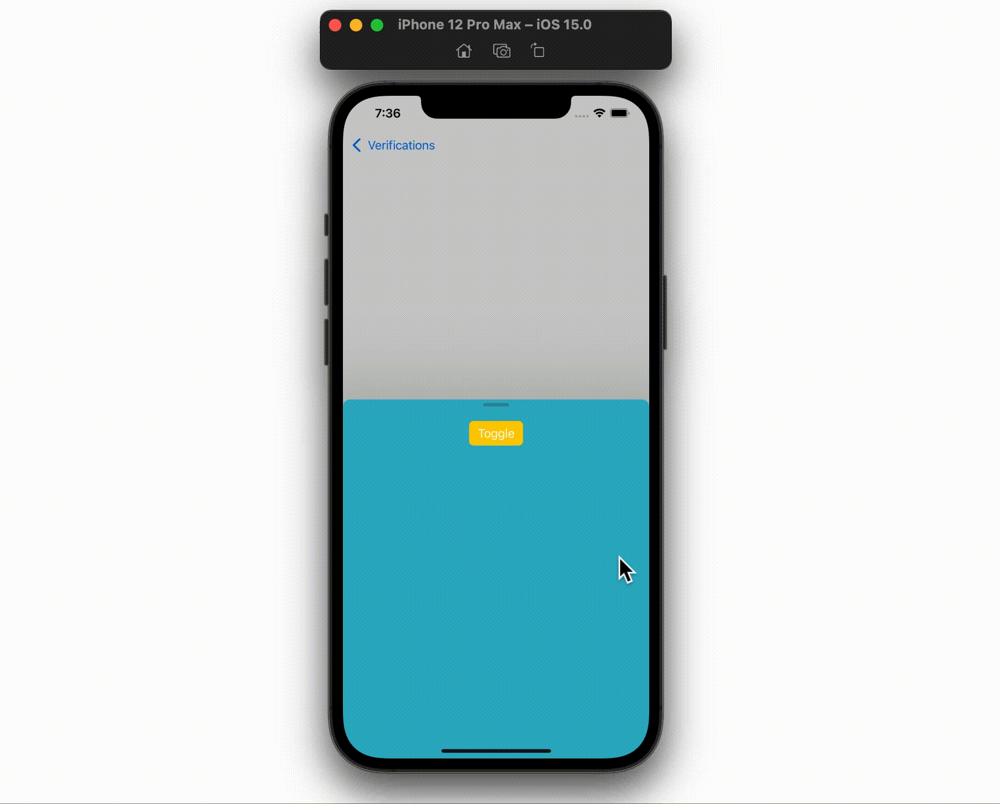

  
<!--more-->  
  
## 開発環境  
  
```bash
> xcodebuild -version
Xcode 13.0
Build version 13A233
```
  
## UISheetPresentationController とは
  
iOS 15.0 以上で使用可能となった、シート形式で表示する画面の外観と動作を管理できるクラス。  
  
## 最小構成で実装  
  
  
  
#### 呼び出し側
  
```swift
import UIKit

final class HalfModalBaseViewController: UIViewController {

    override func viewDidLoad() {
        super.viewDidLoad()
    }

    @IBAction func presentModal(_ sender: Any) {
        let vc = R.storyboard.halfModalContent.halfModalContent()!
        present(vc, animated: true)
    }

}
```
  
#### 呼び出される側
  
```swift
import UIKit

final class HalfModalContentViewController: UIViewController, UISheetPresentationControllerDelegate {

    override var sheetPresentationController: UISheetPresentationController {
        presentationController as! UISheetPresentationController
    }

    override func viewDidLoad() {
        super.viewDidLoad()
        configureHalfModal()
    }

}

extension HalfModalContentViewController {

    private func configureHalfModal() {
        sheetPresentationController.delegate = self

        // top 0 で水平方向の中心に表示されている灰色のバー
        sheetPresentationController.prefersGrabberVisible = true
        
        // 留まることが可能な位置
        sheetPresentationController.detents = [
            .medium()
        ]
    }

}

```
  
　
  
## Detent変更時の動きにアニメーションをつける
  
シートの高さの上端 (Detent) として、[UISheetPresentationController.Detent.Identifier](https://developer.apple.com/documentation/uikit/uisheetpresentationcontroller/detent/identifier) のうち、large と medium を指定できる
  
| large | medium |
| ---- | ---- |
|  |  |
  
　
  
Detent をコード上で変更すると、ゼロフレで切り替わってしまうのでアニメーションを付けたい。  
  

  
　
  
[animateChanges(_:)](https://developer.apple.com/documentation/uikit/uisheetpresentationcontroller/3801901-animatechanges) を使ってみた。  
  

  
　
  
```swift
@IBAction func toggleDetent(_ sender: Any) {
    let nextDetent: UISheetPresentationController.Detent.Identifier
    
    if sheetPresentationController.selectedDetentIdentifier == .large {
        nextDetent = .medium
    } else {
        nextDetent = .large
    }
    
    sheetPresentationController.animateChanges {
        sheetPresentationController.selectedDetentIdentifier = nextDetent
    }
}
```
  
Detent を変更する処理をクロージャとして渡すだけでOK。  
  
  
## 参考  
  
- [UISheetPresentationController | Apple Developer Documentation](https://developer.apple.com/documentation/uikit/uisheetpresentationcontroller)  
- [UISheetPresentationController.Detent.Identifier | Apple Developer Documentation](https://developer.apple.com/documentation/uikit/uisheetpresentationcontroller/detent/identifier)
- [animateChanges(_:) | Apple Developer Documentation](https://developer.apple.com/documentation/uikit/uisheetpresentationcontroller/3801901-animatechanges)  
  