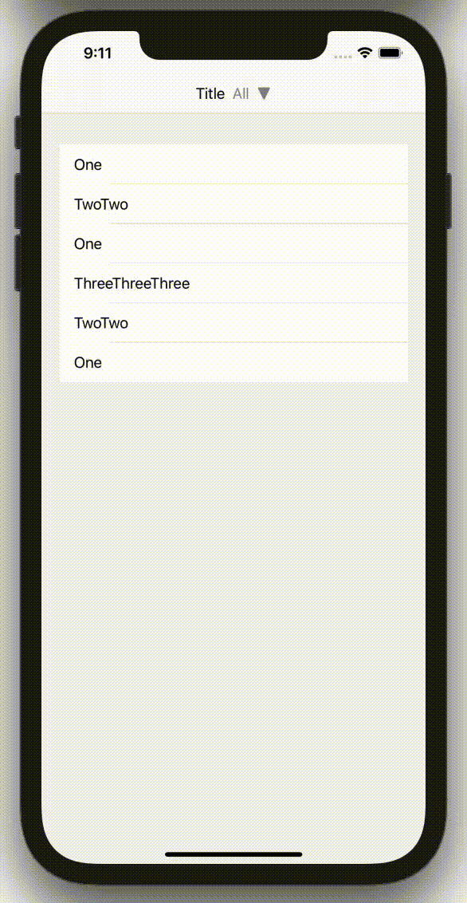
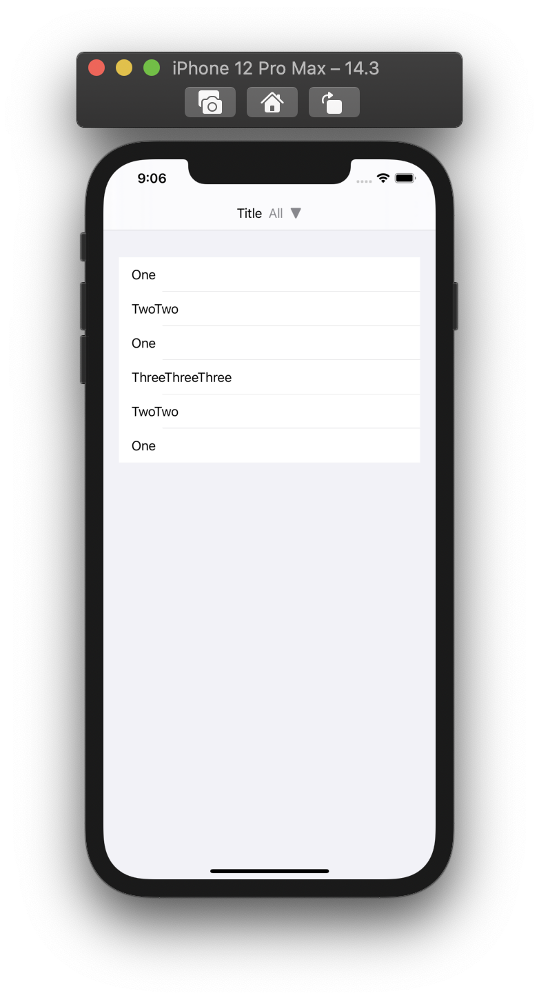
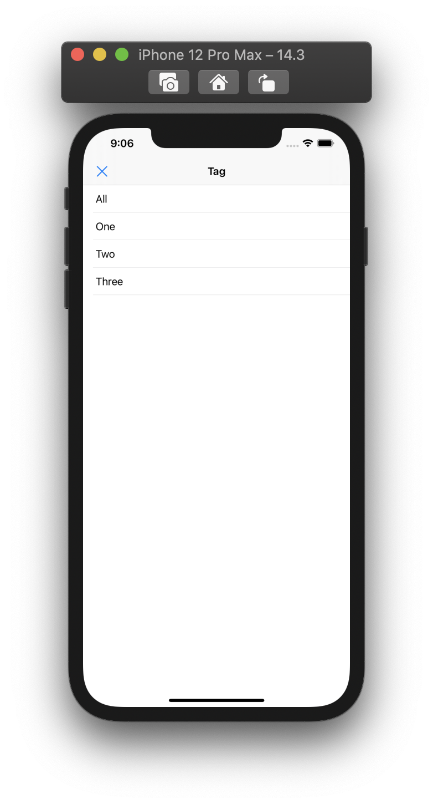
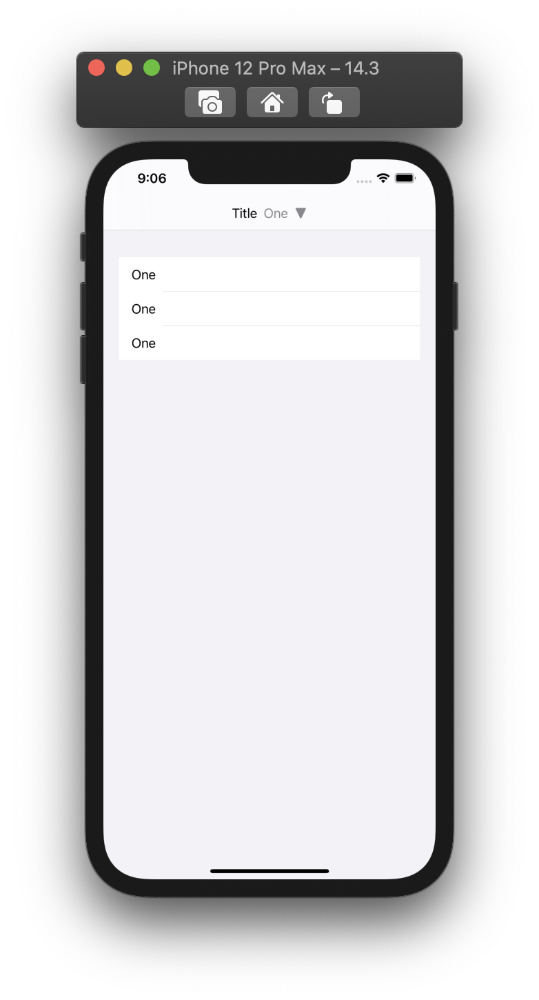
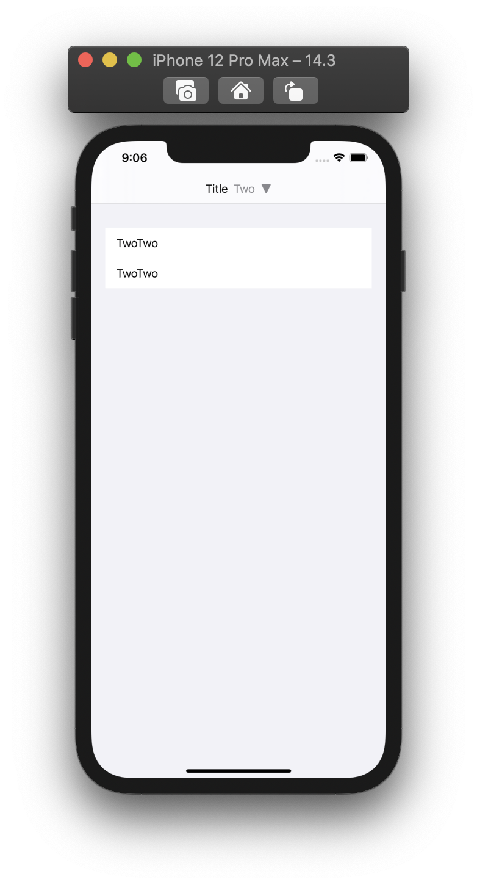
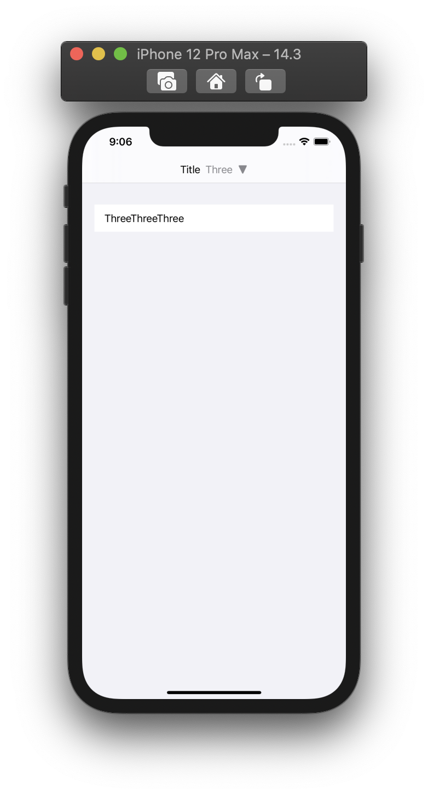

  
<!--more-->  
  
## 開発環境  
  
```bash
> xcodebuild -version
Xcode 12.3
Build version 12C33
```
  
## 動作
  
タグOneを選択した時の絞り込みの様子。  
  
  
  
## 画面一覧  
  
| 記事一覧 | タグ一覧 |
| ---- | ---- |
|  |  |
  
| 記事一覧 (タグ: one) | 記事一覧 (タグ: two) | 記事一覧 (タグ: three) |
| ---- | ---- | ---- |
|  |  |  |
  
## コード  
  
```swift
import SwiftUI

enum TagType: String, CaseIterable, Identifiable {
    case all = "All"
    case one = "One"
    case two = "Two"
    case three = "Three"
    var id: String { rawValue }
}

struct ViewModel {
    let articles: [Article]
}

struct Article: Identifiable {
    let tag: TagType
    let text: String
    
    var id: Int
}

// 記事一覧画面
struct ContentView: View {
    @State private var isPresented: Bool = false
    @State private var currentTagType: TagType = .all
    
    let viewModel = ViewModel(articles: [
        Article(tag: .one, text: "One", id: 1),
        Article(tag: .two, text: "TwoTwo", id: 2),
        Article(tag: .one, text: "One", id: 3),
        Article(tag: .three, text: "ThreeThreeThree", id: 4),
        Article(tag: .two, text: "TwoTwo", id: 5),
        Article(tag: .one, text: "One", id: 6),
    ])
    
    var body: some View {
        NavigationView {
            List {
                ForEach(viewModel.articles) { article in
                    if (currentTagType == .all) || (article.tag == currentTagType) {
                        Text(article.text)
                    }
                }
            }
            .navigationBarTitleDisplayMode(.inline)
            .toolbar {
                ToolbarItem(placement: .principal) {
                    HStack {
                        Text("Title")
                        Button {
                            isPresented.toggle()
                        } label: {
                            HStack {
                                Text(currentTagType.rawValue)
                                    // 何故か"One", "Two"が省略されるので対策
                                    .fixedSize(horizontal: true, vertical: false)
                                    .foregroundColor(.secondary)
                                    
                                Image(systemName: "arrowtriangle.down.fill")
                                    .foregroundColor(.secondary)
                            }
                            .foregroundColor(.primary)
                        }
                        
                    }
                }
            }
            .fullScreenCover(isPresented: $isPresented) {
                TagsView(currentTagType: $currentTagType,
                         isPresented: $isPresented)
            }
        }
    }
}

// タグ一覧画面
struct TagsView: View {
    @Binding private var currentTagType: TagType
    @Binding private var isPresented: Bool
    
    init(currentTagType: Binding<TagType>,
         isPresented: Binding<Bool>) {
        self._currentTagType = currentTagType
        self._isPresented = isPresented
    }
    
    var body: some View {
        NavigationView {
            List {
                ForEach(TagType.allCases) { tagType in
                    Button {
                        isPresented.toggle()
                        currentTagType = tagType
                    } label: {
                        Text(tagType.id)
                    }
                }
            }
            .navigationTitle(Text("Tag"))
            .navigationBarTitleDisplayMode(.inline)
            .toolbar {
                ToolbarItem(placement: .navigationBarLeading) {
                    Button {
                        isPresented.toggle()
                    } label: {
                        Image(systemName: "xmark")
                    }
                }
            }
        }
    }
}

```
  
## 参考  
  
- [SF Symbols - SF Symbols - Human Interface Guidelines - Apple Developer](https://developer.apple.com/design/human-interface-guidelines/sf-symbols/overview/)  
    - "arrowtriangle.down.fill", "xmark"  