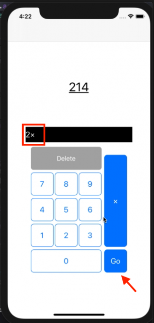
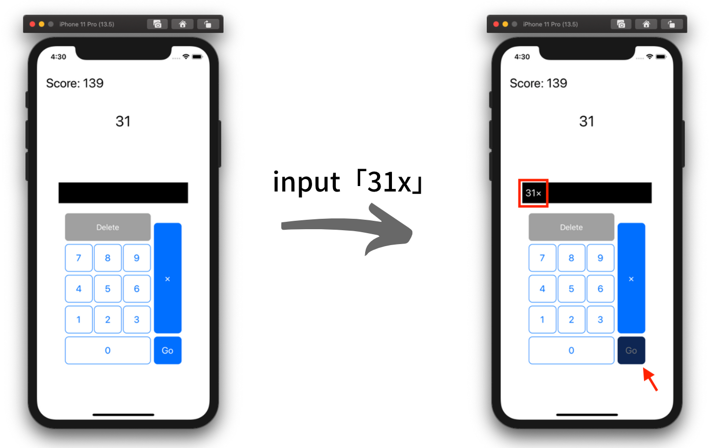

個人で素因数分解電卓アプリを作っています。  
そのアプリのUX改善点と改善内容を記事にしました。  
<!--more-->  
  
## 不適切な入力結果の処理  
素因数分解の式として末尾が `x` の場合、式として成立しません。  
不正な式を弾くために、Goボタン押下に紐付いている入力文字列の処理実行の際にエラーを吐くようにしています。  
  
  
  
今のままの実装だと、ユーザーはGoボタン押下時に式が不成立なことを知ることになります。  
入力文字列はアプリ側で保持しているので、末尾が `x` の際はGoボタンを押下不可にすればユーザーの無駄な動作が防げることを考えました。  
  
## 改善したこと  
現時点での入力文字列の末尾が `x` の際に、Goボタンを非活性にしました。  
  
  
  
ボタンの非活性化にあたり、下記のボタンのデザインを変更しました。  
  
- 背景色（濃い青）   
- 枠の色（濃い青）  
- 文字色（グレー）  
  
コード上で非活性にするだけですとデザイン上は何も変わらないので、分かりやすくデザインを変えました。  
下記のコードを入力毎に場合分けして実行させています。  
  
```swift
func enableGoButton() {
    goButton.isEnabled = true
    goButton.backgroundColor = .systemBlue
    goButton.setTitleColor(.white, for: .normal)
    goButton.layer.borderColor = UIColor.systemBlue.cgColor
}

func disableGoButton() {
    let goDisableColor = UIColor(red: 11/255, green: 43/255, blue: 94/255, alpha: 1)
    goButton.isEnabled = false
    goButton.backgroundColor = goDisableColor
    goButton.setTitleColor(.gray, for: .disabled)
    goButton.layer.borderColor = goDisableColor.cgColor
}
```
  
`backgroundColor` と `layer.borderColor` の型が異なることを知りました。(UIColor, CGColor)  
  