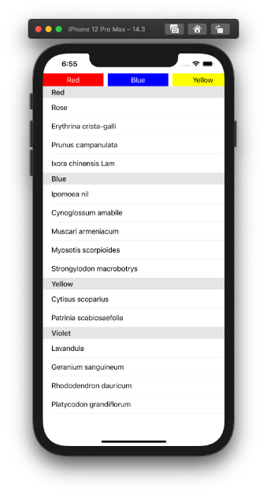
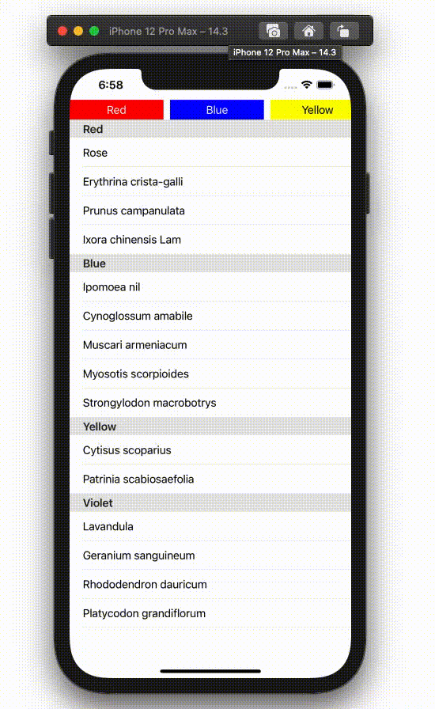

  
[Parchment](https://github.com/rechsteiner/Parchment)のUITableView sectionバージョンが欲しかった。  
  
<!--more-->  
  
## 開発環境  
  
```bash
> xcodebuild -version[master]
Xcode 12.3
Build version 12C33
```
  
## 作りたい機能  
  
- 上タブ(UICollectionView) + UITableViewの構成  
- 最も上に表示されているUITableViewのcellのsectionが上タブに反映  
  
## スクリーンショット  
  

  
## gif
  
  
  
## コード
  
```swift
import UIKit

final class ViewController: UIViewController {

    private enum FlowerColor: String, CaseIterable {
        case red = "Red"
        case blue = "Blue"
        case yellow = "Yellow"
        case violet = "Violet"
    }
    
    private struct Flower {
        let name: String
        let color: FlowerColor
    }
    
    private struct Flowers {
        let redFlowers: [Flower]
        let blueFlowers: [Flower]
        let yellowFlowers: [Flower]
        let violetFlowers: [Flower]
    }
    
    private let redFlowers: [Flower] = [
        Flower(name: "Rose", color: .red),
        Flower(name: "Erythrina crista-galli", color: .red),
        Flower(name: "Prunus campanulata", color: .red),
        Flower(name: "Ixora chinensis Lam", color: .red)
    ]
    
    private let blueFlowers: [Flower] = [
        Flower(name: "Ipomoea nil", color: .blue),
        Flower(name: "Cynoglossum amabile", color: .blue),
        Flower(name: "Muscari armeniacum", color: .blue),
        Flower(name: "Myosotis scorpioides", color: .blue),
        Flower(name: "Strongylodon macrobotrys", color: .blue)
    ]
    
    private let yellowFlowers: [Flower] = [
        Flower(name: "Cytisus scoparius", color: .yellow),
        Flower(name: "Patrinia scabiosaefolia", color: .yellow)
    ]
    
    private let violetFlowers: [Flower] = [
        Flower(name: "Lavandula", color: .violet),
        Flower(name: "Geranium sanguineum", color: .violet),
        Flower(name: "Rhododendron dauricum", color: .violet),
        Flower(name: "Platycodon grandiflorum", color: .violet)
    ]
    
    var redSectionBottomDistance: CGFloat {
        // 28: section header height
        // 44: UITableView Cell height
        return CGFloat(28 + 44 * redFlowers.count)
    }
    var blueSectionBottomDistance: CGFloat {
        return redSectionBottomDistance + 28 + 44 * CGFloat(blueFlowers.count)
    }
    var yellowSectionBottomDistance: CGFloat {
        return blueSectionBottomDistance + 28 + 44 * CGFloat(yellowFlowers.count)
    }
    
    @IBOutlet weak var tableView: UITableView!
    @IBOutlet weak var collectionView: UICollectionView!

    override func viewDidLoad() {
        super.viewDidLoad()
        configureTableView()
        configureCollectionView()
    }
    
    private func configureTableView() {
        tableView.dataSource = self
        tableView.tableFooterView = UIView(frame: .zero)
        tableView.contentInset = UIEdgeInsets(top: 0,
                                              left: 0,
                                              bottom: 1000,
                                              right: 0)
        tableView.delegate = self
    }
    
    private func configureCollectionView() {
        collectionView.dataSource = self
        let layout = UICollectionViewFlowLayout()
        layout.itemSize = CGSize(width: view.frame.width / 3, height: 30)
        layout.scrollDirection = .horizontal
        collectionView.collectionViewLayout = layout
        collectionView.showsHorizontalScrollIndicator = false
        collectionView.register(UINib(nibName: "UpperTabCollectionViewCell", bundle: nil),
                                forCellWithReuseIdentifier: "upperTabCollectionViewCell")
        collectionView.contentInset = UIEdgeInsets(top: 0,
                                                   left: 0,
                                                   bottom: 0,
                                                   right: 1000)
        collectionView.delegate = self
    }
}

extension ViewController: UITableViewDataSource {
    func numberOfSections(in tableView: UITableView) -> Int {
        return FlowerColor.allCases.count
    }

    func tableView(_ tableView: UITableView, numberOfRowsInSection section: Int) -> Int {
        switch FlowerColor.allCases[section] {
        case .red:
            return redFlowers.count
        case .blue:
            return blueFlowers.count
        case .yellow:
            return yellowFlowers.count
        case .violet:
            return violetFlowers.count
        }
    }

    func tableView(_ tableView: UITableView, cellForRowAt indexPath: IndexPath) -> UITableViewCell {
        let text: String
        switch FlowerColor.allCases[indexPath.section] {
        case .red:
            text = redFlowers[indexPath.row].name
        case .blue:
            text = blueFlowers[indexPath.row].name
        case .yellow:
            text = yellowFlowers[indexPath.row].name
        case .violet:
            text = violetFlowers[indexPath.row].name
        }
        let cell = UITableViewCell()
        cell.textLabel?.text = text
        return cell
    }
    
    func tableView(_ tableView: UITableView, titleForHeaderInSection section: Int) -> String? {
        return FlowerColor.allCases[section].rawValue
    }
}

extension ViewController: UITableViewDelegate {
    func scrollViewDidEndDragging(_ scrollView: UIScrollView, willDecelerate decelerate: Bool) {
        let y = scrollView.contentOffset.y
        guard y != 0.0 else {
            return
        }

        if y <= redSectionBottomDistance {
            collectionView.scrollToItem(at: IndexPath(row: 0, section: 0), at: .left, animated: true)
        } else if redSectionBottomDistance < y && y <= blueSectionBottomDistance {
            collectionView.scrollToItem(at: IndexPath(row: 1, section: 0), at: .left, animated: true)
        } else if blueSectionBottomDistance < y && y <= yellowSectionBottomDistance {
            collectionView.scrollToItem(at: IndexPath(row: 2, section: 0), at: .left, animated: true)
        } else {
            collectionView.scrollToItem(at: IndexPath(row: 3, section: 0), at: .left, animated: true)
        }
    }
}

extension ViewController: UICollectionViewDataSource {
    func collectionView(_ collectionView: UICollectionView, numberOfItemsInSection section: Int) -> Int {
        return FlowerColor.allCases.count
    }
    
    func collectionView(_ collectionView: UICollectionView, cellForItemAt indexPath: IndexPath) -> UICollectionViewCell {
        let cell = collectionView.dequeueReusableCell(withReuseIdentifier: "upperTabCollectionViewCell", for: indexPath) as! UpperTabCollectionViewCell
        
        var backgroundColor: UIColor?
        var textColor: UIColor?
        switch FlowerColor.allCases[indexPath.row] {
        case .red:
            backgroundColor = .red
            textColor = .white
        case .blue:
            backgroundColor = .blue
            textColor = .white
        case .yellow:
            backgroundColor = .yellow
        case .violet:
            backgroundColor = .purple
            textColor = .white
        }
        cell.setup(tabName: FlowerColor.allCases[indexPath.row].rawValue,
                   backgroundColor: backgroundColor,
                   textColor: textColor)
        return cell
    }
}


extension ViewController: UICollectionViewDelegate {
    func collectionView(_ collectionView: UICollectionView, didSelectItemAt indexPath: IndexPath) {
        var y: CGFloat = 0
        switch indexPath.row {
        case 0:
            y = 0
        case 1:
            y = redSectionBottomDistance
        case 2:
            y = blueSectionBottomDistance
        case 3:
            y = yellowSectionBottomDistance
        default:
            break
        }
        tableView.setContentOffset(CGPoint(x: 0, y: y), animated: true)
    }
}
```
  
## 改善点  
  
- 変数名 `redSectionBottomDistance` を分かりやすく修正  
- 汎用化  
- マジックナンバーの変数化  
  