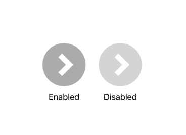

  
Buttonに `.renderingMode(.original)` を指定したときに使える。  
  
<!--more-->  
  
## 開発環境  
  
```bash
> xcodebuild -version
Xcode 12.0.1
Build version 12A7300
```
  
## スクリーンショット  
  

  
## コード  
  
```swift
import SwiftUI

struct ContentView: View {
    var body: some View {
        VStack{
            Spacer()
            HStack {
                VStack {
                    Button(action: {
                        // action
                    }){
                        Image("arrow")
                    }
                    .disabled(false)
                    .frame(width: 30, height: 30)
                    .padding(EdgeInsets(top: 0, leading: 0, bottom: 30, trailing: 0))
                    Text("Enabled")
                }
                .padding(EdgeInsets(top: 0, leading: 100, bottom: 0, trailing: 0))
                Spacer()
                VStack {
                    Button(action: {
                        // action
                    }){
                        Image("arrow")
                    }
                    .disabled(/*@START_MENU_TOKEN@*/true/*@END_MENU_TOKEN@*/)
                    .opacity(0.5)
                    .frame(width: 30, height: 30)
                    .padding(EdgeInsets(top: 0, leading: 0, bottom: 30, trailing: 0))
                    Text("Disabled")
                }
                .padding(EdgeInsets(top: 0, leading: 0, bottom: 0, trailing: 100))
            }
            Spacer()
        }
    }
}
```
  